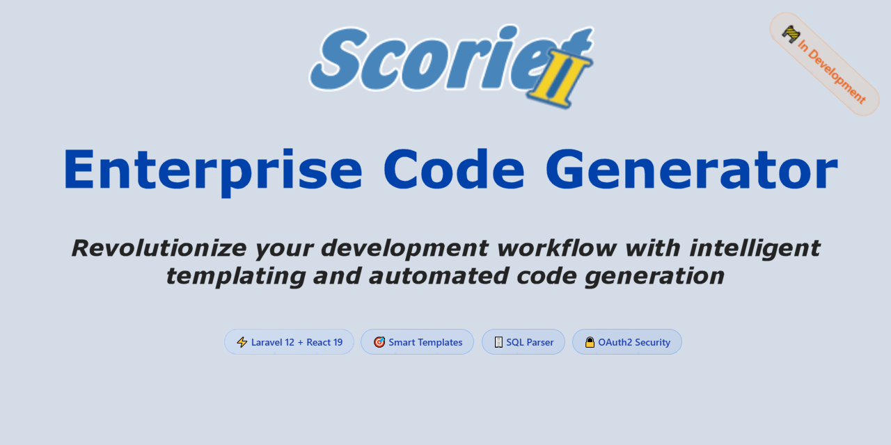

<div align="center">

# Scoriet

### Enterprise Code Generator with Intelligent Templating



[](https://laravel.com)
[](https://reactjs.org)
[](https://www.typescriptlang.org)
[](https://inertiajs.com)
[](https://opensource.org/licenses/MIT)
[](https://github.com/harveyhase68/scoriet)

[**🧪 Live Demo**](https://demo.scoriet.dev) • [**🚧 Alpha Preview**](https://scoriet.dev) • [**📋 Installation**](INSTALLATION.md) • [**Documentation**](#documentation) • [**Contributing**](#contributing)

> **⚠️ Development Status**: Scoriet is currently in **active development**. The application is functional but features are being added regularly. Expect frequent updates and breaking changes. Not recommended for production use yet.

</div>

---

## 🚀 About Scoriet

Scoriet is a modern enterprise code generator that revolutionizes development workflows through intelligent templating and automation. Built as a complete rewrite of the original WinDev application, it now leverages cutting-edge web technologies to provide a seamless, browser-based development experience.

## 🚧 Current Development Status

**We're currently in active development!** Here's what's working and what's coming:

### ✅ **Completed Features** (Alpha Ready)
- ✅ **Modern UI/UX**: Professional dark theme with dockable panels
- ✅ **Authentication System**: Complete OAuth2 login, registration, profiles
- ✅ **Internationalization (i18n)**: 5 languages with automatic browser detection
- ✅ **CSS Flag Icons**: Beautiful country flags using pure CSS gradients
- ✅ **Language Selector**: Elegant dropdown with flag icons and smooth UX
- ✅ **Demo System**: Instant demo access with `demo-admin` and `demo-user`
- ✅ **Professional Landing Page**: Marketing site with pricing tiers
- ✅ **Maintenance Mode**: Professional 503 page for updates
- ✅ **Responsive Design**: Works on desktop, tablet, and mobile
- ✅ **Environment-based Features**: Demo vs. Production mode
- ✅ **Development Tooling**: Full CI/CD, linting, testing setup
- ✅ **Accessibility**: WCAG compliant forms with proper autocomplete attributes

### 🚧 **In Progress** (Coming Soon)
- 🚧 **SQL Parser Engine**: MySQL schema parsing and analysis
- 🚧 **Template System**: JavaScript-based code generation
- 🚧 **Database Designer**: Visual schema creation tools
- 🚧 **Project Management**: Teams, projects, and collaboration
- 🚧 **Payment Integration**: PayPal and Stripe subscription handling
- 🚧 **AI Integration**: Claude API for enhanced code generation

### 📅 **Planned Features** (Roadmap)
- 📅 **Multi-Database Support**: PostgreSQL, SQLite, SQL Server
- 📅 **Advanced Templates**: Loop constructs and complex generation
- 📅 **Team Collaboration**: Multi-user projects and sharing
- 📅 **API Ecosystem**: Public API for third-party integrations
- 📅 **Plugin System**: Extensible architecture for custom generators

### 🧪 **Try It Now**
- **Live Demo**: [demo.scoriet.dev](https://demo.scoriet.dev) - Full featured demo environment
- **Alpha Preview**: [scoriet.dev](https://scoriet.dev) - Latest development build

### ✨ Key Features

- **🌍 Internationalization** - 5 languages (English, German, French, Spanish, Italian) with automatic browser detection
- **🎨 CSS Flag Icons** - Beautiful country flags created with pure CSS gradients (no image dependencies)
- **🗄️ Advanced SQL Parser** - Parse MySQL schemas with intelligent relationship detection
- **🎯 Template Engine** - Powerful client-side template execution with JavaScript integration
- **🖥️ Modern MDI Interface** - Professional dock-based UI with floating panels
- **🔒 Enterprise Security** - Laravel Passport OAuth2 with Password Grant authentication
- **👤 User Management** - Complete registration, login, and profile management system
- **🔐 JWT Token Authentication** - Secure API access with Bearer tokens
- **⚡ Real-time Generation** - Instant code generation without server processing
- **🔧 Flexible Templates** - Stack multiple templates for complex application scaffolding
- **♿ Accessibility First** - WCAG compliant with screen reader support and proper form attributes

### 🏗️ Architecture

**Frontend Stack:**
- React 19 with TypeScript
- RC Dock for MDI interface
- Tailwind CSS 4.0 for styling
- Ant Design Icons
- Vite for lightning-fast builds

**Backend Stack:**
- Laravel 12 with PHP 8.2+
- Inertia.js for seamless SPA experience
- Laravel Passport for API security
- Multi-database support (MySQL, PostgreSQL, SQLite, SQL Server)

**Template System:**
- Client-side JavaScript execution
- Flexible placeholder system (`{projectname}`, `{tablename}`)
- Advanced loop constructs (`{for %}{endfor}`)
- Stackable template composition

## 📋 Requirements

- **PHP** ≥ 8.2 with extensions: `mbstring`, `xml`, `bcmath`, `pdo`, `tokenizer`
- **Composer** ≥ 2.0
- **Node.js** ≥ 18.0 & npm ≥ 9.0
- **Database**: MySQL 8.0+ / PostgreSQL 13+ / SQLite 3.8+ / SQL Server 2019+
- **Memory**: 512MB RAM minimum (2GB+ recommended)

## 🚀 Getting Started

> **📋 For detailed Windows installation instructions, see [INSTALLATION.md](INSTALLATION.md)**

## ⚡ Quick Start

### 1️⃣ Clone & Install

```bash
# Clone the repository
git clone https://github.com/harveyhase68/scoriet.git
cd scoriet

# Install dependencies
composer install
npm install
```

### 2️⃣ Environment Setup

```bash
# Copy environment file
cp .env.example .env

# Generate application key
php artisan key:generate

# Configure your database in .env
# Edit the following variables:
DB_CONNECTION=mysql
DB_HOST=127.0.0.1
DB_PORT=3306
DB_DATABASE=scoriet
DB_USERNAME=your_username
DB_PASSWORD=your_password
```

### 3️⃣ Database Setup

```bash
# Create database (MySQL example)
mysql -u root -p -e "CREATE DATABASE scoriet CHARACTER SET utf8mb4 COLLATE utf8mb4_unicode_ci;"

# Run migrations
php artisan migrate

# (Optional) Seed sample data
php artisan db:seed
```

### 4️⃣ Authentication Setup

```bash
# Install Laravel Passport for API authentication
php artisan passport:install

# Create OAuth clients for authentication
php artisan passport:client --password --name="Scoriet Password Grant Client"
php artisan passport:client --personal --name="Scoriet Personal Access Client"

# Update .env with the Password Grant Client credentials
# VITE_PASSPORT_CLIENT_ID=your-password-grant-client-id
# VITE_PASSPORT_CLIENT_SECRET=your-password-grant-client-secret

# For demo installations (optional)
# SCORIET_DEMO=true     # Disables registration, enables demo mode
# VITE_SCORIET_DEMO="${SCORIET_DEMO}"
```

## 🧪 Demo Access

### Instant Demo (No Registration Required)

Visit [demo.scoriet.dev](https://demo.scoriet.dev) and try either:

**Option 1: Click Demo Cards**
- Click on `demo-admin` or `demo-user` cards in the login modal
- Instant access to demo environment

**Option 2: Manual Login**
- Username: `demo-admin` or `demo-user`
- Password: Leave empty
- Click "Log In"

### Demo Users
- **demo-admin**: Full admin access, 2 teams, 3 projects
- **demo-user**: Team member access, assigned to 1 project

> **Note**: Demo resets automatically every 20 minutes. All changes are temporary.

## 🛠️ Development

### Start Development Server

```bash
# 🚀 All-in-one development server (recommended)
# Runs Laravel server + queue worker + Vite dev server
composer run dev

# 🔥 With Server-Side Rendering
composer run dev:ssr

# ⚙️ Manual start (for debugging)
php artisan serve --host=10.0.0.8 --port=8000  # Backend
php artisan queue:listen --tries=1              # Queue worker
npm run dev                                       # Frontend
```

### Access Points
- **Application**: http://10.0.0.8:8000
- **Vite Dev Server**: http://10.0.0.8:5173
- **Hot Module Replacement**: Enabled automatically

### 🔐 Authentication System

Scoriet includes a complete authentication system with OAuth2 Password Grant:

#### Registration & Login
- **Registration**: Create new user accounts with email verification
- **Login**: Secure OAuth2 authentication with JWT tokens
- **Profile Management**: Update user details and change passwords
- **Token Management**: Automatic token refresh and secure storage

#### API Authentication
```bash
# Example: Login via OAuth2 Password Grant
curl -X POST http://10.0.0.8:8000/api/oauth/token \
  -H "Content-Type: application/json" \
  -d '{
    "grant_type": "password",
    "client_id": "your-client-id",
    "client_secret": "your-client-secret", 
    "username": "user@example.com",
    "password": "userpassword"
  }'

# Example: Access protected routes
curl -X GET http://10.0.0.8:8000/api/user \
  -H "Authorization: Bearer your-access-token"
```

#### Available Authentication Endpoints
- `POST /api/auth/register` - User registration
- `POST /api/oauth/token` - OAuth2 token exchange
- `GET /api/user` - Get authenticated user
- `PUT /api/profile/update` - Update user profile
- `PUT /api/profile/password` - Change password
- `POST /api/auth/forgot-password` - Password reset request
- `POST /api/auth/reset-password` - Password reset confirmation

### 🌍 Internationalization Features

Scoriet includes comprehensive multilingual support:

#### Supported Languages
- **🇺🇸 English** (en) - Default language
- **🇩🇪 German** (de) - Deutsch
- **🇫🇷 French** (fr) - Français
- **🇪🇸 Spanish** (es) - Español
- **🇮🇹 Italian** (it) - Italiano

#### Language Features
- **🔍 Automatic Detection** - Browser language detected on first visit
- **💾 Persistent Selection** - Language choice saved in localStorage
- **🎨 CSS Flag Icons** - Beautiful flags using pure CSS gradients (no external images)
- **🖱️ Smooth UX** - Elegant language selector with instant switching
- **📱 Responsive Flags** - Scalable flags that work on all screen sizes
- **♿ Accessible** - Screen reader support with proper ARIA labels

#### Implementation Details
- Client-side translation system with TypeScript support
- Language data stored in `resources/js/utils/i18n.ts`
- Custom CSS flag components in `Components/CSSFlag.tsx`
- Language selector component with PrimeReact integration
- Automatic lobby language inheritance in registration forms

### Development Features
- ⚡ **Hot Reload** - Instant UI updates
- 🔍 **Debug Toolbar** - Laravel Debugbar (when enabled)
- 📝 **Logging** - Real-time logs with `php artisan pail`
- 🎨 **Live Styling** - Tailwind CSS with JIT compilation

## 🧪 Testing

```bash
# Run all tests with Pest PHP
composer run test

# Alternative command
php artisan test

# Run specific test suites
php artisan test --testsuite=Feature
php artisan test --testsuite=Unit

# Run tests with coverage
php artisan test --coverage

# Run tests in parallel (faster)
php artisan test --parallel
```

### Test Structure
- **Feature Tests**: `tests/Feature/` - End-to-end functionality
- **Unit Tests**: `tests/Unit/` - Individual component testing
- **Browser Tests**: Coming soon with Laravel Dusk

## 🚀 Production Deployment

### Build Assets

```bash
# Build for production
npm run build

# Build with Server-Side Rendering
npm run build:ssr

# Optimize Laravel
php artisan optimize
php artisan config:cache
php artisan route:cache
php artisan view:cache
```

### Production Checklist

- [ ] Set `APP_ENV=production` in `.env`
- [ ] Set `APP_DEBUG=false` in `.env`
- [ ] Configure production database
- [ ] Set up proper `APP_URL`
- [ ] Configure mail settings
- [ ] Set up SSL certificate
- [ ] Configure proper file permissions
- [ ] Set up backup strategy
- [ ] Configure monitoring (logs, errors)

### Server Requirements

```bash
# Web server configuration
# Point document root to /public
# Enable mod_rewrite (Apache) or try_files (Nginx)

# File permissions
chmod -R 755 storage bootstrap/cache
chown -R www-data:www-data storage bootstrap/cache
```

## 🎯 Code Quality & Development Tools

### Frontend Quality Tools

```bash
# 🎨 Code formatting with Prettier
npm run format        # Format all files
npm run format:check  # Check formatting without changes

# 🔍 Linting with ESLint
npm run lint          # Lint and auto-fix issues

# 📝 TypeScript validation
npm run types         # Type checking without compilation
```

### Backend Quality Tools

```bash
# 🎨 PHP Code formatting with Laravel Pint
./vendor/bin/pint

# 🔍 Static analysis with PHPStan (if configured)
./vendor/bin/phpstan analyse

# 📋 Code style checking
php artisan pint --test
```

### Git Hooks & CI/CD

```bash
# Pre-commit hooks (recommended setup)
npm install --save-dev husky lint-staged
npx husky init

# Add to package.json:
# "lint-staged": {
#   "*.{js,jsx,ts,tsx}": ["eslint --fix", "prettier --write"],
#   "*.php": ["./vendor/bin/pint"]
# }
```

## 🔧 Troubleshooting

### Common Issues & Solutions

#### Permission Errors
```bash
# Fix Laravel permissions
chmod -R 755 storage bootstrap/cache
chown -R www-data:www-data storage bootstrap/cache  # Linux/Mac

# Windows (run as Administrator)
icacls storage /grant Users:F /T
icacls bootstrap/cache /grant Users:F /T
```

#### Dependency Issues
```bash
# Clear and reinstall Node dependencies
rm -rf node_modules package-lock.json
npm install

# Clear and reinstall Composer dependencies
rm -rf vendor composer.lock
composer install

# Regenerate autoload files
composer dump-autoload
```

#### Laravel Cache Issues
```bash
# Clear all Laravel caches
php artisan optimize:clear
php artisan cache:clear
php artisan config:clear
php artisan route:clear
php artisan view:clear
```

#### Database Issues
```bash
# Reset database
php artisan migrate:fresh --seed

# Check database connection
php artisan tinker
# In tinker: DB::connection()->getPdo();
```

#### Vite/Asset Issues
```bash
# Clear Vite cache
rm -rf node_modules/.vite
npm run dev

# Rebuild assets
npm run build
```

### Getting Help

- 📖 **Documentation**: Check the `/docs` folder (coming soon)
- 🐛 **Bug Reports**: [Create an issue](https://github.com/harveyhase68/scoriet/issues)
- 💬 **Discussions**: [GitHub Discussions](https://github.com/harveyhase68/scoriet/discussions)
- 📧 **Email**: [Contact us](mailto:support@scoriet.com)

---

## 📚 Documentation

### Project Structure
```
scoriet/
├── app/
│   ├── Http/Controllers/     # Laravel controllers
│   ├── Models/              # Eloquent models
│   └── Services/            # Business logic (SQL Parser, etc.)
├── resources/
│   ├── js/
│   │   ├── Components/      # React components
│   │   │   ├── AuthModals/  # Authentication modals
│   │   │   ├── Panels/      # RC Dock panels
│   │   │   ├── CSSFlag.tsx  # CSS-based flag icons
│   │   │   └── LanguageSelector.tsx  # i18n language picker
│   │   ├── pages/          # Inertia.js pages
│   │   ├── utils/          # Utility functions
│   │   │   └── i18n.ts     # Internationalization system
│   │   └── types/          # TypeScript definitions
│   └── css/                # Stylesheets
├── routes/                 # Laravel routes
├── tests/                 # Test files
└── database/              # Migrations, seeders, factories
```

### Key Technologies

- **[Laravel 12](https://laravel.com/docs)** - PHP framework
- **[React 19](https://react.dev)** - UI library  
- **[Inertia.js](https://inertiajs.com)** - Modern monolith bridge
- **[TypeScript](https://www.typescriptlang.org)** - Type safety
- **[Tailwind CSS](https://tailwindcss.com)** - Utility-first CSS
- **[RC Dock](https://github.com/ticlo/rc-dock)** - Docking layout system
- **[Vite](https://vitejs.dev)** - Build tool and dev server
- **[Pest PHP](https://pestphp.com)** - Testing framework

### API Reference

Coming soon - comprehensive API documentation with examples.

## 🤝 Contributing

We welcome contributions! Please see our [Contributing Guide](CONTRIBUTING.md) for details.

### Development Workflow

1. Fork the repository
2. Create a feature branch: `git checkout -b feature/amazing-feature`
3. Make your changes
4. Run tests: `composer run test`
5. Run quality checks: `npm run lint && npm run types`
6. Commit changes: `git commit -m 'Add amazing feature'`
7. Push to branch: `git push origin feature/amazing-feature`
8. Create a Pull Request

### Code Style

- **PHP**: Follow PSR-12 standards, use Laravel Pint
- **JavaScript/TypeScript**: Use ESLint + Prettier configuration
- **Commits**: Use conventional commit format

## 📄 License

This project is licensed under the MIT License - see the [LICENSE](LICENSE) file for details.

## 🙏 Acknowledgments

- Built with the assistance of Claude, ChatGPT, Gemini, and Builder.io AI
- Inspired by the original WinDev implementation
- Thanks to the Laravel and React communities

---

<div align="center">

**[⭐ Star this project](https://github.com/harveyhase68/scoriet)** if you find it helpful!

*Made with ❤️ for the developer community*

</div>