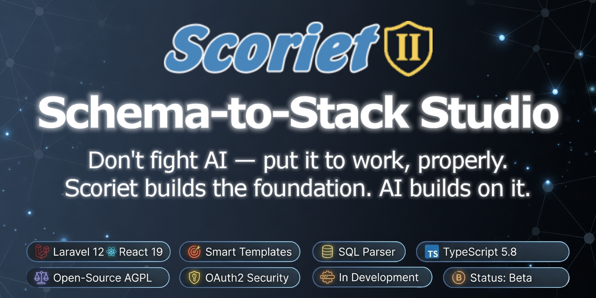

<div align="center">

# Scoriet V 1.0.0.4 Latest Changes from 31.5.2026

### Schema-to-Stack Studio with Intelligent Templating



[](https://laravel.com)
[](https://reactjs.org)
[](https://www.typescriptlang.org)
[](https://inertiajs.com)


[](https://www.gnu.org/licenses/agpl-3.0)
[](https://github.com/harveyhase68/scoriet)

[**🧪 Live Demo**](https://demo.scoriet.dev) • [** Application**](https://scoriet.dev) • [**📋 Installation**](INSTALLATION.md) • [**Documentation**](https://scoriet.com/docs/) • [**Contributing**](#contributing)

** Development Status**: Scoriet is still under **development**. The application is functional, but changes may occur and restarts may happen during the day.

</div>

---

## 🚀 About Scoriet

Scoriet is a modern enterprise code generator that revolutionizes development workflows through intelligent templating and automation. Built as a complete rewrite of the original WinDev application, it now leverages cutting-edge web technologies to provide a seamless, browser-based development experience.

## Current Development Status

**We're still in development!** The feature list and what's coming (Roadmap):

#### 🎨 **Core Platform**
- ✅ **Theme System**: Dark/Light mode with dynamic color switching via `useTheme()` hook
- ✅ **Modern UI/UX**: Professional theme-aware interface with dockable panels
- ✅ **Authentication System**: Complete OAuth2 login, registration, profiles
- ✅ **2FA with TOTP Authenticator App**: User optional activated 2FA authtetifiaction with an authenticator app
- ✅ **Internationalization (i18n)**: 5 languages with automatic browser detection
- ✅ **CSS Flag Icons**: Beautiful country flags using pure CSS gradients
- ✅ **Language Selector**: Elegant dropdown with flag icons and smooth UX
- ✅ **Demo System**: Instant demo access with `demo-admin` and `demo-user`
- ✅ **Professional Landing Page**: Marketing site with pricing tiers
- ✅ **CMS System**: Inertia-based CMS pages (Impressum, Help) with React components
- ✅ **Maintenance Mode**: Professional 503 page for updates
- ✅ **Responsive Design**: Works on desktop, tablet, and mobile
- ✅ **Environment-based Features**: Demo vs. Production mode
- ✅ **Development Tooling**: Full CI/CD, linting, tsc, testing setup
- ✅ **Accessibility**: WCAG compliant forms with proper autocomplete attributes

#### 🗄️ **Database & Schema Management**
- ✅ **Database Designer**: Visual SQL schema creation and editing with control type detection
- ✅ **Control Type System**: Automatic UI control type detection (TEXT, COMBOBOX, DATEPICKER, etc.)
- ✅ **Link Fields**: Complete foreign key relationship support with display fields and ordering
- ✅ **Referential Actions**: CASCADE, SET NULL, RESTRICT, NO ACTION for foreign keys
- ✅ **Edit Masks**: Field-level input masks for data validation
- ✅ **Per-Table/Field Generation State**: Two orthogonal ENUMs on every schema table and field — `display_state` (enabled, disabled, grayed, invisible, excluded) passes visual metadata into the gtree, and `generation_mode` (full, code_only, template_only, reference_only, excluded) controls which parts of the code-generator iterate a given table or field. Typical use: keep ASP.NET Identity `Users`/`Tenants` in the schema for FK resolution but exclude them from generated Controllers/Models/Forms.
- ✅ **Resizable Table Modal**: The Database Designer's table editor (`TableModal`) now opens as a draggable, resizable, and maximizable dialog with two tabs — **Table Settings** (name, file key, generation state, FormSet/ReportPattern overrides) and **Fields** (per-field editor including the same state combos). No more cramped layouts when editing large tables.
- ✅ **Per-Row Audit & Versioning**: Every `schema_tables` and `schema_fields` row now carries `version`, `created_at`, `created_by_username`, `updated_at`, `updated_by_username`. Field edits bump the field version; structural table edits (rename, settings) and field add/remove bump the table version. Pure field-content edits do **not** bump the table version — the two counters are independent so you can tell at a glance "what changed where". Surfaced in the Table Modal via the new `AuditInfoBlock` card in both Settings and Fields tabs.
- ✅ **JSON Metadata in SQL COMMENT (Round-Trip Safe)**: The MySQL/PostgreSQL exporter now serialises Scoriet-only metadata (audit, version, lookup config, display/generation state, edit mask, FormSet/ReportPattern by **name**) as a compact JSON object **inside the SQL COMMENT clause** itself. On re-import the JSON is parsed back out, the keys are restored to their proper columns, and only the human-readable `comment` ends up in the comment column. Legacy SQL without the marker is recognised and falls through with sensible defaults — nothing breaks for foreign dumps. Field comments stay under MySQL's 1024-byte cap via graceful comment truncation; lookup/audit/version keys are sacred. **Effect: an SQL export is now a true backup vector — drop the schema, re-import the SQL, lookup combos / audit history / formset assignments all come back exactly as they were.**
- ✅ **Control Types Expanded (11 → 42)**: The control-type catalogue went from 11 to 42 entries grouped into 9 categories — text & numeric (`TEXT`, `NUMBER`, `CURRENCY`, `PASSWORD`, `CAPTCHA`, `RATING`, `SLIDER`), multi-line & rich (`TEXTAREA`, `WYSIWYGEDIT`, `MARKDOWN`, `HTML`, `CODEEDITOR`, `JSONEDITOR`), boolean (`CHECKBOX`, `SWITCH`, `RADIOBUTTONS`), selection (`COMBOBOX`, `LISTBOX`, `MULTISELECT`, `TAGSELECT`, `PICKLIST`, `TREEVIEW`), date/time, color & icon pickers, file & media (`FILEUPLOAD`, `SIGNATURE`, `IMAGE`, `VIDEO`, `AUDIO`, `CAMERA`), geo (`LOCATION`, `MAP`), codes (`BARCODE`, `QRCODE`), plus `HIDDEN` and `LABEL`. Lookup-relevant link fields auto-show only for COMBOBOX / LISTBOX / MULTISELECT / TAGSELECT / PICKLIST / TREEVIEW — clean UI for the other 36.
- ✅ **Schema Translation**: Multi-language support for table and field descriptions
- ✅ **Excel Translation Import**: Bulk import translations from Excel files
- ✅ **SQL Parser Engine**: Advanced MySQL and PostgreSQL schema parsing with relationship detection
- ✅ **MySQL & MariaDB Import**: Full support for MySQL and MariaDB SQL dumps and schema import
- ✅ **PostgreSQL Import**: Full support for PostgreSQL SQL dumps and schema import
- ✅ **SQLite Import**: Support for SQLite SQL schema import
- ✅ **MS-SQL/T-SQL Import**: Support for MS-SQL/T-SQL schema import
- ✅ **Firebird Import**: Support for Firebird SQL schema import
- ✅ **Schema Versioning**: Automatic version tracking for database changes
- ✅ **Schema Diff & Migration**: Compare schema versions and generate SQL migration scripts
- ✅ **Copy Database**: Clone schemas with all tables, fields, and relationships

#### 🚀 **Code Generation System**
- ✅ **Template Engine**: Powerful JavaScript-based code generation with conditionals
- ✅ **Template Includes**: Reusable template snippets with `{:include: path/file.ext:}` syntax
- ✅ **Template Tester & Debug**: Real-time template debugging and testing (with built-in filter that hides excluded/reference-only tables from the DB Table File dropdown)
- ✅ **Full Code Generation**: Generate complete projects from multiple templates
- ✅ **Multi-Template Support**: Stack multiple templates for complex applications
- ✅ **Multi-Language Generation**: Generate code in multiple languages simultaneously
- ✅ **Multi-Schema Generation**: Generate code in from multiple database schemas simultaneously
- ✅ **Multi-Schema-Versioning (Migration) Generation**: Generate code in from multiple database schema versions simultaneously
- ✅ **Indirection Arrays in gtree**: `gtree[0].project[0].tablesgen[]` and `tables[i].fieldsgen[]` — stable index arrays that drive `{:for nmaxtables:}` and `{:for nmaxitems:}` loops. All tables/fields stay in `tables[]` / `fields[]` for FK and by-name lookups; only iterable ones (mode `full` or `code_only`) are listed in the `*gen` arrays. This mirrors the proven `fieldsnokey` / `fieldsnoblob` pattern and fixes off-by-count iteration when some tables/fields have non-iterable generation modes — templates themselves need no changes, `tableIdx` / `i` still resolve to the actual record index inside the loop body.
- ✅ **Schema State Metadata in gtree**: Every table and field entry in the generated gtree exposes `state`, `generation_mode`, `in_iteration`, and `generates_files` — user `{:code:}` blocks can branch on these (e.g. `{:if item.state == "grayed":}` or `{:if !table.generates_files:}`).
- ✅ **Audit & Version in gtree**: Tables and fields now expose `version`, `created_at`, `created_by_username`, `updated_at`, `updated_by_username` to templates — generated files can stamp themselves with `Generated for {:table.name:} v{:table.version:} (last edit by {:table.updated_by_username:} on {:table.updated_at:})` headers, drive cache-keys off the version counter, or simply document provenance.
- ✅ **Control Type as String in gtree**: `item.controltype` now resolves to the readable type name (`"COMBOBOX"`, `"DATEPICKER"`, `"SLIDER"`, …) instead of a hardcoded numeric id — `{:if item.controltype == "COMBOBOX":}` reads naturally and survives the 11 → 42 catalogue expansion without template changes.
- ✅ **FormSet/ReportPattern Provenance Flag**: Tables in the gtree carry `form_set_id` / `form_set_name` / `form_set_inherited` (and the same trio for ReportPattern). The IDs are always the **effective** ones (real DB id, never a sentinel when something exists) and a new boolean `*_inherited` tells templates whether the value comes from an explicit per-table assignment or was fallback-resolved from the project default. `{:if form_set_id gt 0:}` matches both cases; `{:if form_set_inherited:}` separates them.
- ✅ **Reverse Engineering (Code Adjustments)**: Compare previous generations with your actual code, create code adjustments as needed
- ✅ **ZIP/tar Template Upload**: Upload complete template structures as ZIP or tar files
- ✅ **File Path Organization**: Automatic directory structure for generated code
- ✅ **Template Variables**: Custom project-level variables with multi-language support
- ✅ **Error Reporting**: Comprehensive syntax error detection and reporting in ERRORS.txt
- ✅ **Progress Tracking**: Real-time generation progress with file counters
- ✅ **ZIP/tar Download**: Package generated code with all files and error reports
- ✅ **Form Designer**: Visual form design with database field integration
- ✅ **Form Layout Designer**: Drag-and-drop field placement with container, label, and control type configuration
- ✅ **Form Live Preview**: Real-time form rendering with simulated test data
- ✅ **Form Set Management**: Create, clone, and share reusable form sets with visibility control
- ✅ **Anchor System**: Responsive positioning for form elements (horizontal/vertical anchoring)
- ✅ **Code Adjustments**: Post-generation code customization system
- ✅ **Template Marketplace**: Share and download community templates
- ✅ **Template Import Wizard**: Multi-step import workflow with extension presets and file tree browser
- ✅ **FTP/SSH Upload**: Direct deployment via FTP or SFTP to remote servers

#### 📊 **Report Designer**
- ✅ **Report Pattern Designer**: Visual report pattern creation with sections (header, detail, footer)
- ✅ **Report Layout Designer**: Detailed layout design with column resize, reorder, and font styling
- ✅ **Report Pattern Management**: Create, clone, and share report patterns with visibility control
- ✅ **Paper Configuration**: A4, A3, A5, Letter, Legal sizes with portrait/landscape orientation
- ✅ **Report Elements**: Containers, static text, headings, lines, boxes, page numbers, image placeholders
- ✅ **Container Styling**: Font family/size/weight/style/decoration/alignment/color plus border and background — editable on every container type (Single mode's `container`, List mode's `header_section`, `detail_section`, `footer_section`, `table_header`). Container styles **cascade onto auto-placed fields** via `ReportLayoutElement::inheritContainerStyle()`, so a single "default look" on the container applies to every field without per-field tweaking.
- ✅ **Schema Translation in Auto-Placement**: "Autom. aufbauen" now pulls captions from `schema_translations` for the selected language AND persists the full per-language map as a snapshot on each layout element's `caption_labels`. Switching the language in the designer toolbar instantly updates the column headers without re-running auto-place.
- ✅ **Report Image Upload**: Per-element image assets with multi-language variants
- ✅ **List Report Support**: Row height, column configuration, header/footer sections, table headers
- ✅ **Typography Control**: Full font stack (family, size, weight, style, decoration, alignment, color)
- ✅ **Unit System**: Millimeter and inch precision for professional print layouts
- ✅ **Report Pattern Field Assignments**: New matrix panel (`ReportFieldAssignmentPanel`) that mirrors the Forms field-assignment matrix — rows are schema fields, columns are the report patterns linked to the project. Each cell controls per-pattern `visibility_state` (visible / grayed / inactive / invisible / not_available) and optional `sort_order`. The active ReportPattern's assignments are applied as a global overlay on field metadata in the gtree (`item.report_visibility_state`, `item.report_visible`, `item.report_sort_order`), so report templates can filter and order fields independently of Canvas-level placements.
- ✅ **Menu Reorganization**: Field-assignment panels now sit where they belong thematically — **Form Field Assignments** is under the Forms menu, **Report Field Assignments** under Reports. Consistent with each panel's domain.

#### 🌐 **Public Project Sharing**
- ✅ **Public Project Pages**: URL-based public access (`/public/{username}/{projectname}`)
- ✅ **Project Translations**: Multi-language project metadata (caption, description, formats per language)
- ✅ **Locale Defaults**: Pre-configured regional formats (decimal/thousands separators, date/time, currency, timezone)

#### 👥 **Project & Team Management**
- ✅ **Project Management**: Teams, projects, and collaboration tools
- ✅ **Public Projects Gallery**: Clone and share projects with credit system
- ✅ **Team Collaboration**: Invite members, assign roles, manage permissions
- ✅ **Advanced Team Permissions**: Enhanced role-based access control
- ✅ **Project Settings**: Comprehensive project configuration and variable management
- ✅ **Kanban Board**: Visual project task management with drag-and-drop cards
- ✅ **Project Import/Export**: ZIP-based project backup and restore
- ✅ **Project Attachments**: File attachments and documents per project
- ✅ **Protected Files**: Mark generated files as protected from overwrite
- ✅ **Messaging System**: In-app messaging with file attachments

#### 🔐 **Admin & Review System**
- ✅ **Template Review System**: Inner Core reviewer approval workflow
- ✅ **User Management Panel**: Assign Inner Core reviewer permissions
- ✅ **System Settings Panel**: Global API keys, pricing management, user administration
- ✅ **Review Dashboard**: Approve/reject templates with feedback system
- ✅ **Performance Metrics**: System performance monitoring and tracking
- ✅ **Deployment Logs**: Real-time logging for code deployment operations
- ✅ **Cache Management**: Debug panel for cache inspection and clearing

#### ✨ **Quality & Developer Experience**
- ✅ **Production Ready**: Clean codebase with zero ESLint errors
- ✅ **Code Quality Tools**: ESLint, Prettier, TypeScript validation
- ✅ **Error Boundary**: Graceful error handling with user-friendly messages
- ✅ **Toast Notifications**: Professional feedback system for user actions
- ✅ **Loading States**: Smooth loading indicators throughout the application
- ✅ **VSCode Extension**: Template syntax highlighting and snippets for VSCode
- ✅ **Query Builder**: Visual SQL query builder for database operations

#### Payment for Patron and credit system
- ✅ **Payment Integration**: PayPal and Stripe subscription handling

#### GitHub and GitLab Integration
- ✅ **Git Integration**: Direct push to GitHub and GitLab repositories

#### API, CLI and local Service
- ✅ **API Ecosystem**: Public API for third-party integrations
- ✅ **CLI command line tool**: Access Scoriet from bash, cmd or Powershell
- ✅ **CLI local Service**: A service for accessing your local database, deploy generated projects and upload directorys for code adjustments
- ✅ **CLI upload via FTP/SSH**: The service can upload/delploy the generated sources to your server

### 📅 **Planned Features** (Roadmap)
- 📅 **AI Integration**: Claude API for enhanced code generation
- 📅 **Plugin System**: Extensible architecture for custom generators
- 📅 **Cloud Deployment**: One-click deployment to major cloud providers (cPanel integration???)

### 🧪 **Try It Now**
- **Demo Beta**: [demo.scoriet.dev](https://demo.scoriet.dev) - Latest development build, reset every 24 hours!
- **Beta**: [scoriet.dev](https://scoriet.dev) - You can start signing in and test!

### ✨ Key Features

#### 🌍 **Internationalization & UX**
- **5 Languages** - English, German, French, Spanish, Italian with automatic browser detection
- **CSS Flag Icons** - Beautiful country flags created with pure CSS gradients (no image dependencies)
- **Modern MDI Interface** - Professional dock-based UI with floating panels
- **Accessibility First** - WCAG compliant with screen reader support and proper form attributes
- **Toast Notifications** - Professional feedback system for all user actions

#### 🗄️ **Database & Schema Tools**
- **Advanced SQL Parser** - Parse MySQL schemas with intelligent relationship detection
- **Database Designer** - Visual schema creation with drag-and-drop table editing
- **Control Type System** - Automatic UI control detection (TEXT, COMBOBOX, DATEPICKER, CHECKBOX, etc.)
- **Link Fields** - Complete foreign key support with display fields, ordering, and relationship management
- **Referential Actions** - Full CASCADE, SET NULL, RESTRICT, NO ACTION support
- **Edit Masks** - Field-level input validation masks
- **Schema Translation** - Multi-language descriptions for tables and fields
- **Excel Translation Import** - Bulk import translations from Excel files
- **Schema Versioning** - Automatic version tracking for all database changes
- **Schema Diff & Migration** - Compare versions and generate SQL migration scripts
- **Copy Database** - Clone entire schemas with all relationships intact

#### 🚀 **Code Generation Engine**
- **Template Engine** - Powerful client-side template execution with JavaScript integration
- **Template Includes** - Reusable template snippets with `{:include:}` syntax
- **Template Tester & Debug** - Real-time template debugging with live preview
- **Full Code Generation** - Generate complete projects from multiple templates
- **Multi-Template Support** - Stack templates for complex application scaffolding
- **Multi-Language Generation** - Generate code in multiple languages simultaneously
- **ZIP Template Upload** - Upload complete template structures as ZIP files
- **File Path Organization** - Automatic directory structure (/components/, /services/, etc.)
- **Template Variables** - Custom project-level variables with multi-language support
- **Error Reporting** - Comprehensive syntax error detection with ERRORS.txt
- **Progress Tracking** - Real-time generation progress with file counters
- **ZIP Download** - Package generated code with all files and error reports
- **Form Designer** - Visual form creation with 5 window types, containers, anchoring, and live preview
- **Form Layout Designer** - Database field placement with control type override and combobox configuration
- **Report Pattern Designer** - Professional print-ready report layouts with mm precision
- **Report Layout Designer** - Column-based report design with header/detail grids and multi-language support
- **Code Adjustments** - Post-generation code customization system

#### 🔐 **Security & Admin**
- **Enterprise Security** - Laravel Passport OAuth2 with Password Grant authentication
- **User Management** - Complete registration, login, and profile management
- **JWT Token Authentication** - Secure API access with Bearer tokens
- **Template Review System** - Inner Core reviewer approval workflow
- **Admin Dashboard** - System settings, pricing, API key management
- **Role-Based Access** - Granular permissions for teams and projects
- **Deployment Logs** - Real-time logging for deployment operations
- **Performance Metrics** - System monitoring and performance tracking
- **Cache Management** - Debug panel for cache inspection

#### 🏢 **Collaboration**
- **Project Management** - Teams, projects, and collaboration tools
- **Kanban Board** - Visual project task management with drag-and-drop
- **Project Import/Export** - ZIP-based project backup and migration
- **Project Attachments** - File attachments and documentation per project
- **Protected Files** - Mark files as protected from overwrite during regeneration
- **Messaging System** - In-app messaging with file attachments
- **Public Gallery** - Clone and share projects with the community
- **Public Project Pages** - Direct URL sharing (`/public/{username}/{projectname}`)
- **Project Translations** - Multi-language project metadata with regional locale defaults
- **Credit System** - Track project clones and give credit to creators
- **Team Invitations** - Invite members and manage team access

### 🏗️ Architecture

**Frontend Stack:**
- React 19 with TypeScript
- RC Dock for MDI interface
- Tailwind CSS 4.0 for styling
- Ant Design Icons
- Vite for lightning-fast builds

**Backend Stack:**
- Laravel 12 with PHP 8.2+
- Inertia.js for seamless SPA experience
- Laravel Passport for API security
- Multi-database support (MySQL, PostgreSQL, SQLite, SQL Server, Firebird)

**Template System:**
- Client-side JavaScript execution with full ES6+ support
- Advanced placeholder system (`{:projectname:}`, `{:tablename:}`, `{:item.name:}`, `{:item.type:}`)
- Powerful loop constructs (`{:for nmaxitemsnokey:}`, `{:endfor:}`)
- Conditional logic (`{:if condition:}`, `{:else:}`, `{:endif:}`)
- Switch statements (`{:switch variable:}`, `{:case value:}`, `{:break:}`, `{:endswitch:}`)
- ZIP template upload for complete project structures
- Automatic file path organization (/components/, /services/, /data/, etc.)
- Real-time debugging with live preview
- Stackable template composition for complex scaffolding

## 📋 Requirements

- **PHP** ≥ 8.2 with extensions: `mbstring`, `xml`, `bcmath`, `pdo`, `tokenizer`
- **Composer** ≥ 2.0
- **Node.js** ≥ 18.0 & npm ≥ 9.0
- **Database**: MySQL 8.0+ / MariaDB 10.3+ / PostgreSQL 12+ / SQLite 3.35.0+ / SQL Server 2017+
- **Memory**: 512MB RAM minimum (2GB+ recommended)

## 🚀 Getting Started

> **📋 For detailed Windows installation instructions, see [INSTALLATION.md](INSTALLATION.md)**

## ⚡ Quick Start

### 1️⃣ Clone & Install

```bash
# Clone the repository
git clone https://github.com/harveyhase68/scoriet.git
cd scoriet

# Install dependencies
composer install
npm install
```

### 2️⃣ Environment Setup

```bash
# Copy environment file
cp .env.example .env

# Generate application key
php artisan key:generate

# Configure your database in .env
# Edit the following variables:
DB_CONNECTION=mysql
DB_HOST=127.0.0.1
DB_PORT=3306
DB_DATABASE=scoriet
DB_USERNAME=your_username
DB_PASSWORD=your_password
```

### 3️⃣ Database Setup

```bash
# Create database (MySQL example)
mysql -u root -p -e "CREATE DATABASE scoriet CHARACTER SET utf8mb4 COLLATE utf8mb4_unicode_ci;"

# Run migrations
php artisan migrate

# (Optional) Seed sample data
php artisan db:seed
```

### 4️⃣ Authentication Setup

```bash
# Install Laravel Passport for API authentication
php artisan passport:install

# Create OAuth clients for authentication
php artisan passport:client --password --name="Scoriet Password Grant Client"
php artisan passport:client --personal --name="Scoriet Personal Access Client"

# Update .env with the Password Grant Client credentials
# VITE_PASSPORT_CLIENT_ID=your-password-grant-client-id
# VITE_PASSPORT_CLIENT_SECRET=your-password-grant-client-secret

# For demo installations (optional)
# SCORIET_DEMO=true     # Disables registration, enables demo mode
# VITE_SCORIET_DEMO="${SCORIET_DEMO}"
```

## 🐳 Docker Live Demo

Scoriet ships with a self-contained Docker setup intended as a **one-command live demo** of the running application. It is deliberately *not* a development environment and *not* a production build — it is an in-between that lets you spin up a working Scoriet instance next to your existing dev environment without conflicts.

### What you get

```bash
docker compose up
# Open http://localhost:8888
```

That's it. The container provisions everything on first start: database wait-loop, migrations, Passport key generation, an idempotent password-grant OAuth client, and a fresh Vite production build of the frontend. Apache serves the prebuilt assets from `public/build/`. A separate `mysql:8.0` container holds the database.

### Why port 8888 (and 3307)

The setup is designed to **coexist with a local development environment** — you can run WAMP/XAMPP/`composer run dev` on the host (using ports 80/8000/5173/3306) and the Docker demo on the same machine without collisions. The `docker-compose.yml` maps:

- App container `:80` → host `:8888`
- DB container `:3306` → host `:3307`

So `localhost:8888` is the obvious "I'm hitting the Docker instance" indicator.

### What this setup is and isn't

| Aspect | Configuration | Type |
|---|---|---|
| Web server | Apache + PHP 8.4 (production-style) | prod-like |
| Frontend | `vite build --mode docker` → static `public/build` | prod-like |
| Composer | `--no-dev --optimize-autoloader` | prod-like |
| `APP_ENV` | `local` | dev |
| `APP_DEBUG` | `true` (full stacktraces in browser) | dev |
| `LOG_LEVEL` | `debug` | dev |
| OAuth secret | hardcoded in image (development-only value) | dev |
| Frontend rebuild | every container start (slow first start, instant DB visibility) | hybrid |

**Use this for**: trying Scoriet, demoing it, debugging issues against a clean state, training, screenshots.

**Do not use this for**:
- Active code editing — the frontend is a static build per container start; there is no Vite HMR. Edit-reload cycles require a full container restart. Use `composer run dev` on the host for that.
- Internet-facing deployments — `APP_DEBUG=true`, hardcoded OAuth credentials, default DB password (`admin`), and no HTTPS termination make this unsafe to expose publicly.

### Files involved

- [`Dockerfile`](Dockerfile) — PHP 8.4 + Apache base image, dependency install
- [`docker-compose.yml`](docker-compose.yml) — App + MySQL services, port mapping, env-file mount
- [`entrypoint.sh`](entrypoint.sh) — runtime provisioning (DB wait, migrate, Passport setup, Vite build)
- [`.env.docker`](.env.docker) — environment template, mounted read-only into the container as `.env`
- [`.dockerignore`](.dockerignore) — excludes other `.env.*` files (so production credentials never leak into the image) and `public/hot` (so the container doesn't accidentally proxy assets to a host Vite dev server)

### Converting to a real DEV + Vite environment

If you want hot-reloading inside Docker (edit code on host, see changes instantly), the changes you'd make are:

1. **Bind-mount the source** in `docker-compose.yml`:
   ```yaml
   volumes:
     - ./:/var/www/scoriet
     - ./.env.docker:/var/www/scoriet/.env:ro
   ```
2. **Run Vite in dev mode** in `entrypoint.sh` instead of `npm run build`:
   ```bash
   npm run dev -- --host 0.0.0.0 &
   ```
3. **Expose Vite's port** in `docker-compose.yml`: `- "5173:5173"`
4. **Install dev dependencies** in the `Dockerfile`: drop `--no-dev` from `composer install`.
5. Optional: separate file as `docker-compose.dev.yml` so the demo setup stays untouched.

### Converting to a real PROD build

If you want a production-ready image suitable for deploying behind a reverse proxy:

1. **Tighten env** in `.env.docker` (or a dedicated `.env.production`):
   - `APP_ENV=production`
   - `APP_DEBUG=false`
   - `LOG_LEVEL=warning`
2. **Build the frontend at image-build time**, not on container start. Move `npm install && npm run build` into the `Dockerfile` and remove the runtime build step from `entrypoint.sh`. This makes container startup near-instant.
3. **Bake the Laravel caches**: append to the `Dockerfile`:
   ```dockerfile
   RUN php artisan config:cache && php artisan route:cache && php artisan view:cache && php artisan event:cache
   ```
4. **Replace hardcoded OAuth credentials** in `entrypoint.sh` with values injected via Docker secrets or your secret manager — the current values are intentionally for development only.
5. **Drop default passwords** from `docker-compose.yml` (the `admin` MySQL root password, the demo OAuth secret).
6. **Add a reverse proxy** (Traefik / Nginx / Caddy) for HTTPS termination; remove the `8888:80` mapping in favor of internal-only networking.
7. **Run the queue as a separate service** (separate container or `supervisord`) instead of relying on `composer run dev`'s `queue:listen`.
8. **Remove `chown -R` at runtime** — set ownership at image build time and run Apache as a non-root user where possible.

For most production scenarios, the practical approach is to fork `Dockerfile` → `Dockerfile.prod` and `docker-compose.yml` → `docker-compose.prod.yml` rather than parameterising one set of files for both.

## 🧪 Demo Access

### Instant Demo (No Registration Required)

Visit [demo.scoriet.dev](https://demo.scoriet.dev) and try either:

**Option 1: Click Demo Cards**
- Click on `demo-admin` or `demo-user` cards in the login modal
- Instant access to demo environment

**Option 2: Manual Login**
- Username: `demo-admin` or `demo-user`
- Password: Leave empty
- Click "Log In"

### Demo Users
- **demo-admin**: Full admin access, 2 teams, 3 projects
- **demo-user**: Team member access, assigned to 1 project

> **Note**: Demo resets automatically every 20 minutes. All changes are temporary.

## 🛠️ Development

### Start Development Server

```bash
# 🚀 All-in-one development server (recommended)
# Runs Laravel server + queue worker + Vite dev server
composer run dev

# 🔥 With Server-Side Rendering
composer run dev:ssr

# ⚙️ Manual start (for debugging)
php artisan serve --host=10.0.0.8 --port=8000  # Backend
php artisan queue:listen --tries=1              # Queue worker
npm run dev                                       # Frontend
```

### Access Points
- **Application**: http://10.0.0.8:8000
- **Vite Dev Server**: http://10.0.0.8:5173
- **Hot Module Replacement**: Enabled automatically

## 🎨 Template Engine Features

Scoriet's template engine is one of its most powerful features, offering advanced code generation capabilities:

### 🔧 Template Tester & Debug

The Template Tester & Debug provides real-time template debugging and testing:

- **Live Preview**: See generated code instantly as you edit templates
- **File Type Detection**: Automatically determines if templates need database or project context
- **Dynamic UI**: Shows/hides relevant dropdowns based on template requirements
- **Database Integration**: Select specific tables for database-driven templates
- **Project Context**: Choose projects for project-specific generation
- **Error Handling**: Clear error messages and validation feedback

### 📦 Template Features

#### Template Variables
```javascript
{:projectname:}        // Current project name
{:tablename:}          // Database table name
{:item.name:}          // Field name from database schema
{:item.type:}          // Field data type (VARCHAR, INT, etc.)
{:item.typecast:}      // PHP typecast ((int), (string), etc.)
{:item.controltype:}   // UI control type (14=int, 24=string, etc.)
```

#### Loop Constructs
```javascript
{:for nmaxitemsnokey:}
  // Loop through all database fields without key
  $p_{:item.name:} = {:item.typecast:}0;
{:endfor:}
```

#### Conditional Logic
```javascript
{:if item.typecast=="(int)":}
  $p_{:item.name:} = {:item.typecast:}0;
{:else:}
  $p_{:item.name:} = {:item.typecast:}"";
{:endif:}
```

#### Include Constructs
```javascript
// Include reusable template snippets from other files
{:include: common/header.tpl:}
{:include: partials/validation.tpl:}
{:include: shared/footer.tpl:}

// Includes are resolved recursively - included files can include other files
// Great for reusable code blocks, common headers, footers, and shared logic
```

#### Switch Statements
```javascript
{:switch item.controltype:}
{:case 14:}
  // Integer field processing
  echo "Processing integer field: {:item.name:}";
{:break:}
{:case 24:}
  // String field processing
  echo "Processing string field: {:item.name:}";
{:break:}
{:default:}
  // Default processing
  echo "Processing other field: {:item.name:}";
{:break:}
{:endswitch:}
```

### 📁 File Organization

Templates now support automatic file organization with output paths:

```javascript
// Template files can specify target directories
Output Path: /components/     // React components
Output Path: /services/       // API helpers
Output Path: /app/Http/Controllers/  // Laravel controllers
Output Path: /database/migrations/   // Database migrations
Output Path: /data/           // Data models
Output Path: /meta/           // Metadata files
```

### 📦 ZIP Template Upload

Upload complete template structures as ZIP files:

- **Drag & Drop Interface**: Easy file upload with visual feedback
- **Structure Preservation**: Maintains directory structure from ZIP
- **Base64 Storage**: Secure storage in database as Base64-encoded text
- **Validation**: Ensures only valid ZIP files are accepted
- **Preview**: Shows uploaded file information and size

### 🚀 Full Code Generation

**NEW!** Complete project generation with advanced features:

#### Generation Workflow
1. **Select Project**: Choose your target project with linked schema
2. **Choose Templates**: Select one or multiple templates to stack
3. **Select Languages**: Generate for multiple languages simultaneously (EN, DE, FR, ES, IT)
4. **Validation**: Automatic checks for warnings and errors
5. **Generation**: Real-time progress tracking with file counters
6. **Download**: ZIP package with all generated files

#### Multi-Template Support
- **Template Stacking**: Combine multiple templates in one generation
- **Layer-by-Layer**: Each template builds on previous results
- **Complex Scaffolding**: Generate complete applications with:
  - Database models
  - API controllers
  - Frontend components
  - Service layers
  - Documentation files
  - Configuration files

#### Multi-Language Generation
- **Simultaneous Output**: Generate for all 5 languages at once
- **Language-Specific Files**: Each language in separate directory
- **Translation Integration**: Uses schema translations automatically
- **File Naming**: Automatic language suffix (`_en.php`, `_de.php`, etc.)

#### Template Variables
- **Project Variables**: Custom variables defined per project
- **Multi-Language Values**: Different values per language
- **Template Access**: Use in any template with `{variable_name}`
- **Dynamic Replacement**: Variables replaced during generation

#### Progress Tracking
- **Real-Time Updates**: See exactly what's being generated
- **File Counters**: Track files generated per template and language
- **Status Messages**: Clear feedback on current operation
- **Progress Percentage**: Visual indication of completion

#### Error Handling & Reporting
- **Syntax Detection**: Catch JavaScript syntax errors in templates
- **Validation Warnings**: Pre-generation checks for common issues
- **Error Collection**: All errors aggregated during generation
- **ERRORS.txt File**: Comprehensive error report included in ZIP
- **Error Summary**: Count and preview in UI before download
- **Scrollable Error List**: Review all errors in modal dialog

#### Output Structure
```
generated_project.zip
├── /template1/
│   ├── /en/
│   │   ├── users_en.php
│   │   └── products_en.php
│   ├── /de/
│   │   ├── users_de.php
│   │   └── products_de.php
│   └── ...
├── /template2/
│   ├── /en/
│   └── /de/
└── ERRORS.txt (if errors occurred)
```

#### Advanced Features
- **Warning System**: Pre-generation validation checks
  - Missing templates warning
  - Missing schema warning
  - No languages selected warning
- **Error Recovery**: Generation continues even if some files fail
- **ZIP Packaging**: Automatic compression of all output
- **Filename Sanitization**: Safe filenames for all platforms
- **Memory Efficient**: Streams large outputs directly to ZIP

### 🎨 Form Designer

Comprehensive visual form design system with multiple designers and live preview:

#### Form Set Management
- **Form Sets**: Reusable form template containers with pre-defined window types
- **5 Window Types**: Main Menu, Create/Edit, Data Table, Report Single, Report List
- **Color Theming**: Default colors for background, window, text, buttons per set
- **Visibility Control**: Private, team, or public sharing
- **Clone Capability**: Deep copy of form sets with all windows and elements

#### Visual Form Designer
- **ReactFlow-Based Editor**: Drag-and-drop form layout with grid background
- **Element Types**: Containers (vertical/horizontal/tabs), navigation buttons, action buttons, separators, spacers
- **Color-Coded Elements**: Gray containers, blue navigation, green positive actions, red negative actions
- **Element Properties**: Live-updating property panels for each element
- **Tab Support**: Nested tab container structures
- **MiniMap & Zoom**: Navigation controls for complex forms

#### Form Layout Designer
- **Field Placement**: Map database fields to form positions within containers
- **Control Type Override**: Text, integer, float, currency, combobox, checkbox, textarea, date, datetime, file, etc.
- **Label Configuration**: Position (top/left/right), custom width, multi-language labels
- **Combobox Configuration**: Lookup table, value field, display field, sort options
- **Data Table Grid**: Interactive table with column resize, reorder, multi-language headers, sample data preview
- **Menu Items**: Hierarchical menu structure with role-based visibility

#### Anchor System
- **Responsive Positioning**: Horizontal (Left, Width, Center, Right) and Vertical (Top, Height, Center, Bottom)
- **Quick Presets**: One-click anchor configuration dropdowns
- **Advanced Fine-Tuning**: 4 percentage fields for precise control
- **Visual Indicator**: SVG preview showing anchor point positions

#### Form Live Preview
- **Real-Time Rendering**: See form appearance with simulated test data
- **Field Type Rendering**: Text inputs, number fields, checkboxes, dropdowns, calendars, textareas
- **Container Layout**: Visual container and tab navigation simulation
- **Button Actions**: Preview button placement and styling
- **Responsive Testing**: Test form at different window dimensions

### 📊 Report Designer

Professional report pattern design system for print-ready layouts:

#### Report Pattern Management
- **Report Patterns**: Top-level report template containers with visibility control
- **Default Forms**: Automatic creation of report_single and report_list forms
- **Clone Capability**: Deep copy with all forms, elements, and layout
- **Visibility Model**: Private, public, or system-level patterns

#### Visual Report Pattern Designer
- **Section-Based Layout**: Header, detail, and footer sections for list reports
- **Element Palette**: Containers, static text, headings, horizontal/vertical lines, boxes, page numbers, date fields, image placeholders
- **Positioning in mm**: Precise millimeter-based placement with visual rulers
- **Paper Size Visualization**: A4, A3, A5, Letter, Legal with orientation preview
- **Margin Configuration**: Top, right, bottom, left margins in mm or inches
- **Full Typography Control**: Font family, size, weight, style, decoration, alignment, color
- **Element Styling**: Border width/color, background color per element

#### Report Layout Designer
- **Dual Grid View**: Editable header grid and preview detail grid
- **Column Management**: Resize and reorder columns with drag interactions
- **Multi-Language Headers**: Per-language column header text
- **Font Styling Per Column**: Independent typography settings
- **Row Alternation**: Even/odd row coloring for readability
- **Border Configuration**: Per-side border styling (width, color, style) for headers, rows, and columns
- **Schema Field Binding**: Select table and field for each layout element
- **Static Elements**: Insert text, lines, boxes, page numbers, date fields

#### Report Images
- **Per-Element Images**: Upload image assets for specific report elements
- **Multi-Language Variants**: Language-specific images (e.g., per-language logos)
- **Format Support**: PNG, JPG, GIF, SVG, WebP, BMP, ICO (max 10MB)
- **Automatic Dimensions**: Image width/height detection on upload
- **Caching**: Optimized image delivery with browser caching headers

#### Paper & Print Configuration
- **Standard Sizes**: A4, A3, A5, Letter, Legal or custom dimensions
- **Orientation**: Portrait or landscape
- **Unit System**: Millimeters or inches with automatic conversion
- **List Settings**: Row height, max columns, header/footer height
- **Computed Properties**: Effective printable area accounting for margins and orientation

### 🌐 Public Project Sharing

Share projects publicly without authentication:

- **Public URL Access**: `/public/{username}/{projectname}` for direct sharing
- **Filtered Data**: Only public templates, schemas, and metadata visible
- **Project Statistics**: Teams count, templates count, schemas count
- **Multi-Language Support**: Translated project captions and descriptions
- **Team Overview**: Public team names and descriptions

#### Project Translations
- **Per-Language Metadata**: Caption, description, and formatting preferences per language
- **Regional Defaults**: Pre-configured locale settings for German, English, French, Spanish, Italian
  - Decimal separator (`,` / `.`)
  - Thousands separator (`.` / `,` / space)
  - Date/time formats (regional)
  - Currency symbol and timezone

### 🔧 Code Adjustments

Post-generation code customization system:

- **Custom Modifications**: Define code adjustments per project
- **Pattern Matching**: Apply adjustments based on file patterns
- **Version Safe**: Adjustments reapplied after regeneration
- **Team Sharing**: Share adjustments with team members

#### Example Usage
```typescript
// Generate a complete PHP CRUD application
Templates:
  - PHP Model Template
  - PHP Controller Template
  - PHP View Template
  - API Endpoint Template

Languages: EN, DE, FR
Tables: 131 tables from e-commerce schema
Result: 786+ files in organized ZIP structure
```

## 📋 Database Designer

Scoriet includes a powerful visual database designer for creating and editing schemas:

### 🎨 Visual Schema Creation

- **Drag & Drop Interface**: Create tables with intuitive drag-and-drop functionality
- **Field Management**: Add, edit, and remove database fields with ease
- **Data Type Selection**: Support for all common MySQL data types
- **Constraint Management**: Define primary keys, foreign keys, and indexes
- **Relationship Visualization**: See table relationships at a glance
- **Real-time Validation**: Instant feedback on schema validity

### 🎛️ Control Type System

Automatic UI control type detection for intelligent form generation:

**Supported Control Types (42, grouped):**

*Text & Numeric:* `TEXT`, `NUMBER`, `CURRENCY`, `PASSWORD`, `CAPTCHA`, `RATING`, `SLIDER`
*Multi-line & Rich:* `TEXTAREA`, `WYSIWYGEDIT`, `MARKDOWN`, `HTML`, `CODEEDITOR`, `JSONEDITOR`
*Boolean:* `CHECKBOX`, `SWITCH`, `RADIOBUTTONS`
*Selection (lookup-aware):* `COMBOBOX`, `LISTBOX`, `MULTISELECT`, `TAGSELECT`, `PICKLIST`, `TREEVIEW`
*Date & Time:* `DATEPICKER`, `DATETIMEPICKER`, `TIMEPICKER`, `MONTHPICKER`, `YEARPICKER`, `WEEKPICKER`
*Color & Icon:* `COLORPICKER`, `ICONPICKER`
*File & Media:* `FILEUPLOAD`, `SIGNATURE`, `IMAGE`, `VIDEO`, `AUDIO`, `CAMERA`
*Geo:* `LOCATION`, `MAP`
*Codes:* `BARCODE`, `QRCODE`
*Misc:* `HIDDEN`, `LABEL`

> The lookup-aware controls (COMBOBOX / LISTBOX / MULTISELECT / TAGSELECT / PICKLIST / TREEVIEW) automatically expose the `link_table` / `link_field` / `link_display_field` / `link_order_field` / `link_order_direction` editors. The remaining 36 hide them, so the field editor stays tidy.

**Auto-Detection Rules:**
- `LONGTEXT/TEXT` types → TEXTAREA
- `BOOLEAN/TINYINT(1)` → CHECKBOX
- `DATETIME/TIMESTAMP` → DATETIMEPICKER
- `DATE` → DATEPICKER
- `TIME` → TIMEPICKER
- Fields ending with `_id` → COMBOBOX
- Fields containing "color" → COLORPICKER
- Fields containing "file/upload" → FILEUPLOAD

### 🔗 Link Field System

Complete foreign key relationship management:

**Link Field Properties:**
- **Link Table**: Target table for foreign key
- **Link Field** (Value Field): Primary key field in target table
- **Link Display Field**: Human-readable field to display (e.g., `name`, `title`)
- **Link Order Field**: Field to sort results by
- **Link Order Direction**: ASC or DESC sorting

**Example Usage:**
```typescript
{
  field_name: "category_id",
  control_type: "COMBOBOX",
  link_table: "categories",
  link_field: "id",              // Value to store
  link_display_field: "name",     // Value to show user
  link_order_field: "name",       // Sort by name
  link_order_direction: "ASC"     // A-Z order
}
```

This enables automatic generation of dropdown selects with proper foreign key relationships and user-friendly displays.

### 🌐 Schema Translation

Multi-language support for database schemas:

- **Table Translations**: Translate table names and descriptions
- **Field Translations**: Translate field labels and help text
- **Language Support**: **Any** language is supported, the system administrator needs to fill the language table
- **Fallback System**: Automatic fallback to default language
- **Excel Import**: Bulk import translations from Excel files
- **Template Integration**: Access translated names in code generation

### 🔄 Schema Diff & Migration Generator

**NEW!** Powerful schema comparison and SQL migration generation:

#### Compare Schema Versions
- **Version Selection**: Compare any two schema versions (FROM → TO)
- **Automatic Detection**: Auto-selects last two versions for quick comparisons
- **Visual Diff**: See exactly what changed between versions
- **Detailed Summary**: Statistics for all changes (tables, columns, keys)

#### Migration Features
- **SQL Script Generation**: Automatically generate ALTER TABLE statements
- **Ordered Changes**: Changes prioritized in correct execution order
  1. Drop foreign keys first
  2. Create/drop tables
  3. Add/modify/drop columns
  4. Add primary keys
  5. Add foreign keys last
- **Comprehensive Change Types**:
  - `CREATE_TABLE` / `DROP_TABLE`
  - `ADD_COLUMN` / `DROP_COLUMN` / `MODIFY_COLUMN`
  - `ADD_PRIMARY_KEY` / `DROP_PRIMARY_KEY`
  - `ADD_FOREIGN_KEY` / `DROP_FOREIGN_KEY`
- **Change Details**: Shows table name, field name, columns, constraint names
- **Color-Coded Tags**: Visual indicators for change severity
  - 🟢 Green: CREATE/ADD operations
  - 🔴 Red: DROP operations
  - 🟡 Yellow: MODIFY operations

#### Export & Usage
- **Download SQL**: Export migration script as `.sql` file
- **MySQL and PostgreSQL Support**: Dual database export support
- **Copy to Clipboard**: Quick copy for immediate use
- **Preview Changes**: Review changes before executing
- **Statistics Dashboard**:
  - Total changes count
  - Tables created/dropped
  - Columns added/modified/dropped
  - Primary keys changed
  - Foreign keys added/dropped

#### Example Workflow
```typescript
// 1. Select a schema
// 2. Choose FROM version (e.g., v1.0)
// 3. Choose TO version (e.g., v1.1)
// 4. Click "Compare Versions"
// 5. Review detected changes in table
// 6. Download or copy generated SQL
// 7. Execute on your database

// Generated SQL example:
ALTER TABLE `users` ADD COLUMN `phone` VARCHAR(20) NULL AFTER `email`;
ALTER TABLE `users` ADD INDEX `idx_phone` (`phone`);
ALTER TABLE `orders` ADD CONSTRAINT `fk_user`
  FOREIGN KEY (`user_id`) REFERENCES `users` (`id`)
  ON DELETE CASCADE ON UPDATE CASCADE;
```

#### Safety Features
- **Review First**: Always shows changes before download
- **No Automatic Execution**: Scripts must be manually applied
- **Warning Messages**: Alerts for no changes or identical versions
- **Error Validation**: Prevents comparing same version

### 🔧 Advanced Features

- **SQL Export**: Generate CREATE TABLE statements from visual designs
- **Schema Import**: Import existing database schemas for editing
- **Version Control**: Track schema changes over time
- **Team Collaboration**: Share schemas with team members
- **Template Integration**: Use schemas directly in template generation

### 🗄️ SQL Parser Engine

Advanced MySQL schema parsing capabilities:

- **Intelligent Analysis**: Automatically detect table relationships
- **Field Type Detection**: Recognize and categorize field types
- **Constraint Extraction**: Parse primary keys, foreign keys, and indexes
- **Metadata Generation**: Create rich metadata for template systems
- **Error Handling**: Graceful handling of malformed SQL
- **Performance Optimization**: Efficient parsing of large schemas
- **PostgreSQL Support**: Full support for PostgreSQL dumps and syntax

## 🏢 Project & Team Management

Comprehensive project and team collaboration features:

### 👥 Team Features

- **Team Creation**: Create and manage development teams
- **Member Management**: Invite users and assign roles
- **Project Assignment**: Organize projects within teams
- **Access Control**: Role-based permissions for team resources

### 📂 Project Management

- **Project Creation**: Set up new development projects
- **Schema Attachment**: Link database schemas to projects
- **Template Libraries**: Organize templates within projects
- **Collaboration Tools**: Share projects with team members

### 🌐 Public Gallery

- **Project Sharing**: Make projects publicly available
- **Cloning System**: Clone interesting projects to your account
- **Credit System**: Original creators receive credit for clones
- **Discovery**: Browse community projects and templates

### 📋 Kanban Board

Scoriet includes a built-in Kanban board for visual project management:

- **Drag & Drop**: Intuitive card management with drag-and-drop interface
- **Custom Columns**: Create and organize workflow columns
- **Card Management**: Create, edit, and archive task cards
- **Labels & Tags**: Color-coded labels for task categorization
- **Assignees**: Assign team members to cards
- **Comments**: Discussion threads on cards
- **Activity Log**: Track all card changes and updates
- **Board Roles**: Permission system for board access

### 📦 Project Import/Export

Complete project backup and migration system:

- **ZIP Export**: Export entire projects with schemas, templates, and settings
- **ZIP Import**: Import projects from backup files
- **Version Preservation**: Maintains schema versions and history
- **Cross-Instance**: Move projects between Scoriet installations
- **Team Sharing**: Share complete project packages with teams

### 📎 Project Attachments

File management for project documentation:

- **File Upload**: Attach documents, images, and files to projects
- **Organized Storage**: Files organized by project
- **Download & Preview**: Easy access to attached files
- **Multiple Formats**: Support for common file types

### ⭐ Template Review System

**NEW!** Professional quality control for public templates:

#### Inner Core Reviewers
- **Elite Reviewer Status**: Assigned by system administrators
- **Special Permissions**: Review and approve/reject templates
- **Quality Gate**: Ensures only high-quality templates go public
- **Badge System**: Reviewers receive special recognition

#### Review Workflow
1. **Template Submission**: User marks template as "pending review"
2. **Review Queue**: Template appears in Inner Core reviewer dashboard
3. **Template Inspection**: Reviewers examine code, documentation, examples
4. **Quick View**: Preview template files without full download
5. **Decision**: Approve or reject with feedback
6. **Notification**: Creator receives approval/rejection notice

#### Review Features
- **Pending Templates Dashboard**: See all templates awaiting review
- **Template Details**: View name, description, file count, size
- **File Preview**: Quick look at template contents
- **Approval Actions**:
  - ✅ **Approve**: Template becomes publicly available
  - ❌ **Reject**: Template stays private with feedback
- **Status Tracking**: Monitor review status in template management

#### Quality Criteria
Inner Core reviewers check for:
- **Code Quality**: Well-structured, maintainable code
- **Documentation**: Clear usage instructions
- **Examples**: Working examples included
- **Best Practices**: Follows language/framework standards
- **Security**: No security vulnerabilities
- **Completeness**: All necessary files included

#### Benefits
- **For Users**: Access to verified, high-quality templates
- **For Creators**: Professional feedback and recognition
- **For Community**: Curated library of excellent templates
- **For Platform**: Maintained quality standards

### 🔐 Authentication System

Scoriet includes a complete authentication system with OAuth2 Password Grant:

#### Registration & Login
- **Registration**: Create new user accounts with email verification
- **Login**: Secure OAuth2 authentication with JWT tokens
- **Profile Management**: Update user details and change passwords
- **Token Management**: Automatic token refresh and secure storage

#### API Authentication
```bash
# Example: Login via OAuth2 Password Grant
curl -X POST http://10.0.0.8:8000/api/oauth/token \
  -H "Content-Type: application/json" \
  -d '{
    "grant_type": "password",
    "client_id": "your-client-id",
    "client_secret": "your-client-secret", 
    "username": "user@example.com",
    "password": "userpassword"
  }'

# Example: Access protected routes
curl -X GET http://10.0.0.8:8000/api/user \
  -H "Authorization: Bearer your-access-token"
```

#### Available Authentication Endpoints
- `POST /api/auth/register` - User registration
- `POST /api/oauth/token` - OAuth2 token exchange
- `GET /api/user` - Get authenticated user
- `PUT /api/profile/update` - Update user profile
- `PUT /api/profile/password` - Change password
- `POST /api/auth/forgot-password` - Password reset request
- `POST /api/auth/reset-password` - Password reset confirmation

### ⚙️ System Settings & Administration

**NEW!** Comprehensive admin panel for system management:

#### User Management
- **User List**: View all registered users with details
- **User Details**: Name, email, type, verification status, join date
- **Inner Core Assignment**: Assign/remove reviewer permissions
- **User Statistics**: Member since, last login tracking
- **Filtering & Sorting**: Search and organize user list
- **Pagination**: Handle large user bases efficiently

#### System Settings
- **Global API Keys**: Configure shared services
  - Google Translate API key for Business users
  - Centralized API key management
- **Subscription Pricing**: Set plan prices
  - Premium Plan monthly price
  - Business Plan monthly price
  - Patron Plan minimum monthly price
  - Currency configuration (USD, EUR, etc.)
- **Real-time Updates**: Instant price changes
- **Validation**: Ensure valid pricing configuration

#### Admin Features
- **Settings Dashboard**: Tabbed interface for organization
  - Settings tab: API keys and pricing
  - User Management tab: User administration
- **Access Control**: Admin-only access to system settings
- **Audit Trail**: Track who changed what (planned)
- **Refresh Controls**: Manual data refresh options

#### Configuration Examples
```typescript
// System Settings
Global Google Translate API Key: AIza***********
Premium Plan: $9.99/month
Business Plan: $29.99/month
Patron Plan: $99.99/month (minimum)

// User Management
Total Users: 1,247
Verified Users: 1,156
Inner Core Reviewers: 5
Admin Users: 2
```

### 📋 Deployment Logs

Real-time logging for deployment operations:

- **Live Monitoring**: Watch deployment progress in real-time
- **Log Levels**: Info, success, warning, and error messages
- **Task Tracking**: Monitor background task status
- **Auto-Scroll**: Automatic scroll to latest entries
- **Log Clearing**: Clean up old deployment logs
- **Timestamp Display**: Precise timing for all log entries

### 🔒 Protected Files

Prevent generated files from being overwritten:

- **File Protection**: Mark specific files as protected
- **Regeneration Safe**: Protected files preserved during regeneration
- **Visual Indicators**: Clear marking of protected files
- **Bulk Management**: Manage multiple protected files at once

### 💬 Messaging System

In-app communication for teams:

- **Direct Messages**: Send messages to team members
- **File Attachments**: Share files in messages
- **Notification System**: Alerts for new messages
- **Message History**: Complete conversation archives

### 🌍 Internationalization Features

Scoriet includes comprehensive multilingual support:

#### Supported Languages
- **🇺🇸 English** (en) - Default language
- **🇩🇪 German** (de) - Deutsch
- **🇫🇷 French** (fr) - Français
- **🇪🇸 Spanish** (es) - Español
- **🇮🇹 Italian** (it) - Italiano

#### Language Features
- **🔍 Automatic Detection** - Browser language detected on first visit
- **💾 Persistent Selection** - Language choice saved in localStorage
- **🎨 CSS Flag Icons** - Beautiful flags using pure CSS gradients (no external images)
- **🖱️ Smooth UX** - Elegant language selector with instant switching
- **📱 Responsive Flags** - Scalable flags that work on all screen sizes
- **♿ Accessible** - Screen reader support with proper ARIA labels

#### Implementation Details
- Client-side translation system with TypeScript support
- Language data stored in `resources/js/utils/i18n.ts`
- Custom CSS flag components in `Components/CSSFlag.tsx`
- Language selector component with PrimeReact integration
- Automatic lobby language inheritance in registration forms

### 🔧 VSCode Extension

Scoriet provides a VSCode extension for template development:

- **Syntax Highlighting**: Color-coded Scoriet template syntax
- **Snippets**: Quick insertion of common template constructs
- **Bracket Matching**: Proper matching for `{:` and `:}` delimiters
- **Auto-Complete**: Suggestions for template variables and constructs
- **Installation**: Available in `/public/downloads/vscode-scoriet-templates/`

### 🔍 Query Builder

Visual SQL query builder for database operations:

- **Visual Interface**: Build queries without writing SQL
- **Table Selection**: Choose from available database tables
- **Column Picker**: Select specific columns to query
- **Filter Builder**: Add WHERE conditions visually
- **Join Support**: Create JOIN operations graphically
- **Result Preview**: See query results immediately
- **Export**: Copy generated SQL for use elsewhere

### 📊 Performance Metrics

System monitoring and performance tracking:

- **Real-time Metrics**: Monitor system performance
- **Usage Statistics**: Track resource utilization
- **Bottleneck Detection**: Identify performance issues
- **Historical Data**: View performance trends over time

### Development Features
- ⚡ **Hot Reload** - Instant UI updates
- 🔍 **Debug Toolbar** - Laravel Debugbar (when enabled)
- 📝 **Logging** - Real-time logs with `php artisan pail`
- 🎨 **Live Styling** - Tailwind CSS with JIT compilation

## 🧪 Testing

```bash
# Run all tests with Pest PHP
composer run test

# Alternative command
php artisan test

# Run specific test suites
php artisan test --testsuite=Feature
php artisan test --testsuite=Unit

# Run tests with coverage
php artisan test --coverage

# Run tests in parallel (faster)
php artisan test --parallel
```

### Test Structure
- **Feature Tests**: `tests/Feature/` - End-to-end functionality
- **Unit Tests**: `tests/Unit/` - Individual component testing
- **Browser Tests**: Coming soon with Laravel Dusk

## 🚀 Production Deployment

### Build Assets

```bash
# Build for production
npm run build

# Build with Server-Side Rendering
npm run build:ssr

# Optimize Laravel
php artisan optimize
php artisan config:cache
php artisan route:cache
php artisan view:cache
```

### Production Checklist

- [ ] Set `APP_ENV=production` in `.env`
- [ ] Set `APP_DEBUG=false` in `.env`
- [ ] Configure production database
- [ ] Set up proper `APP_URL`
- [ ] Configure mail settings
- [ ] Set up SSL certificate
- [ ] Configure proper file permissions
- [ ] Set up backup strategy
- [ ] Configure monitoring (logs, errors)

### Server Requirements

```bash
# Web server configuration
# Point document root to /public
# Enable mod_rewrite (Apache) or try_files (Nginx)

# File permissions
chmod -R 755 storage bootstrap/cache
chown -R www-data:www-data storage bootstrap/cache
```

## 🎯 Code Quality & Development Tools

### Frontend Quality Tools

```bash
# 🎨 Code formatting with Prettier
npm run format        # Format all files
npm run format:check  # Check formatting without changes

# 🔍 Linting with ESLint
npm run lint          # Lint and auto-fix issues

# ⚡ Errors live on development
npx tsc --noEmit --watch

# 📝 TypeScript validation
npm run types         # Type checking without compilation
```

### Backend Quality Tools

```bash
# 🎨 PHP Code formatting with Laravel Pint
./vendor/bin/pint

# 🔍 Static analysis with PHPStan (if configured)
./vendor/bin/phpstan analyse

# 📋 Code style checking
php artisan pint --test
```

### Git Hooks & CI/CD

```bash
# Pre-commit hooks (recommended setup)
npm install --save-dev husky lint-staged
npx husky init

# Add to package.json:
# "lint-staged": {
#   "*.{js,jsx,ts,tsx}": ["eslint --fix", "prettier --write"],
#   "*.php": ["./vendor/bin/pint"]
# }
```

## 🔧 Troubleshooting

### Common Issues & Solutions

#### Permission Errors
```bash
# Fix Laravel permissions
chmod -R 755 storage bootstrap/cache
chown -R www-data:www-data storage bootstrap/cache  # Linux/Mac

# Windows (run as Administrator)
icacls storage /grant Users:F /T
icacls bootstrap/cache /grant Users:F /T
```

#### Dependency Issues
```bash
# Clear and reinstall Node dependencies
rm -rf node_modules package-lock.json
npm install

# Clear and reinstall Composer dependencies
rm -rf vendor composer.lock
composer install

# Regenerate autoload files
composer dump-autoload
```

#### Laravel Cache Issues
```bash
# Clear all Laravel caches
php artisan optimize:clear
php artisan cache:clear
php artisan config:clear
php artisan route:clear
php artisan view:clear
```

#### Database Issues
```bash
# Reset database
php artisan migrate:fresh --seed

# Check database connection
php artisan tinker
# In tinker: DB::connection()->getPdo();
```

#### Vite/Asset Issues
```bash
# Clear Vite cache
rm -rf node_modules/.vite
npm run dev

# Rebuild assets
npm run build
```

### Getting Help

- 📖 **Documentation**: Check the `/docs` folder (coming soon)
- 🐛 **Bug Reports**: [Create an issue](https://github.com/harveyhase68/scoriet/issues)
- 💬 **Discussions**: [GitHub Discussions](https://github.com/harveyhase68/scoriet/discussions)
- 📧 **Email**: [Contact us](mailto:support@scoriet.com)

---

## 📚 Documentation

### Project Structure
```
scoriet/
├── app/
│   ├── Http/Controllers/     # Laravel controllers
│   │   └── Api/             # API controllers (Form, Report, Template, Schema, etc.)
│   ├── Models/              # Eloquent models (Form*, Report*, Schema*, Template*, etc.)
│   ├── Services/            # Business logic (SQL Parser, Template Engine, etc.)
│   └── Observers/           # Model observers (Cache, Schema, etc.)
├── resources/
│   ├── js/
│   │   ├── Components/      # React components
│   │   │   ├── AuthModals/  # Authentication modals
│   │   │   ├── Modals/      # Application modals
│   │   │   └── Panels/      # RC Dock panels
│   │   │       ├── FormDesignerPanel.tsx         # Visual form designer
│   │   │       ├── FormLayoutDesignerPanel.tsx    # Field placement designer
│   │   │       ├── FormLivePreviewModal.tsx       # Real-time form preview
│   │   │       ├── ReportPatternDesignerPanel.tsx # Report pattern designer
│   │   │       ├── ReportLayoutDesignerPanel.tsx  # Report layout designer
│   │   │       ├── ReportManagementPanel.tsx      # Report pattern management
│   │   │       └── ...                            # Other panels
│   │   ├── contexts/        # React contexts (Project, Theme)
│   │   ├── i18n/            # Internationalization system
│   │   ├── lib/             # API client and utilities
│   │   ├── pages/           # Inertia.js pages
│   │   └── types/           # TypeScript definitions
│   └── css/                 # Stylesheets
├── routes/                  # Laravel routes (web, api, channels)
├── tests/                   # Test files
└── database/                # Migrations, seeders, factories
```

### Key Technologies

- **[Laravel 12](https://laravel.com/docs)** - PHP framework
- **[React 19](https://react.dev)** - UI library  
- **[Inertia.js](https://inertiajs.com)** - Modern monolith bridge
- **[TypeScript](https://www.typescriptlang.org)** - Type safety
- **[Tailwind CSS](https://tailwindcss.com)** - Utility-first CSS
- **[RC Dock](https://github.com/ticlo/rc-dock)** - Docking layout system
- **[RC Flow](https://github.com/xyflow/xyflow)** - Visual schema editor & Kanban board
- **[Vite](https://vitejs.dev)** - Build tool and dev server
- **[Pest PHP](https://pestphp.com)** - Testing framework

### API Reference

Coming soon - comprehensive API documentation with examples.

## 📖 User Documentation (Docusaurus)

The [`/doku/`](doku/) folder contains a standalone [Docusaurus](https://docusaurus.io) sub-project that hosts the complete Scoriet user and developer documentation. It is **not** integrated into the Laravel application — the live version is served separately at [scoriet.com/docs/](https://scoriet.com/docs/).

### Structure

```
doku/
├── docs/                    # Markdown documentation source
│   ├── intro.md
│   ├── getting-started/
│   ├── templates/
│   ├── database/
│   ├── code-generator/
│   ├── projects/
│   ├── team/
│   ├── features/
│   ├── gtree/
│   └── developer/
├── src/                     # React components & custom CSS
├── static/                  # Static assets (images, favicon)
├── docusaurus.config.ts     # Docusaurus configuration
├── sidebars.ts              # Sidebar navigation structure
├── package.json
└── tsconfig.json
```

### Requirements

- **Node.js** ≥ 20.0 (Docusaurus 3.x requirement)
- **npm** ≥ 9.0

### Installation

```bash
# Change into the doku sub-project
cd doku

# Install dependencies (only needed once)
npm install
```

### Development Server

```bash
# Start the Docusaurus dev server with hot reload
cd doku
npm start
```

The dev server opens on **http://localhost:3000** by default. Changes to `.md` files are reflected instantly without a manual refresh.

### Production Build

```bash
# Build static HTML files for deployment
cd doku
npm run build

# Preview the production build locally
npm run serve
```

Generated static files end up in `doku/build/`. Upload this folder to the web server at `scoriet.com/docs/` for deployment.

### Editing & Notes

- **Editing docs**: Edit any `.md` file inside [`doku/docs/`](doku/docs/). The sidebar structure is defined in [`doku/sidebars.ts`](doku/sidebars.ts).
- **Navbar / footer links**: Adjust in [`doku/docusaurus.config.ts`](doku/docusaurus.config.ts).
- **Gitignored**: `doku/node_modules/`, `doku/build/`, and `doku/.docusaurus/` are excluded from Git — they regenerate via `npm install` / `npm run build`.
- **Independent from the Laravel app**: The documentation runs as its own static site; it does not share dependencies with the main project and can be developed, built, and deployed entirely on its own.

## 🤝 Contributing

We welcome contributions! Please see our [Contributing Guide](CONTRIBUTING.md) for details.

### Development Workflow

1. Fork the repository
2. Create a feature branch: `git checkout -b feature/amazing-feature`
3. Make your changes
4. Run tests: `composer run test`
5. Run quality checks: `npm run lint && npm run types && npx tsc --noEmit --watch`
6. Commit changes: `git commit -m 'Add amazing feature'`
7. Push to branch: `git push origin feature/amazing-feature`
8. Create a Pull Request

### Code Style

- **PHP**: Follow PSR-12 standards, use Laravel Pint
- **JavaScript/TypeScript**: Use ESLint + Prettier configuration
- **Commits**: Use conventional commit format

## 📄 License

This project is licensed under the GNU Affero General Public License v3.0 (AGPL-3.0).

If you use this software over a network (e.g. as a SaaS), you must make the source code available to users.

## 🙏 Acknowledgments

- Built with the assistance of Claude AI
- Inspired by the original WinDev implementation
- Thanks to the Laravel and React communities

---

<div align="center">

**[⭐ Star this project](https://github.com/harveyhase68/scoriet)** if you find it helpful!

*Made with ❤️ for the developer community*

</div>
