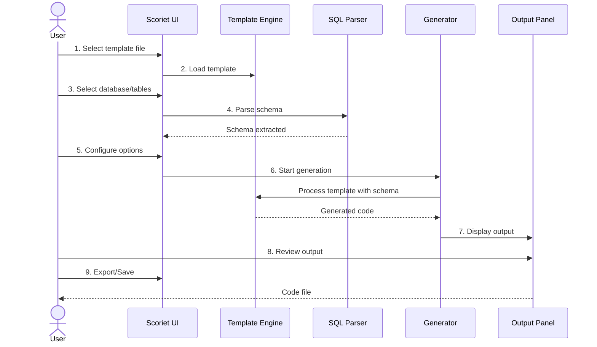
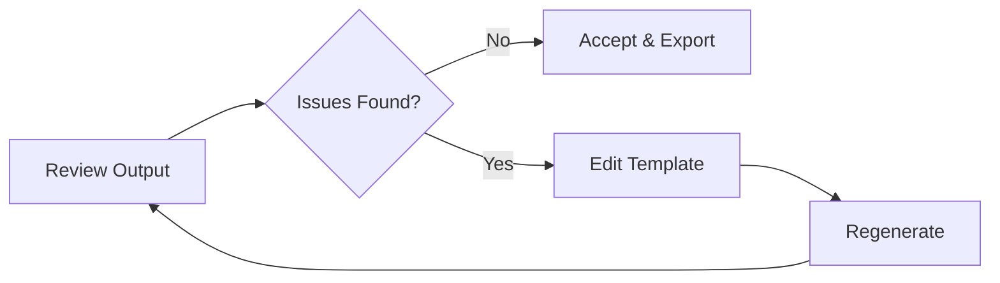

# Generation Workflow

This guide walks you through the complete step-by-step process of generating code in Scoriet — from selecting templates to exporting the final output.

## Workflow Overview

Code generation in Scoriet follows a clear, predictable workflow:



## Step 1: Launch Scoriet and Access Code Generator

Open Scoriet and navigate to the Code Generator section. You'll see the main generation interface with multiple panels:

```
<div class="screenshot-placeholder">Screenshot: Scoriet Code Generator main interface showing template selection, database connection, and configuration panels — <code>scoriet-codegen-main.png</code></div>
```

**What you'll see:**
- Left sidebar: Navigation panel with template library
- Top bar: Project, database, and language selectors
- Main panel: Template content editor
- Right sidebar: Output preview panel (after generation)

## Step 2: Select a Template File

Templates are the foundation of code generation. Select the template you want to use to generate code.

### Finding Templates

**In the left sidebar:**
1. Expand the **Templates** section
2. Browse available templates by category (Models, API, Database, etc.)
3. Click on a template name to preview it

### Template Preview

When you click a template, you'll see:
- **Template Name** — Descriptive name and file extension
- **Description** — What code this template generates
- **Content** — The actual template syntax (read-only preview)

### Common Templates

| Template | Generates | Best For |
|----------|-----------|----------|
| `Model.template` | Entity/Model classes | Object-oriented code |
| `Migration.template` | Database migrations | Schema changes |
| `APIController.template` | REST API endpoints | Web services |
| `Form.template` | HTML/CSS forms | Web UI generation |
| `Documentation.template` | API documentation | Project docs |
| `Repository.template` | Data access layer | ORM patterns |

:::tip
**New to code generation?** Start with simple templates like `Model.template` or `Entity.template`. These generate straightforward class definitions that are easy to validate.
:::

## Step 3: Select Database and Tables

Scoriet needs to know which database schema to use and which tables to generate code for.

### Select Database Connection

1. **Top Database Selector** — Choose connected database from dropdown
2. The database connection is persistent during your session

### Select Tables for Generation

You have two options:

#### Option A: Generate for All Tables
```
Generate all tables at once
→ Use if you want complete application generation
→ Output: Code for every table in sequence
```

#### Option B: Generate for Selected Tables
```
Select specific tables only
→ Use if you're focusing on a subset
→ Output: Code only for selected tables
```

**How to select tables:**
1. Click **Select Tables** button
2. Check boxes next to tables you want
3. Uncheck to deselect
4. Click **Apply Selection**

### Preview Selected Schema

Before generation, review the schema that will be used:

```
<div class="screenshot-placeholder">Screenshot: Database schema preview showing selected tables and their fields — <code>schema-preview.png</code></div>
```

## Step 4: Configure Generation Options

Fine-tune how code is generated using the options panel.

### Available Options

| Option | Description | Default | When to Change |
|--------|-------------|---------|-----------------|
| **Target Language** | Output language (PHP, Java, C#, JavaScript) | Project default | Multi-language projects |
| **Output Type** | Classes, interfaces, documentation, etc. | Template default | Different output formats |
| **Namespace/Package** | Root package/namespace for code | Project name | Different organizational structure |
| **Include Comments** | Add documentation comments to output | Enabled | Minimize output size |
| **Format Output** | Apply code formatting/indentation | Enabled | Raw output for post-processing |

### Configuration Panel

```
<div class="screenshot-placeholder">Screenshot: Generation options panel with language, output type, and formatting settings — <code>config-options.png</code></div>
```

**Typical configuration:**
- Language: Select target language (PHP, Java, C#, etc.)
- Output Type: Select desired output format
- Namespace: Set root package (usually `{:projectname:}`)
- Comments: Toggle on/off based on preference

:::info
**Options are template-dependent.** Different templates expose different configuration options. A PHP template may show namespace options, while a JavaScript template might show module type options.
:::

## Step 5: Review Template Before Generation

Always review the template before generation to catch issues early.

### Template Review Checklist

- [ ] Template syntax is correct (`{:...:}` markers)
- [ ] Loops are properly closed (`{:for:}...{:endfor:}`)
- [ ] Conditionals are complete (`{:if:}...{:endif:}`)
- [ ] File paths/names are correct
- [ ] Language-specific syntax is valid
- [ ] Special characters are escaped where needed

### Common Template Issues

| Issue | Fix |
|-------|-----|
| Trailing whitespace creating extra blank lines | Remove blank lines from template |
| Wrong case conversion applied | Update function: `{:pascalcase(...):}` |
| Missing loop end marker | Add `{:endfor:}` or `{:endif:}` |
| Escaped characters not showing correctly | Check escape syntax: `\{:...:}` |

:::caution
**Don't skip template review.** A small typo in the template will corrupt all generated code. Catching it now prevents wasted generation.
:::

## Step 6: Start Code Generation

Once template and options are configured, start the generation process.

### Initiate Generation

**Click the Generate button** in the main interface.

The system will:
1. Load the template file
2. Parse database schema
3. Process template syntax
4. Execute loops and conditionals
5. Run JavaScript code blocks (if any)
6. Combine output into final code
7. Display in output panel

**Progress indicator** shows generation status:
- "Parsing schema..." → Reading database
- "Processing template..." → Executing template syntax
- "Generating output..." → Creating code
- "Complete" → Ready to review

### Generation Speed

Typical generation times:
- **Simple templates** (< 100 lines): < 1 second
- **Complex templates** (loops + conditionals): 1-3 seconds
- **Large databases** (100+ tables, nested loops): 3-10 seconds

If generation takes > 30 seconds, review template for inefficient nested loops.

## Step 7: Review Generated Output

After generation completes, the output panel displays your generated code.

### Output Panel

```
<div class="screenshot-placeholder">Screenshot: Generated code displayed in output panel with syntax highlighting — <code>generated-output.png</code></div>
```

**Features:**
- **Syntax highlighting** — Color-coded for readability
- **Line numbers** — For reference and navigation
- **Scroll/search** — Find specific code sections
- **Copy button** — Copy entire output to clipboard

### Code Review Process

1. **Scan for obvious errors**
   - Missing braces, semicolons, syntax errors
   - Wrong field names or types
   - Unexpected blank lines or formatting

2. **Check generated content**
   - All tables/fields generated?
   - Correct case conversion (PascalCase, camelCase)?
   - Foreign key relationships correct?

3. **Validate logic**
   - Conditionals produced expected code?
   - Loop iterations complete?
   - JavaScript code blocks executed correctly?

### Example Review

```
Generated output shows:
✓ All 5 tables have models
✓ Field properties in correct case
✓ Foreign key relationships defined
✓ Proper indentation and formatting
✓ Comments included

Problem found:
✗ Field type "varchar" missing length constraint
→ Template needs update: {:item.length:} missing
```

:::tip
**First-time generation?** Generate for a single table first, review carefully, then batch-generate for all tables. This helps you validate the template quality before full generation.
:::

## Step 8: Fix and Regenerate (If Needed)

If output has issues, you don't need to start over — just fix the template and regenerate.

### Iteration Workflow



### Common Fixes

| Issue | Fix | Regen |
|-------|-----|-------|
| Wrong field order | Reorder loop in template | Quick |
| Missing validation | Add conditional logic | Quick |
| Incorrect type | Fix type mapping conditional | Quick |
| Namespace wrong | Update variable reference | Instant |
| Extra blank lines | Remove from template | Instant |

**Edit Template:**
1. Click **Edit Template** button
2. Modify template content
3. Save changes
4. Return to generation panel
5. Click **Regenerate**

**Regeneration is fast** — usually completes in under 1 second.

### Avoiding Common Regen Issues

:::caution
**When editing a template for regeneration:**

1. **Don't change loop structure mid-generation**
   - If loop is generating wrong number of items, fix it right, then regen
   - Don't try partial fixes

2. **Test edge cases**
   - Does template handle tables with 0 fields?
   - Does it handle tables with 100 fields?
   - Test with your actual database structure

3. **Validate after each change**
   - Edit one thing at a time
   - Regenerate and review
   - Don't make multiple changes before testing
:::

## Step 9: Export Generated Code

Once you're satisfied with the output, export it to a file.

### Export Options

#### Option 1: Copy to Clipboard

```
Click "Copy Output"
→ Entire generated code copied to system clipboard
→ Paste into editor: Ctrl+V / Cmd+V
```

Best for: Small outputs, quick testing

#### Option 2: Save to File

```
Click "Save to File"
→ Choose location and filename
→ Select file format (auto-detected from template)
→ Click Save
```

Best for: Creating permanent generated files

#### Option 3: Export as Template

```
Click "Export as Template"
→ Save generated code as a new reusable template
→ Name it (e.g., "Custom_Model_PHP.template")
→ Use in future projects
```

Best for: Creating project-specific templates

### File Naming

Use consistent naming conventions:

**Recommended:**
- `User.php` — Single model file per table
- `UserModel.php` — Clarifies it's a model
- `models/User.php` — Organized by subdirectory
- `User_2026_04_13.php` — Version with timestamp

**Avoid:**
- `generated.php` — Too generic
- `temp.php` — Sounds temporary
- `xxx.php` — Not descriptive

## Batch Generation Workflow

Generate code for multiple tables efficiently.

### Batch Generation Steps

1. **Select all tables** (or subset)
2. **Configure options once** (applies to all)
3. **Generate**
   - Output shows code for first table
   - Pagination/tabs show other tables
4. **Review all outputs** (one by one or all at once)
5. **Export each file**
   - Save individually
   - Or bulk export (if supported)

### Example: Generate All Models

**Scenario:** Generate Eloquent models for 15 tables

```
1. Template: "EloquentModel.template"
2. Tables: Select All (15 tables)
3. Options: 
   - Language: PHP
   - Namespace: App\Models
   - Include Comments: Yes
4. Generate
5. Review User model output → Looks good
6. Check Products model → Looks good
7. Export all models to models/ directory
```

### Batch Export Patterns

**Pattern 1: One File Per Table**
```
php/
├── User.php
├── Product.php
├── Order.php
└── Payment.php
```

**Pattern 2: Organized by Type**
```
app/
├── Models/
│   ├── User.php
│   ├── Product.php
│   ├── Order.php
│   └── Payment.php
├── Migrations/
│   ├── users_migration.php
│   ├── products_migration.php
│   └── orders_migration.php
└── Requests/
    ├── UserRequest.php
    ├── ProductRequest.php
    └── OrderRequest.php
```

:::tip
**Organize your exports.** If generating multiple file types (models, migrations, requests), create subdirectories before exporting. This keeps your project organized.
:::

## Advanced Workflows

### Workflow 1: Multi-Language Generation

Generate the same database for multiple target languages:

```
1. Select template: "Model.template"
2. Generate for PHP
   - Options → Language: PHP
   - Export to php/models/
3. Regenerate for Java
   - Options → Language: Java
   - Export to java/models/
4. Regenerate for C#
   - Options → Language: C#
   - Export to csharp/models/
```

All three versions now exist, generated from same template and schema.

### Workflow 2: Incremental Development

Start with basic templates, enhance as project grows:

```
Phase 1: Basic Models
→ Template: "SimpleModel.template"
→ Generate core entity models
→ Deploy and test

Phase 2: Add Validation
→ Template: "ModelWithValidation.template"
→ Update existing models with validation rules
→ Regenerate and export

Phase 3: Add Relationships
→ Template: "FullModel.template"
→ Now includes relationships and helpers
→ Final comprehensive models
```

### Workflow 3: Documentation Generation

Generate multiple documentation formats:

```
1. Generate API Docs
   - Template: "APIDocumentation.template"
   - Export to docs/api/

2. Generate DB Schema Docs
   - Template: "SchemaDocumentation.template"
   - Export to docs/schema/

3. Generate Model Docs
   - Template: "ModelDocumentation.template"
   - Export to docs/models/

→ Complete documentation suite
```

## Troubleshooting Generation Issues

### Issue: Generation Produces No Output

**Possible causes:**
1. Template has errors (missing endfor, endif)
2. Loop collection is empty
3. All conditions evaluate to false

**Solution:**
- Review template syntax
- Check loop markers are complete
- Use debug code blocks to verify schema structure

### Issue: Output Contains Literal {:...:} Markers

**Problem:** Template syntax not processed

**Cause:** Template file not recognized as template

**Solution:**
- Ensure file has correct extension (.template)
- Regenerate

### Issue: Generation Very Slow

**Possible causes:**
1. Large database with many tables (100+)
2. Deeply nested loops (3+ levels)
3. Complex JavaScript code blocks

**Solution:**
- Break into multiple smaller templates
- Reduce nesting depth
- Use JavaScript more efficiently (pre-compute values)

### Issue: Special Characters Corrupted

**Problem:** UTF-8 or special characters show as ???

**Cause:** Encoding mismatch

**Solution:**
- Ensure database connection uses UTF-8
- Regenerate

## Generation Best Practices

:::tip
**1. Start simple**
Generate for one table with a simple template first. Validate the output, then expand.

**2. Review before exporting**
Always review generated code before saving. Bugs found early are easy to fix.

**3. Keep templates modular**
Use small, focused templates that generate one thing well. Combine them for complex generation.

**4. Version your templates**
If you create custom templates, keep versions:
- `Model_v1.template`
- `Model_v2.template` (improved version)

**5. Document template purpose**
Add comments in templates explaining what they generate:
```
{:code:}
// This template generates Eloquent models for Laravel
// with relationships, timestamps, and fillable properties
{:codeend:}
```

**6. Test with sample data**
Before generating production code, test with a small sample database that has the expected structure.

**7. Post-process if needed**
Generated code doesn't need to be perfect. You can:
- Add custom logic afterward
- Refactor for style
- Optimize performance

**8. Regenerate confidently**
If you update the template, regenerate without fear. Generated code is meant to be replaced as template improves.
:::

## Complete End-to-End Example

### Scenario: Generate PHP Eloquent Models

**Step 1:** Select template → `templates/EloquentModel.template`

**Step 2:** Select database → `ecommerce_prod`

**Step 3:** Select tables → Users, Products, Orders, Payments (4 tables)

**Step 4:** Configure options
- Language: PHP
- Namespace: App\Models
- Include Comments: Yes
- Format Output: Yes

**Step 5:** Review template
- Looks good, syntax correct

**Step 6:** Generate
- Click Generate button
- Status: "Processing..." → "Complete"

**Step 7:** Review output
- Output 1: Users model
  ✓ All fields present
  ✓ Relationships to roles and orders
  ✓ Proper indentation
  
- Output 2: Products model
  ✓ All fields present
  ✓ Relationships correct
  
- Output 3: Orders model
  ✓ All fields present
  ✓ Foreign keys to users and products

**Step 8:** Minor fix needed
- Remove extra blank line after methods
- Edit template, remove blank line
- Regenerate (takes < 1 second)

**Step 9:** Export
- Save Users model to app/Models/User.php
- Save Products to app/Models/Product.php
- Save Orders to app/Models/Order.php
- Save Payments to app/Models/Payment.php

**Result:** 4 complete, fully functional Eloquent models ready to use in Laravel application.

---

**Next Steps:**
- Review all the reference sections: [Template Syntax](./template-syntax.md), [Loops](./loops.md), [Conditionals](./conditionals.md), [Functions](./functions.md), [JavaScript Blocks](./javascript-code-blocks.md), [Includes](./includes.md)
- Create your first template using the patterns you've learned
- Start small, test thoroughly, then expand
