# Code Generation Overview

Welcome to the Scoriet Code Generator — the heart of Scoriet. This powerful tool transforms your database schema into complete, production-ready code through intelligent template processing. Whether you're generating Entity models, API endpoints, database migrations, or documentation, Scoriet's template engine makes it simple, efficient, and consistent.

## What is Code Generation?

Code generation is the automated creation of source code based on a template and data. In Scoriet's case:

- **Template**: A text file containing placeholders, loops, and logic that define the *shape* of your output
- **Data**: Your database schema (tables, fields, relationships, constraints)
- **Output**: Generated code files ready to use in your application

```
┌─────────────────────────────────────────────────────────────────┐
│                    Code Generation Formula                       │
├─────────────────────────────────────────────────────────────────┤
│                                                                  │
│  Template (with placeholders)  +  Database Schema  =  Generated │
│                                                        Code Files│
│                                                                  │
│  "class {:pascalcase(item.name):} {" +  "users table"  =  "class │
│   public $id;                    +  "id, name,              │
│   public $name;                  +   email fields"      →  "Users │
│  }"                                                       class"  │
│                                                                  │
└─────────────────────────────────────────────────────────────────┘
```

### Why Use Code Generation?

- **Consistency**: All generated code follows the same patterns and conventions
- **Speed**: Generate hundreds of lines of code in seconds
- **Maintainability**: Update a template once, regenerate everywhere
- **Reduced Errors**: Eliminates manual, repetitive typing
- **Scalability**: Handle large databases with complex relationships effortlessly

## The Generation Pipeline

Scoriet processes code generation in a well-defined pipeline:

```mermaid
graph LR
    A["1. Load Template File"] --> B["2. Parse Database Schema"]
    B --> C["3. Process Template Syntax"]
    C --> D["4. Execute Loops & Conditionals"]
    D --> E["5. Run JavaScript Code Blocks"]
    E --> F["6. Generate Output String"]
    F --> G["7. Format & Export Code"]
    
    style A fill:#e1f5ff
    style B fill:#e1f5ff
    style C fill:#fff3e0
    style D fill:#fff3e0
    style E fill:#f3e5f5
    style F fill:#c8e6c9
    style G fill:#c8e6c9
```



### Pipeline Stages Explained

#### 1. Load Template File
The template file is read from your project's template library. Templates are plain text files with a `.template` or custom extension.

#### 2. Parse Database Schema
Scoriet analyzes your connected database, extracting:
- Table names and relationships
- Field names, types, and constraints
- Primary keys, unique keys, foreign keys
- Data lengths, defaults, nullability

#### 3. Process Template Syntax
The template engine scans for Scoriet's special `{:...:}` markers and identifies:
- System variables like `{:projectname:}` and `{:tablename:}`
- Loop constructs like `{:for nmaxitems:}...{:endfor:}`
- Conditional blocks like `{:if item.type=="int":}...{:endif:}`

#### 4. Execute Loops & Conditionals
For each loop, Scoriet iterates through the corresponding data set (fields, tables, constraints) and processes the loop body. Conditionals evaluate based on item properties.

#### 5. Run JavaScript Code Blocks
Advanced templates can include `{:code:}...{:codeend:}` blocks that execute custom JavaScript logic, with full access to the database schema through the `gtree` object.

#### 6. Generate Output String
All processed template syntax produces the final output string — your generated code.

#### 7. Format & Export Code
The output is formatted with proper indentation, saved to a file, and displayed for review before export.

## Template Complexity Levels

Scoriet templates range from simple to powerful. Choose the right complexity for your needs:

### Level 1: Simple Replacements (Beginner)

Use only system variables and static text. Perfect for straightforward output like file headers.

```
Project: {:projectname:}
Database: {:projectdatabase:}
Generated: 2026-04-13
```

**Output:**
```
Project: MyEcommerceApp
Database: ecommerce_db
Generated: 2026-04-13
```

### Level 2: Loops (Intermediate)

Add loop constructs to iterate over fields and tables. Most code generation uses this level.

```
{:for nmaxitems:}public $item.name:};
{:endfor:}
```

**Output:**
```
public $id;
public $username;
public $email;
public $created_at;
```

### Level 3: Conditionals (Advanced)

Combine loops with conditionals to generate different code based on field properties.

```
{:for nmaxitems:}
{:if item.type=="varchar":}
  public string $item.name:};
{:else:}
  public int $item.name:};
{:endif:}
{:endfor:}
```

**Output:**
```
public string $username;
public int $age;
public string $email;
public int $user_id;
```

### Level 4: Advanced with JavaScript (Expert)

Use `{:code:}...{:codeend:}` blocks to write custom JavaScript logic for complex generation scenarios.

```
{:code:}
  let output = "";
  for (let i = 0; i < gtree.tables.length; i++) {
    let table = gtree.tables[i];
    output += "Table: " + table.tablename + "\n";
    output += "  Fields: " + table.fields.length + "\n";
  }
  return output;
{:codeend:}
```

This unlocks unlimited generation possibilities — switch statements, conditional schemas, dynamic documentation.

## Quick Decision Guide

:::tip
**Which complexity level should I use?**

1. **Simple headers/metadata** → Level 1 (Variables only)
2. **Database entity classes** → Level 2 (Loops)
3. **Validation rules, type-specific code** → Level 3 (Conditionals)
4. **SQL builders, complex logic** → Level 4 (JavaScript)
:::

## System Variables: Your Data Anchors

Throughout your template, you access context information via system variables. These tell you:
- What project and database you're working with
- What table is currently being processed
- How many fields/tables/files exist

Common system variables:

| Variable | Type | Example | Use Case |
|----------|------|---------|----------|
| `{:projectname:}` | String | "MyApp" | Class names, headers |
| `{:projectid:}` | String | "123abc" | Config identifiers |
| `{:projectdatabase:}` | String | "myapp_db" | Connection strings |
| `{:tablename:}` | String | "users" | Table references |
| `{:filename:}` | String | "UserModel.php" | File naming |
| `{:nmaxitems:}` | Integer | 5 | Count of fields in current table |
| `{:nmaxfiles:}` | Integer | 12 | Total table count |
| `{:defaultlanguage:}` | String | "PHP" | Output language |

:::info
**System variables are context-aware.** Inside a loop over tables, `{:nmaxitems:}` changes to reflect the field count of the *current table*. Outside the loop, it refers to the first table's field count.
:::

## The Item Object: Field Properties

When looping over fields with `{:for nmaxitems:}`, each field is represented as `item` with rich properties:

```
item.name          → "user_id"
item.type          → "bigint"
item.controltype   → "TextField"
item.caption       → "User ID"
item.isprimarykey  → true
item.isnullable    → false
item.linktable     → "users"
item.linkfield     → "id"
```

Understanding these properties is crucial for conditional generation. See [Conditionals](./conditionals.md) for details.

## Escaping Scoriet Syntax

Sometimes you need to output literal `{:....:}` text without triggering Scoriet processing. Use a backslash to escape:

```
Template:
Output literal: \{:projectname:}

Generated Output:
Output literal: {:projectname:}
```

This is useful when generating template files themselves, or documentation about Scoriet!

## Whitespace and Formatting

Scoriet preserves whitespace in templates. This is intentional — you have full control over indentation and line breaks in your output.

:::caution
**Common whitespace issue:** Extra blank lines in your template create extra blank lines in output.

```
Template:
public function create() {

}

Generated:
public function create() {

}
```

If you don't want blank lines, don't put them in the template!
:::

## Next Steps

Ready to write your first template? Dive into these sections:

1. **[Template Syntax Reference](./template-syntax.md)** — Complete guide to all `{:...:}` markers
2. **[Loops and Iteration](./loops.md)** — Master loop constructs and nested iteration
3. **[Conditionals](./conditionals.md)** — Add logic to your templates
4. **[Built-in Functions](./functions.md)** — Transform text (PascalCase, pluralize, etc.)
5. **[JavaScript Code Blocks](./javascript-code-blocks.md)** — Advanced generation with full control

Or jump to practical examples in **[Generation Workflow](./generation-workflow.md)** to see it all in action.

:::note
**Pro Tip:** Start simple. Build templates incrementally, testing after each feature you add. Once you master Level 2 (loops), adding conditionals becomes natural. Save JavaScript code blocks for when you truly need their power — most projects succeed with loops and conditionals alone.
:::
