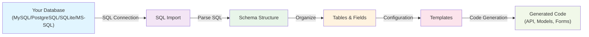

# Database Management Overview

Welcome to Scoriet's Database Management section. In Scoriet, database management refers to the process of importing and organizing your database schemas—the structural blueprint of your applications. This is **not** about managing Scoriet's own internal database, but rather about working with the databases of the applications you're building.

## Understanding Database Schemas in Scoriet

When you work with Scoriet, you're building a code generator that understands your project's data structure. To do this effectively, Scoriet needs to know about:

- **Tables**: The main data structures in your database
- **Fields**: Individual columns with specific data types
- **Constraints**: Rules that ensure data integrity (primary keys, unique constraints, etc.)
- **Relationships**: How tables connect to each other through foreign keys
- **Indexes**: Performance optimizations for faster queries

Once Scoriet understands your database schema, it can intelligently generate:
- Database access layers
- API endpoints
- Form validation rules
- Data models and classes
- Complete CRUD operations

:::tip
Think of schema management in Scoriet as teaching the code generator what your database looks like, so it can automate all the repetitive code that talks to it.
:::

## Supported Databases

Scoriet works with a wide variety of database systems, giving you flexibility in your technology choices:

| Database | Support Level | Notes |
|----------|---------------|-------|
| MySQL | ✅ Full Support | Most widely used, fully tested |
| PostgreSQL | ✅ Full Support | Advanced features supported |
| SQLite | ✅ Full Support | Perfect for development and embedded use |
| MS-SQL Server | ✅ Full Support | Enterprise SQL Server support |

Each database has its own SQL dialect and specific features, but Scoriet handles the differences transparently, allowing you to generate consistent code across different database platforms.

## How Database Workflow Works

Here's the typical workflow for working with databases in Scoriet:

The process works in these stages:

1. **Import**: Connect to your database or paste SQL statements
2. **Parse**: Scoriet analyzes the schema structure
3. **Organize**: View and refine your tables and fields in the Schema Explorer
4. **Configure**: Set properties like control types for form generation
5. **Generate**: Use templates to create code based on your schema

## Getting Started

The Database section guides you through:

- **[Connecting a Database](./connect-database.md)**: How to add connections to your databases
- **[Schema Explorer](./schema-explorer.md)**: Navigating and viewing your database structure
- **[Importing SQL Schemas](./sql-import.md)**: Loading SQL CREATE statements
- **[Field Properties](./field-properties.md)**: Understanding and configuring field attributes

:::info
Each database connection is independent, allowing you to work with multiple databases in a single Scoriet project.
:::

## Key Concepts

### Schema
A schema is the complete structural definition of your database—all tables, fields, relationships, and constraints organized together.

### Field Properties
Beyond basic data types, fields in Scoriet have extended properties like `controlType` (how they appear in forms) and `caption` (human-readable labels) that guide code generation.

### Smart Code Generation
Because Scoriet understands your complete schema, it can generate context-aware code. For example, it knows that an email field should probably use an email input type, or that a `user_id` field likely references the Users table.

## What's Next?

Ready to start? Head to the next section to learn how to [connect your first database](./connect-database.md)!

:::caution
Always ensure you have proper backups of your database before working with schema imports, especially when modifying field properties that will affect code generation.
:::
