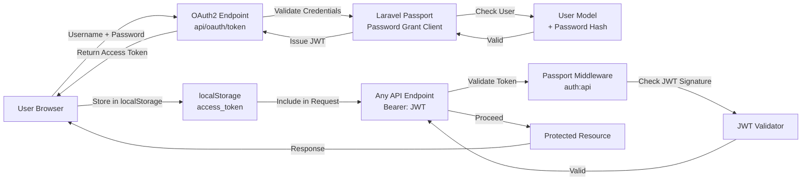

# Authentication & Authorization

Scoriet implements a production-grade authentication system using OAuth2 with Laravel Passport. This document explains how users authenticate, how tokens work, and how permissions are enforced.

## Authentication Overview

Scoriet uses **OAuth2 Password Grant Flow** for user authentication. This approach combines the security of OAuth2 with the simplicity of traditional username/password login, making it ideal for desktop-like applications.

### Key Principles

1. **Stateless Authentication**: No server-side sessions; security relies on JWT tokens
2. **Token-Based API**: All API requests authenticated via Bearer tokens
3. **Secure Token Storage**: JWT tokens stored in browser localStorage
4. **Automatic Refresh**: Tokens automatically refresh before expiration
5. **Role-Based Access Control**: Users have roles with specific permissions

## Architecture Diagram



## OAuth2 Password Grant Flow


*OAuth2 login dialog with email/password authentication and session management*

### Step 1: User Registration

Users can create accounts through the registration endpoint.

**Endpoint**: `POST /api/auth/register`

```javascript
// Frontend (React)
const register = async (email, password, name) => {
  const response = await fetch('/api/auth/register', {
    method: 'POST',
    headers: { 'Content-Type': 'application/json' },
    body: JSON.stringify({ email, password, name })
  });
  return response.json();
};
```

**Backend Validation**:
- Email uniqueness check
- Password strength validation (minimum requirements)
- Encrypted password storage using bcrypt

### Step 2: User Login (OAuth2 Password Grant)

When a user logs in, the frontend exchanges credentials for an access token.

**Endpoint**: `POST /api/oauth/token`

```javascript
// Frontend (React)
const login = async (email, password) => {
  const response = await fetch('/api/oauth/token', {
    method: 'POST',
    headers: { 'Content-Type': 'application/json' },
    body: JSON.stringify({
      grant_type: 'password',
      client_id: process.env.VITE_PASSPORT_CLIENT_ID,
      client_secret: process.env.VITE_PASSPORT_CLIENT_SECRET,
      username: email,
      password: password,
      scope: '*'
    })
  });
  
  const data = await response.json();
  // Store tokens
  localStorage.setItem('access_token', data.access_token);
  localStorage.setItem('refresh_token', data.refresh_token);
  localStorage.setItem('expires_in', data.expires_in);
  
  return data;
};
```

**Backend Process** (in Laravel Passport):
1. Validate client credentials (client_id and client_secret)
2. Check if grant_type is 'password'
3. Look up user by username (email)
4. Verify password against bcrypt hash
5. Issue JWT access token (valid 1 hour by default)
6. Issue refresh token (valid 1 month by default)

**Response Format**:
```json
{
  "token_type": "Bearer",
  "expires_in": 3600,
  "access_token": "eyJ0eXAiOiJKV1QiLCJhbGc...",
  "refresh_token": "def50200abcdef123..."
}
```

### Step 3: Making Authenticated Requests

All API requests include the access token in the Authorization header.

```javascript
// Frontend (React)
const apiCall = async (endpoint, options = {}) => {
  const token = localStorage.getItem('access_token');
  
  const response = await fetch(endpoint, {
    ...options,
    headers: {
      ...options.headers,
      'Authorization': `Bearer ${token}`,
      'Content-Type': 'application/json'
    }
  });
  
  if (response.status === 401) {
    // Token expired, refresh it
    await refreshToken();
    return apiCall(endpoint, options); // Retry
  }
  
  return response.json();
};
```

**Backend Verification** (auth:api Middleware):
```php
// Laravel Middleware
Route::middleware('auth:api')->group(function () {
    Route::get('/user', function (Request $request) {
        return $request->user();
    });
});
```

The middleware:
1. Extracts JWT from Authorization header
2. Validates JWT signature using Passport key
3. Checks token expiration time
4. Loads associated User model
5. Makes user available via `auth()->user()`

### Step 4: Token Refresh

Before the access token expires, the frontend can use the refresh token to get a new access token without requiring the user to log in again.

```javascript
// Frontend (React)
const refreshToken = async () => {
  const refresh_token = localStorage.getItem('refresh_token');
  
  const response = await fetch('/api/oauth/token', {
    method: 'POST',
    headers: { 'Content-Type': 'application/json' },
    body: JSON.stringify({
      grant_type: 'refresh_token',
      client_id: process.env.VITE_PASSPORT_CLIENT_ID,
      client_secret: process.env.VITE_PASSPORT_CLIENT_SECRET,
      refresh_token: refresh_token,
      scope: '*'
    })
  });
  
  const data = await response.json();
  localStorage.setItem('access_token', data.access_token);
  localStorage.setItem('refresh_token', data.refresh_token);
  localStorage.setItem('expires_in', data.expires_in);
};
```

### Step 5: User Logout

Logout removes tokens from the client. The server doesn't maintain a blacklist; expired tokens are automatically invalid.

```javascript
// Frontend (React)
const logout = async () => {
  localStorage.removeItem('access_token');
  localStorage.removeItem('refresh_token');
  localStorage.removeItem('expires_in');
  // Redirect to login page
  window.location.href = '/login';
};
```

## JWT Token Structure

JWT tokens consist of three parts separated by dots: `header.payload.signature`

### Header
```json
{
  "typ": "JWT",
  "alg": "RS256"
}
```

### Payload
```json
{
  "aud": "passport_client_id",
  "iss": "https://scoriet.example.com",
  "jti": "unique_token_id",
  "iat": 1705324800,
  "exp": 1705328400,
  "nbf": 1705324800,
  "sub": "user_id_123",
  "scope": "*"
}
```

**Key Fields**:
- `sub`: Subject (user ID)
- `iat`: Issued at (timestamp)
- `exp`: Expiration time (timestamp)
- `aud`: Audience (client ID)
- `scope`: Granted scopes (permissions)

### Signature
```
HMACSHA256(
  base64UrlEncode(header) + "." +
  base64UrlEncode(payload),
  secret_key
)
```

The signature is generated using a secret key that only the server knows. This ensures tokens cannot be forged or modified by clients.

## Environment Configuration

### Required Environment Variables

```env
# OAuth2 Passport Configuration
PASSPORT_PERSONAL_ACCESS_CLIENT_ID=your_personal_client_id
PASSPORT_PERSONAL_ACCESS_CLIENT_SECRET=your_personal_client_secret
PASSPORT_PASSWORD_GRANT_CLIENT_ID=your_password_grant_client_id
PASSPORT_PASSWORD_GRANT_CLIENT_SECRET=your_password_grant_client_secret

# Frontend OAuth Configuration
VITE_PASSPORT_CLIENT_ID=your_password_grant_client_id
VITE_PASSPORT_CLIENT_SECRET=your_password_grant_client_secret

# Token Configuration
SESSION_DRIVER=database
SESSION_LIFETIME=60

# API Authentication
API_GUARD=passport
```

### Setup Instructions

Generate OAuth2 clients during installation:

```bash
# Generate encryption key
php artisan key:generate

# Create OAuth2 clients
php artisan passport:install

# Output will show:
# Personal access client created successfully.
# Client ID: 1
# Client secret: xxxxx

# Password grant client created successfully.
# Client ID: 2
# Client secret: xxxxx
```

Copy the password grant client credentials to `.env`:
```env
VITE_PASSPORT_CLIENT_ID=2
VITE_PASSPORT_CLIENT_SECRET=xxxxx
```

## User Model Configuration

The User model must use the `HasApiTokens` trait:

```php
// app/Models/User.php
<?php

namespace App\Models;

use Laravel\Passport\HasApiTokens;
use Illuminate\Foundation\Auth\User as Authenticatable;

class User extends Authenticatable
{
    use HasApiTokens;

    protected $fillable = [
        'name',
        'email',
        'password',
    ];

    protected $hidden = [
        'password',
        'remember_token',
    ];

    protected function casts(): array
    {
        return [
            'email_verified_at' => 'datetime',
            'password' => 'hashed',
        ];
    }
}
```

## Passport Configuration

In `app/Providers/AppServiceProvider.php`:

```php
<?php

namespace App\Providers;

use Laravel\Passport\Passport;
use Illuminate\Support\ServiceProvider;

class AppServiceProvider extends ServiceProvider
{
    public function boot(): void
    {
        // Enable password grant for Scoriet
        Passport::enablePasswordGrant();

        // Configure token lifetimes
        Passport::tokensExpireIn(now()->addHours(1));
        Passport::refreshTokensExpireIn(now()->addDays(30));

        // Configure scopes
        Passport::scopes([
            'read' => 'Read resources',
            'write' => 'Write resources',
            'admin' => 'Administrative access',
        ]);
    }
}
```

## Authorization & Permissions

### User Roles

Scoriet uses role-based access control. Users can have multiple roles:

| Role | Permissions | Use Case |
|------|------------|----------|
| `user` | Create generators, templates, projects | Standard user |
| `developer` | + API key management | API consumers |
| `admin` | + User management, billing, system config | Team administrators |
| `super_admin` | All permissions | Platform administrators |

### Role Assignment

```php
// Assign role to user
$user->assignRole('developer');

// Check role
if ($user->hasRole('admin')) {
    // Admin-only operations
}

// Check permission
if ($user->can('create', Generator::class)) {
    // Can create generators
}
```

### Policy-Based Authorization

Scoriet uses Laravel Policies for resource authorization:

```php
// app/Policies/GeneratorPolicy.php
<?php

namespace App\Policies;

use App\Models\User;
use App\Models\Generator;

class GeneratorPolicy
{
    public function view(User $user, Generator $generator): bool
    {
        // User can view their own generators
        return $generator->user_id === $user->id ||
               $generator->team_id === $user->current_team_id;
    }

    public function update(User $user, Generator $generator): bool
    {
        return $this->view($user, $generator) && 
               $user->hasRole('admin');
    }

    public function delete(User $user, Generator $generator): bool
    {
        return $generator->user_id === $user->id && 
               $user->hasRole('admin');
    }
}
```

**Usage in Controllers**:
```php
// app/Http/Controllers/Api/GeneratorController.php
public function update(Request $request, Generator $generator)
{
    $this->authorize('update', $generator);
    
    // Authorized, proceed with update
    $generator->update($request->validated());
    
    return response()->json($generator);
}
```

### Team-Based Access Control

Users can belong to multiple teams. Resources are scoped to teams:

```php
// Get generators for current team
$generators = Generator::where('team_id', auth()->user()->current_team_id)->get();

// Check team membership
if (!auth()->user()->belongsToTeam($team)) {
    abort(403, 'Unauthorized');
}
```

## API Token Management

For server-to-server or headless access, users can create personal API tokens:

**Endpoint**: `POST /api/api-tokens`

```javascript
const createApiToken = async (tokenName) => {
  const response = await fetch('/api/api-tokens', {
    method: 'POST',
    headers: {
      'Authorization': `Bearer ${accessToken}`,
      'Content-Type': 'application/json'
    },
    body: JSON.stringify({ name: tokenName })
  });
  
  const data = await response.json();
  return data.plainTextToken; // Only shown once!
};
```

**Using API Tokens**:
```bash
curl -H "Authorization: Bearer your-api-token" \
     https://scoriet.example.com/api/generators
```

## Security Best Practices

### Frontend Security
1. **Never expose client secret** in frontend code (it's only used server-to-server)
2. **Validate tokens before using** (check expiration time)
3. **Handle 401 responses** by refreshing token and retrying
4. **Clear tokens on logout** from localStorage
5. **Use HTTPS only** in production (tokens sent in headers)

### Backend Security
1. **Validate all tokens** on every protected request
2. **Check token expiration** in addition to signature
3. **Never log sensitive token data** in production logs
4. **Implement rate limiting** on auth endpoints
5. **Monitor suspicious authentication patterns** (brute force)

### Token Security
1. **Short token lifetime** (1 hour default)
2. **Separate refresh tokens** with longer lifetime
3. **Secure token storage** (never in URL parameters)
4. **HTTPS transport** (prevents token interception)
5. **Token rotation** on privilege escalation

## Troubleshooting Authentication

### Common Issues

**Problem**: "Unauthenticated" (401) on API requests

**Solutions**:
```javascript
// 1. Check token exists
const token = localStorage.getItem('access_token');
if (!token) redirect to login;

// 2. Check token not expired
const expiresIn = localStorage.getItem('expires_in');
const issuedAt = localStorage.getItem('issued_at');
if (Date.now() - issuedAt > expiresIn * 1000) {
  await refreshToken();
}

// 3. Check header format
// Wrong: Authorization: JWT token
// Correct: Authorization: Bearer token
```

**Problem**: OAuth token endpoint returns 400

**Check**:
```php
// 1. Verify client credentials in .env
VITE_PASSPORT_CLIENT_ID=correct_client_id
VITE_PASSPORT_CLIENT_SECRET=correct_secret

// 2. Run migrations
php artisan migrate

// 3. Recreate OAuth clients
php artisan passport:install

// 4. Verify User model has HasApiTokens trait
use Laravel\Passport\HasApiTokens;
class User extends Authenticatable {
    use HasApiTokens;
}
```

**Problem**: "Token is invalid" after deployment

**Causes**:
- Encryption keys changed (app key rotated)
- Passport keys regenerated
- Database migrated without client data

**Solution**:
```bash
# Backup old keys
cp storage/oauth-public.key storage/oauth-public.key.bak
cp storage/oauth-private.key storage/oauth-private.key.bak

# Regenerate clients
php artisan passport:install
```

## Password Reset Flow

### Step 1: User Requests Password Reset

**Endpoint**: `POST /api/auth/forgot-password`

```javascript
const requestPasswordReset = async (email) => {
  const response = await fetch('/api/auth/forgot-password', {
    method: 'POST',
    headers: { 'Content-Type': 'application/json' },
    body: JSON.stringify({ email })
  });
  return response.json();
};
```

Backend sends reset token via email.

### Step 2: User Clicks Email Link

Email contains link: `https://scoriet.example.com/reset-password?token=xxxxx&email=user@example.com`

### Step 3: User Submits New Password

**Endpoint**: `POST /api/auth/reset-password`

```javascript
const resetPassword = async (token, email, password) => {
  const response = await fetch('/api/auth/reset-password', {
    method: 'POST',
    headers: { 'Content-Type': 'application/json' },
    body: JSON.stringify({ token, email, password })
  });
  return response.json();
};
```

Backend verifies token, hashes password, sends confirmation email.

## Session Invalidation

### Logout from All Devices

Clear all user sessions:

**Endpoint**: `POST /api/logout-all-devices`

```php
// app/Http/Controllers/Auth/LogoutController.php
public function logoutAllDevices(Request $request)
{
    // Revoke all tokens
    $request->user()->tokens->each(function ($token) {
        $token->revoke();
    });

    return response()->json(['message' => 'Logged out from all devices']);
}
```

## Audit Logging

Track authentication events for security monitoring:

```php
// Log authentication
auth()->user()->tokens()->create([
    'name' => 'Login at ' . now(),
    'event' => 'login',
    'ip_address' => request()->ip(),
    'user_agent' => request()->header('User-Agent'),
]);

// Query audit log
$logs = auth()->user()->tokens()->latest()->get();
```

## Integration with Laravel Sanctum (Alternative)

For a lighter-weight alternative to Passport, Laravel Sanctum can be used:

**Installation**:
```bash
php artisan vendor:publish --provider="Laravel\Sanctum\SanctumServiceProvider"
php artisan migrate
```

**Configuration** (app/Models/User.php):
```php
use Laravel\Sanctum\HasApiTokens;

class User extends Authenticatable
{
    use HasApiTokens;
}
```

**Token issuance**:
```php
$token = $user->createToken('auth-token')->plainTextToken;
```

---

**Scoriet's authentication system is battle-tested and secure.** It balances industry best practices with ease of development and deployment.

For more details on implementation, see the [Project Structure](./project-structure.md) document showing where authentication code lives, or check the [Architecture Overview](./overview.md) for how authentication fits into the larger system.
