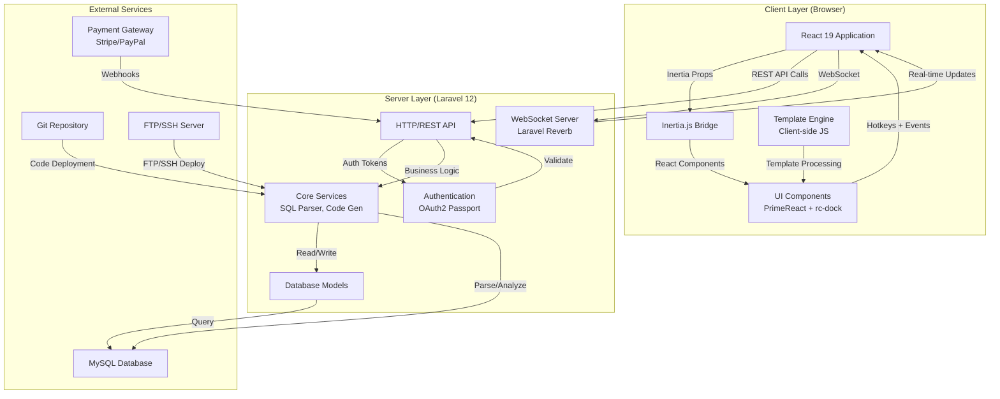
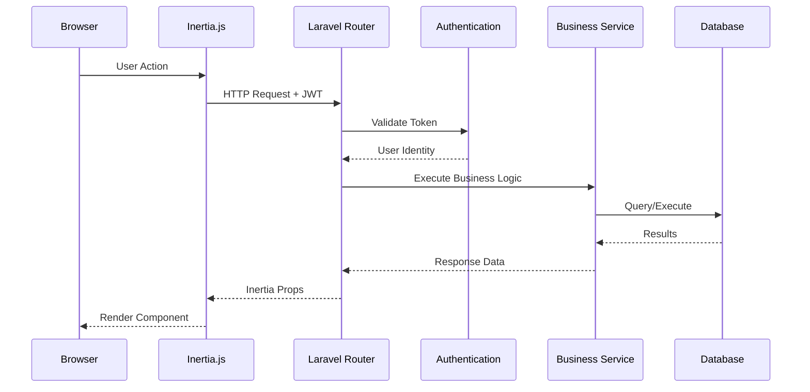
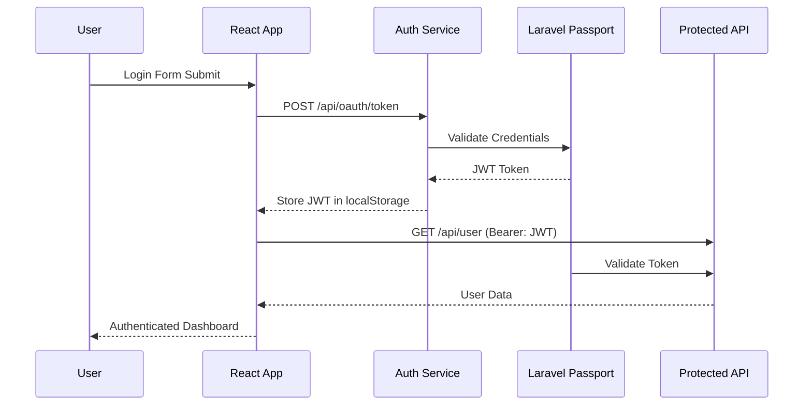

# Architecture Overview

Scoriet is a sophisticated enterprise SaaS platform built with a modern full-stack architecture. This document provides a high-level view of how all components work together.

## System Architecture Diagram



## Core Architecture Principles

### 1. **Monolithic with Separation of Concerns**
Scoriet uses a monolithic architecture pattern that combines Laravel and React:
- **Single Codebase**: Backend and frontend code live in the same repository
- **Inertia.js Bridge**: Seamlessly passes data from Laravel to React without API serialization
- **Clear Boundaries**: Each layer has distinct responsibilities and minimal coupling

### 2. **Multi-Document Interface (MDI)**
The frontend uses rc-dock to provide a professional MDI workspace:
- **57 Lazy-Loaded Panels**: Each panel is loaded on-demand using React.lazy()
- **Floating & Docking**: Panels can be arranged as floating windows or docked to workspace edges
- **Persistent Layout**: Workspace arrangement is saved and restored between sessions
- **Hotkey Navigation**: Alt+key combinations for rapid access to common operations


*The MDI (Multi-Document Interface) with navigation tree, dock panels, and tabbed content area*

### 3. **OAuth2 Authentication**
Security is implemented through a robust OAuth2 flow:
- **Laravel Passport**: Manages OAuth2 token lifecycle
- **Password Grant Flow**: Desktop-style authentication for Scoriet users
- **JWT Tokens**: Stored in localStorage with automatic refresh
- **API Protection**: All `/api/*` routes require Bearer token authentication

### 4. **Real-Time Communication**
WebSocket support via Laravel Reverb enables:
- **Live Notifications**: Instant updates across all user sessions
- **Team Messaging**: Real-time chat and collaboration features
- **Broadcast Events**: Changes sync across all connected clients
- **Presence Awareness**: See who else is online and active

## Request Flow

### Typical API Request Cycle



### Authentication Flow



## Component Hierarchy

### Backend Components

```
app/
├── Http/
│   ├── Controllers/
│   │   ├── Auth/              # Authentication endpoints
│   │   ├── Api/               # Main API controllers
│   │   ├── Admin/             # Admin panel operations
│   │   ├── Settings/          # User settings
│   │   ├── Cli/               # Command-line operations
│   │   └── Traits/            # Reusable controller logic
│   └── Middleware/            # Auth, CORS, etc.
├── Services/
│   ├── MySQLParser.php        # Database schema parsing
│   ├── CodeGeneratorService.php
│   ├── TemplateEngineService.php
│   └── ...
├── Models/
│   ├── User.php               # User with Passport traits
│   ├── Team.php               # Team management
│   ├── Generator.php          # Code generator definitions
│   ├── Template.php           # Code templates
│   └── ...
└── Providers/
    └── AppServiceProvider.php # Passport configuration
```

### Frontend Components

```
resources/js/
├── pages/
│   └── Index.tsx              # Main MDI workspace layout
├── Components/
│   ├── Panels/                # 57 lazy-loaded panel components
│   │   ├── NavigationPanel.tsx
│   │   ├── PanelT1.tsx        # Sidebar/tree view
│   │   ├── PanelT2.tsx        # Main content area
│   │   ├── PanelT5.tsx        # Database explorer
│   │   └── ...
│   ├── Modals/                # Dialog components
│   ├── Common/                # Reusable components
│   ├── AuthModals/            # Login, register, etc.
│   └── Utils/                 # Helper components
└── app.tsx                    # Inertia entry point
```

## Data Flow Patterns

### 1. **CRUD Operations**
```
User Action → React Component → HTTP Request → Controller → Service → Database → Response → Update State
```

### 2. **Template Processing**
```
Parse Database Schema → Build AST → Load Template → Execute JavaScript → Generate Code → Preview/Download
```

### 3. **Real-Time Updates**
```
Action on Server → Broadcast Event → WebSocket → Browser Receives Update → Update State → UI Refresh
```

## Performance Optimizations

### Frontend
- **Lazy Loading**: Panels loaded on-demand with React.lazy()
- **Code Splitting**: Vite automatically splits code by route
- **Memoization**: Components use React.memo() to prevent unnecessary re-renders
- **Virtual Scrolling**: Large lists use virtualization
- **Asset Caching**: Service worker caching for offline capability

### Backend
- **Database Indexing**: Strategic indexes on frequently queried columns
- **Eager Loading**: Prevents N+1 query problems
- **Caching Layer**: Redis for session and data caching
- **Queue Processing**: Long operations delegated to job queue
- **API Response Compression**: Gzip compression for all responses

## Scalability Considerations

### Horizontal Scaling
- **Stateless API**: Servers can be added horizontally
- **Session Storage**: Uses database-backed sessions (shareable)
- **WebSocket Broadcasting**: Reverb supports multiple server instances
- **Database Read Replicas**: Query scaling via replication

### Vertical Scaling
- **Resource Management**: Configurable job queue workers
- **Memory Optimization**: Streaming for large file operations
- **Connection Pooling**: Efficient database connection management

## Security Architecture

### Authentication & Authorization
- **OAuth2 Standard**: Follows RFC 6749 password grant specification
- **Token Validation**: Every API request validates Bearer token
- **Refresh Tokens**: Automatic token refresh prevents session expiration
- **User Roles**: RBAC (Role-Based Access Control) for features and resources

### Data Protection
- **HTTPS/TLS**: Encrypted transport for all communications
- **CORS Policy**: Restricts cross-origin requests
- **CSRF Protection**: Token-based request verification
- **Input Validation**: Server-side validation of all inputs
- **SQL Injection Prevention**: Parameterized queries via Eloquent ORM

### API Security
- **Rate Limiting**: Prevents abuse and brute-force attacks
- **API Versioning**: Backward compatibility management
- **Audit Logging**: Tracks all significant actions
- **IP Whitelisting**: Optional for self-hosted deployments

## Deployment Architecture

### Development Environment
- Local Laravel dev server (port 8000)
- Vite dev server with hot module replacement (port 5173)
- Local MySQL database
- All-in-one command: `composer run dev`

### Production Environment
- Laravel application server (Apache/Nginx)
- Vite static asset build
- CDN for static assets
- Managed database service (RDS, etc.)
- Redis for caching and sessions
- Queue workers for background jobs

## External Integrations

### Payment Processing
- **Stripe**: Credit card processing, subscriptions, webhooks
- **PayPal**: Alternative payment method
- **Webhook Handlers**: Automatically sync payment status

### Deployment Targets
- **Git Integration**: Push generated code to repositories
- **FTP/SFTP**: Direct file upload to web servers
- **SSH**: Remote command execution for advanced deployments

### Database Support
- **MySQL**: Primary database (fully supported)
- **PostgreSQL**: Full parser support
- **MSSQL**: Enterprise SQL Server support
- **SQLite**: Development and embedded support
- **Firebird**: Legacy system support

## Key Architectural Decisions

| Decision | Rationale |
|----------|-----------|
| Monolithic over Microservices | Simpler deployment, easier development, tight coupling justified for SaaS |
| Client-side Template Processing | Security, performance, offline capability |
| rc-dock MDI Interface | Professional workspace experience, multi-panel productivity |
| Inertia.js Bridge | Single codebase simplicity, Laravel template rendering, minimal API overhead |
| OAuth2 Passport | Industry standard, secure, supports multiple authentication flows |
| Laravel Reverb WebSockets | Native Laravel integration, real-time capabilities, simpler deployment |

## Next Steps

- Learn about the [Technology Stack](./tech-stack.md) and specific tool versions
- Explore the [Project Structure](./project-structure.md) directory layout
- Understand the [Authentication System](./authentication.md) in detail
- Check the [Installation Guide](../development/setup.md) for setup instructions

---

**Scoriet's architecture is designed for scale, security, and developer productivity.** Every component choice prioritizes long-term maintainability and real-world operational requirements.
