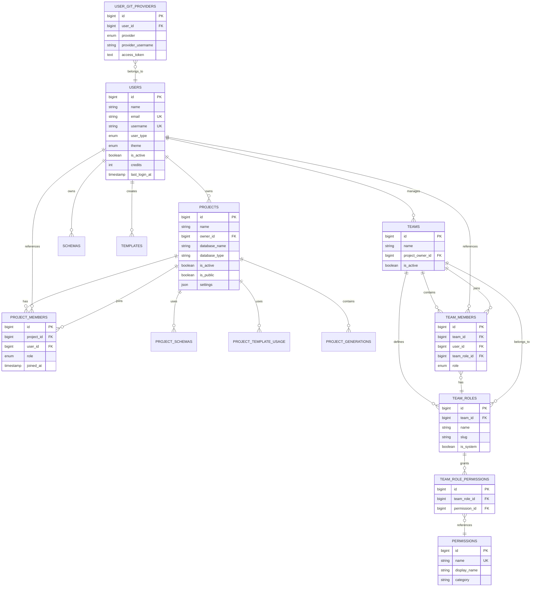
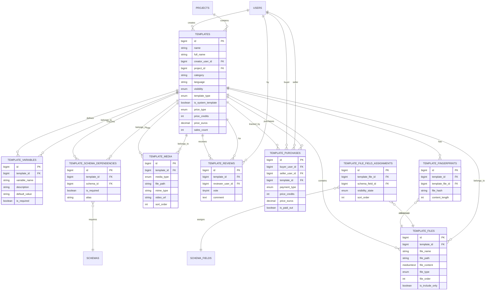
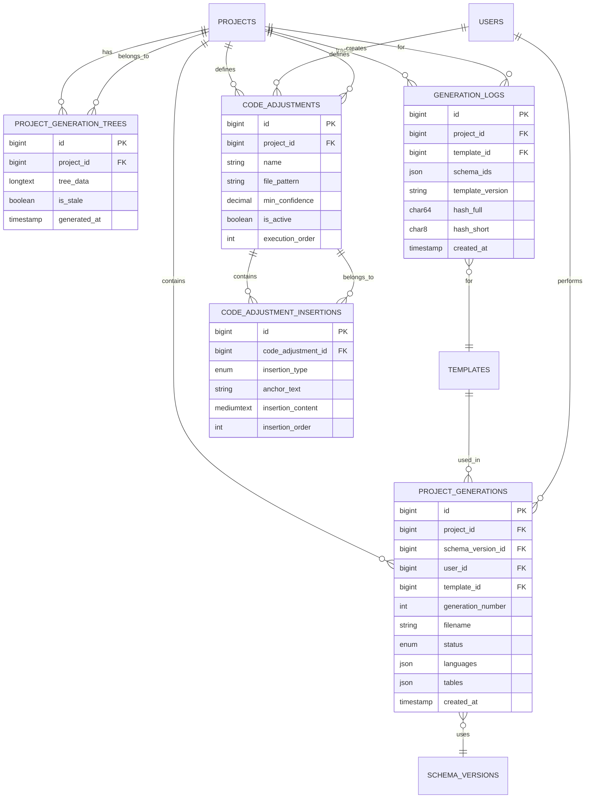
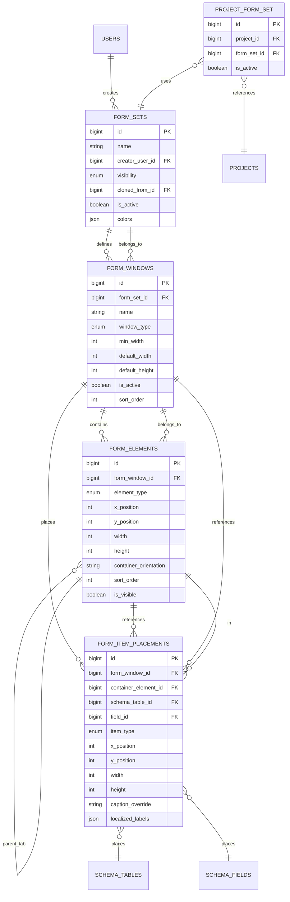
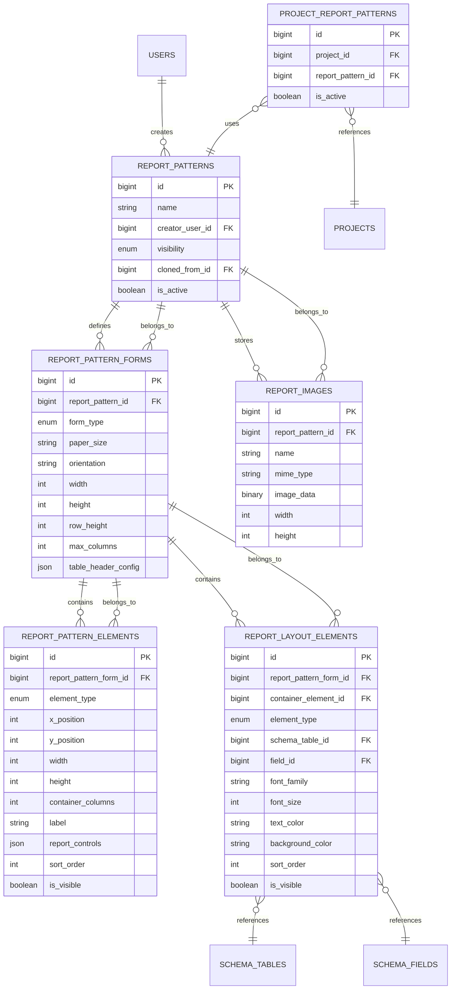
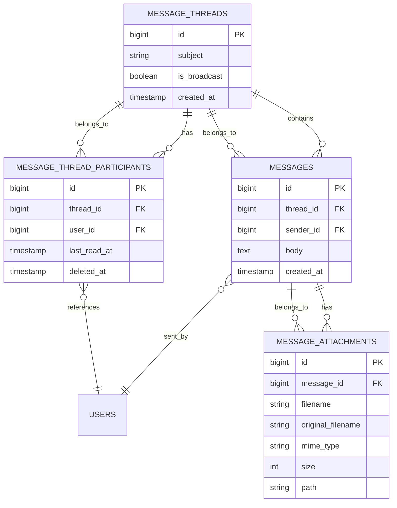

# Entity Relationship Diagrams

This document contains Entity Relationship Diagrams for different domains of the Scoriet database. Each diagram focuses on a specific functional area to provide clarity and easy comprehension.


*Visual Database Designer showing the schema tables and their relationships*

## Core Domain - Users, Projects, Teams

The core domain manages user accounts, project organization, and team structures.



## Schema Domain - Database Schema Modeling

The schema domain manages database schema definitions, versioning, and structure modeling.

```mermaid
erDiagram
    SCHEMAS ||--o{ SCHEMA_VERSIONS : has
    SCHEMAS ||--o{ SCHEMA_DESIGNER_LAYOUTS : stores
    SCHEMAS }o--|| USERS : owned_by
    SCHEMAS {
        bigint id PK
        string name
        bigint owner_id FK
        enum visibility
        boolean is_system_schema
        int last_version
        timestamp created_at
    }
    
    SCHEMA_VERSIONS ||--o{ SCHEMA_TABLES : contains
    SCHEMA_VERSIONS {
        bigint id PK
        bigint schema_id FK
        int version_number
        string version_name
        boolean has_unsaved_changes
        timestamp imported_at
    }
    
    SCHEMA_TABLES ||--o{ SCHEMA_FIELDS : defines
    SCHEMA_TABLES ||--o{ SCHEMA_CONSTRAINTS : has
    SCHEMA_TABLES }o--|| SCHEMA_VERSIONS : belongs_to
    SCHEMA_TABLES {
        bigint id PK
        bigint schema_id FK
        bigint schema_version_id FK
        string table_name
        string primarykeyfield
        string singular_name
        string form_set_report_pattern
    }
    
    SCHEMA_FIELDS }o--|| SCHEMA_TABLES : belongs_to
    SCHEMA_FIELDS {
        bigint id PK
        bigint table_id FK
        string field_name
        string field_type
        boolean is_nullable
        boolean is_primary_key
        boolean is_auto_increment
        string control_type
        string default_value
    }
    
    SCHEMA_CONSTRAINTS ||--o{ SCHEMA_CONSTRAINT_COLUMNS : includes
    SCHEMA_CONSTRAINTS ||--o{ SCHEMA_FOREIGN_KEY_REFERENCES : defines
    SCHEMA_CONSTRAINTS }o--|| SCHEMA_TABLES : belongs_to
    SCHEMA_CONSTRAINTS {
        bigint id PK
        bigint table_id FK
        string constraint_name
        enum constraint_type
    }
    
    SCHEMA_CONSTRAINT_COLUMNS }o--|| SCHEMA_FIELDS : references
    SCHEMA_CONSTRAINT_COLUMNS {
        bigint id PK
        bigint constraint_id FK
        bigint field_id FK
        int column_order
    }
    
    SCHEMA_FOREIGN_KEY_REFERENCES }o--|| SCHEMA_TABLES : references
    SCHEMA_FOREIGN_KEY_REFERENCES {
        bigint id PK
        bigint constraint_id FK UK
        bigint referenced_table_id FK
        enum on_delete
        enum on_update
    }
    
    SCHEMA_FOREIGN_KEY_REFERENCE_COLUMNS }o--|| SCHEMA_FIELDS : references
    SCHEMA_FOREIGN_KEY_REFERENCE_COLUMNS {
        bigint id PK
        bigint reference_id FK
        bigint referenced_field_id FK
        int column_order
    }
    
    SCHEMA_DESIGNER_LAYOUTS }o--|| SCHEMAS : belongs_to
    SCHEMA_DESIGNER_LAYOUTS {
        bigint id PK
        bigint schema_id FK
        int version_number
        json layout_data
    }
    
    SCHEMA_TRANSLATIONS {
        bigint id PK
        string item_name
        string code
        text translated_text
        boolean is_active
    }
```

## Template Domain - Code Templates

The template domain manages code templates, templates files, and template content.



## Generation Domain - Code Generation

The generation domain tracks code generation records, logs, and code adjustments.



## Form Domain - Form Designer

The form domain manages form sets, windows, elements, and field placements.



## Report Domain - Report Designer

The report domain manages report patterns, forms, elements, and layouts.



## Kanban Domain - Project Management

The kanban domain manages kanban boards, columns, cards, and activities.

```mermaid
erDiagram
    PROJECTS ||--|| KANBAN_BOARDS : has
    KANBAN_BOARDS ||--o{ KANBAN_COLUMNS : contains
    KANBAN_BOARDS ||--o{ KANBAN_LABELS : defines
    KANBAN_COLUMNS ||--o{ KANBAN_CARDS : contains
    KANBAN_CARDS ||--o{ KANBAN_CARD_COMMENTS : has
    KANBAN_CARDS ||--o{ KANBAN_CARD_ACTIVITIES : logs
    KANBAN_CARDS ||--o{ KANBAN_CARD_ASSIGNEES : has
    
    KANBAN_BOARDS }o--|| PROJECTS : belongs_to
    KANBAN_BOARDS {
        bigint id PK
        bigint project_id FK UK
        string name
        string description
        boolean is_active
    }
    
    KANBAN_COLUMNS }o--|| KANBAN_BOARDS : belongs_to
    KANBAN_COLUMNS {
        bigint id PK
        bigint board_id FK
        string name
        string color
        int position
        int wip_limit
        boolean is_done_column
    }
    
    KANBAN_CARDS }o--|| KANBAN_COLUMNS : belongs_to
    KANBAN_CARDS }o--|| USERS : created_by
    KANBAN_CARDS {
        bigint id PK
        bigint column_id FK
        bigint created_by FK
        string title
        text description
        string color
        int position
        enum priority
        date due_date
        int estimated_hours
        int actual_hours
        timestamp completed_at
    }
    
    KANBAN_CARD_COMMENTS }o--|| KANBAN_CARDS : belongs_to
    KANBAN_CARD_COMMENTS }o--|| USERS : authored_by
    KANBAN_CARD_COMMENTS {
        bigint id PK
        bigint card_id FK
        bigint user_id FK
        text content
        timestamp created_at
    }
    
    KANBAN_CARD_ACTIVITIES }o--|| KANBAN_CARDS : logs
    KANBAN_CARD_ACTIVITIES }o--|| USERS : by
    KANBAN_CARD_ACTIVITIES {
        bigint id PK
        bigint card_id FK
        bigint user_id FK
        string action
        json old_value
        json new_value
        timestamp created_at
    }
    
    KANBAN_CARD_ASSIGNEES }o--|| KANBAN_CARDS : belongs_to
    KANBAN_CARD_ASSIGNEES }o--|| USERS : assigned_to
    KANBAN_CARD_ASSIGNEES {
        bigint id PK
        bigint card_id FK
        bigint user_id FK
        bigint assigned_by FK
        timestamp assigned_at
    }
    
    KANBAN_LABELS ||--o{ KANBAN_CARD_LABEL : used_by
    KANBAN_LABELS }o--|| KANBAN_BOARDS : belongs_to
    KANBAN_LABELS {
        bigint id PK
        bigint board_id FK
        string name
        string color
    }
    
    KANBAN_CARD_LABEL }o--|| KANBAN_CARDS : references
    KANBAN_CARD_LABEL {
        bigint card_id FK
        bigint label_id FK
    }
    
    PROJECT_KANBAN_ROLES }o--|| PROJECTS : references
    PROJECT_KANBAN_ROLES }o--|| USERS : references
    PROJECT_KANBAN_ROLES {
        bigint id PK
        bigint project_id FK
        bigint user_id FK
        enum role
        bigint assigned_by FK
    }
```

## Messaging Domain - User Communication

The messaging domain manages user-to-user and broadcast messaging.



## Diagram Symbols Reference

- **||--o{**: One-to-Many relationship (one on the left, many on the right)
- **}o--||**: Many-to-One relationship (many on the left, one on the right)
- **||--||**: One-to-One relationship (exactly one on each side)
- **FK**: Foreign Key
- **PK**: Primary Key
- **UK**: Unique Key constraint

Each diagram can be viewed independently to understand relationships within a specific domain, or together as a comprehensive view of the entire database architecture.
