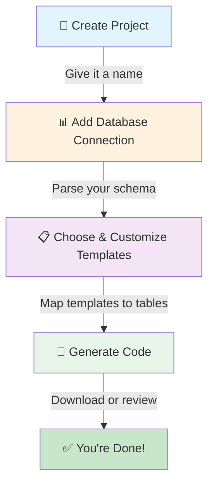

# Creating Your First Scoriet Project

In this walkthrough, we'll take you from zero to generating code in about 15 minutes. By the end, you'll have created a project, connected a database, assigned templates, and generated your first batch of code.

## What We'll Build

We'll create a simple **Blog Project** with a `posts` table and a `comments` table, then use Scoriet templates to generate:
- API endpoints for CRUD operations
- Data validation rules
- Database migrations

Let's get started!

## The Project Creation Workflow

Here's what we'll do step by step:



## Step 1: Create a New Project

### Navigate to Projects

Log in to Scoriet and look for the **"Projects"** section in the left sidebar. Click it to go to your project dashboard.

<div class="screenshot-placeholder">Screenshot: Projects page with New Project button — <code>projects-dashboard.png</code></div>

### Click "New Project"

In the top right, click the blue **"Create New Project"** button. You'll see a form asking for basic information.

<div class="screenshot-placeholder">Screenshot: Create new project form — <code>new-project-form.png</code></div>

### Fill In Project Details

Enter the following information:

| Field | Example | Description |
|-------|---------|-------------|
| **Project Name** | "Blog Platform" | A descriptive name for your project |
| **Description** | "API and models for a blog platform" | Optional but helpful for organization |
| **Type** | "Web Application" | What kind of project this is |
| **Framework** | "Laravel" | Your primary framework (used by templates) |

:::tip **Naming Conventions**
Use clear, descriptive project names. Avoid generic names like "Test" or "Project1". This makes it easier to find projects later, especially as your list grows.
:::

### Click "Create Project"

Once you've filled in the details, click **"Create Project"**. Scoriet creates your project and opens it automatically.

<div class="screenshot-placeholder">Screenshot: New project created and opened — <code>project-created.png</code></div>

## Step 2: Connect Your Database

Now Scoriet needs to know about your database structure. This is where the magic begins!

### Access Database Connection Settings

In your new project, look for the **"Database"** panel or button (usually in the left sidebar or top menu). Click it to open database connection settings.

<div class="screenshot-placeholder">Screenshot: Database connection panel — <code>database-panel.png</code></div>

### Enter Database Credentials

You'll see a form asking for your database details:

| Field | Description | Example |
|-------|-------------|---------|
| **Database Host** | The server where your database runs | `localhost` or `db.example.com` |
| **Port** | The port your database uses | `3306` (MySQL default) |
| **Username** | Database user credentials | `root` |
| **Password** | Database password | ••••••• |
| **Database Name** | The specific database to connect to | `blog_db` |
| **Database Type** | MySQL, PostgreSQL, SQLite, etc. | `MySQL` |

<div class="screenshot-placeholder">Screenshot: Database credentials form — <code>database-credentials.png</code></div>

:::caution **Secure Your Credentials**
Your database credentials are encrypted and never logged or stored insecurely. They're only used during your session to read your schema.
:::

### Test the Connection

Click **"Test Connection"** to make sure Scoriet can reach your database. You'll see a success message if everything is correct.

<div class="screenshot-placeholder">Screenshot: Database connection success message — <code>connection-success.png</code></div>

### Scoriet Parses Your Schema

Once connected, Scoriet automatically analyzes your database structure:
- ✅ Reads all tables
- ✅ Identifies columns and data types
- ✅ Detects relationships and constraints
- ✅ Understands indexes and unique keys

This information appears in the **Database Explorer** panel. You should now see your tables listed.

<div class="screenshot-placeholder">Screenshot: Database explorer showing tables — <code>db-explorer.png</code></div>

## Step 3: Choose Your Templates

Scoriet comes with built-in templates for common code patterns. Now you'll select which templates to use for your project.

### Open the Templates Panel

Look for the **"Templates"** section or tab in the interface. Click it to see available templates.

<div class="screenshot-placeholder">Screenshot: Templates panel with available templates — <code>templates-panel.png</code></div>

### Browse Available Templates

You'll see templates organized by category:

- **Models** – Database model classes
- **Controllers** – API endpoint handlers
- **Migrations** – Database schema creation files
- **Validators** – Input validation rules
- **Resources** – API response formatters
- **Custom** – Your own saved templates

:::info **What Are Templates?**
Templates are reusable blueprints that combine your database schema with code generation rules. One template might generate a complete CRUD API controller—all you do is select it!
:::

### Select Templates for Your Project

For our Blog example, let's select:
1. ✅ **Laravel Model Template** – Generates model classes for your tables
2. ✅ **Laravel API Controller** – Generates API endpoints
3. ✅ **Database Migration** – Generates migration files
4. ✅ **Form Validator** – Generates validation rules

Click each template to select it. Selected templates will be highlighted in blue.

<div class="screenshot-placeholder">Screenshot: Multiple templates selected — <code>templates-selected.png</code></div>

### Preview Template Output

Before applying, you can click **"Preview"** on any template to see what code it will generate. This is helpful to understand what you're about to create.

<div class="screenshot-placeholder">Screenshot: Template preview showing generated code — <code>template-preview.png</code></div>

## Step 4: Map Templates to Tables

Now Scoriet needs to know: which templates apply to which tables in your database?

### Configure Template Mappings

You'll see a mapping interface showing your database tables and selected templates.

For each table (like `posts` and `comments`), you can specify:
- ✅ Which templates to apply
- ✅ Whether to include this table
- ⚙️ Custom template options

<div class="screenshot-placeholder">Screenshot: Template mapping configuration — <code>template-mapping.png</code></div>

:::tip **Selective Generation**
You don't have to generate templates for every table. If you only want models for `posts` and API endpoints for `comments`, you can customize that here.
:::

### Review Configuration

Double-check that:
1. All tables you want included are selected
2. The correct templates are assigned to each table
3. Special options (like namespaces or output paths) are set correctly

### Click "Next" or "Continue"

Once you're happy with the configuration, proceed to the code generation step.

## Step 5: Generate Your Code

This is the moment of truth—time to generate actual, usable code!

### Review Generation Summary

Before generating, you'll see a summary of what Scoriet will create:

```
📊 Generation Summary
├─ Tables to process: 2 (posts, comments)
├─ Templates to apply: 4
├─ Output files: ~12-15 files
└─ Total code lines: ~2,000+ lines
```

<div class="screenshot-placeholder">Screenshot: Generation summary — <code>generation-summary.png</code></div>

### Click "Generate Code"

Click the blue **"Generate Code"** button to let Scoriet work its magic!

<div class="screenshot-placeholder">Screenshot: Generate Code button highlighted — <code>generate-button.png</code></div>

### Watch the Progress

Scoriet processes your templates and generates code in real-time. You'll see a progress indicator:

```
🔄 Generating code...
├─ Posts model (100%)
├─ Posts controller (100%)
├─ Comments model (100%)
├─ Comments controller (100%)
└─ Migrations (100%)

✅ Generation complete! 15 files created.
```

<div class="screenshot-placeholder">Screenshot: Generation progress indicator — <code>generation-progress.png</code></div>

:::success **It's That Fast!**
What would take a developer hours to write manually is generated in seconds. That's the Scoriet difference.
:::

## Step 6: View and Download Your Code

Once generation is complete, you have several options:

### Option A: View Code in Browser

Scoriet displays generated files in a code viewer. Click any file to see its contents. This is great for review before downloading.

<div class="screenshot-placeholder">Screenshot: Generated code in browser viewer — <code>code-viewer.png</code></div>

Use these buttons:
- 📋 **Copy** – Copy code to clipboard
- 📥 **Download** – Download this single file
- ⭐ **Favorite** – Mark important files

### Option B: Download All Files

Click the **"Download All"** button to get a ZIP file containing all generated code organized in proper directory structure.

<div class="screenshot-placeholder">Screenshot: Download All button highlighted — <code>download-all.png</code></div>

The ZIP includes everything organized like this:

```
blog-platform-code.zip
├─ app/Models/
│  ├─ Post.php
│  └─ Comment.php
├─ app/Http/Controllers/
│  ├─ PostController.php
│  └─ CommentController.php
├─ database/migrations/
│  ├─ 2024_create_posts_table.php
│  └─ 2024_create_comments_table.php
└─ app/Validators/
   ├─ PostValidator.php
   └─ CommentValidator.php
```

### Option C: Copy to Project

If you're working in a development environment connected to Scoriet, you can directly copy generated files to your project structure.

<div class="screenshot-placeholder">Screenshot: Copy to project option — <code>copy-to-project.png</code></div>

## Step 7: Integrate Into Your Project

Now it's time to use your generated code!

### 1. Extract/Import Files

If you downloaded a ZIP:
1. Extract the ZIP file
2. Copy the files to your project directory
3. Make sure the directory structure matches your project layout

### 2. Install Dependencies (If Needed)

Some generated code might use packages that aren't installed yet. Check the generation notes for any required packages.

### 3. Run Migrations

If migrations were generated:

```bash
php artisan migrate
```

### 4. Test Your Code

Generate a few API requests to test the endpoints:

```bash
curl http://localhost:8000/api/posts
curl http://localhost:8000/api/posts/1
```

### 5. Review & Customize

The generated code is a great foundation, but it's yours to customize:
- ✏️ Add business logic
- ✏️ Tweak validation rules
- ✏️ Customize API responses
- ✏️ Add authentication/authorization

:::tip **Building on Scoriet**
Generated code is meant to be a starting point. Add your unique business logic, then if you need to regenerate (because your schema changed), Scoriet can update without overwriting your customizations.
:::

## What's Next?

Congratulations! You've successfully:
- ✅ Created a Scoriet project
- ✅ Connected a database
- ✅ Selected and configured templates
- ✅ Generated production-ready code
- ✅ Downloaded and integrated it into your project

### Ready for More?

- **Learn Template Syntax** – Create custom templates for your specific needs
- **Explore Advanced Features** – Work with multiple databases, complex relationships, etc.
- **Team Up** – Invite team members to collaborate on projects
- **Automate** – Set up automatic regeneration when your database changes

---

:::success **You Did It! 🎉**
You've taken your first journey through Scoriet. Every project you create from now on will be just as quick. Imagine what you'll build when you're not spending hours on boilerplate code!
:::
