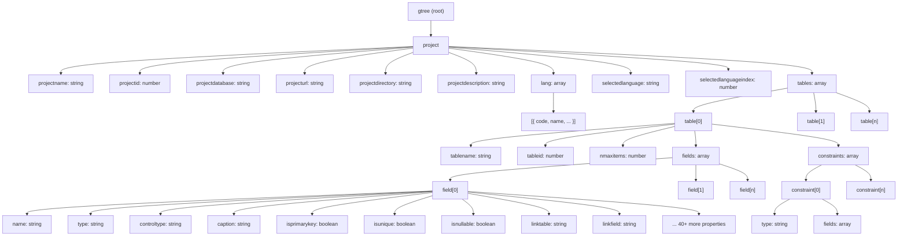

# Gtree — The Global Template Tree

## What Is Gtree?

**Gtree** (Global Template Tree) is the complete hierarchical data structure that templates in Scoriet have access to during code generation. It contains all information about your project, databases, tables, fields, relationships, and language settings—everything your templates need to generate code intelligently.

Think of Gtree as a **dynamic blueprint** of your project. Every time you run a template, Scoriet builds a complete Gtree object and makes it available to your template. Your template can then traverse this structure, access properties, loop over tables and fields, and use the data to dynamically generate code.

:::info What's inside Gtree?
Gtree is a hierarchical JSON-like structure organized in layers:
- **Project level**: Project metadata (name, ID, database, URL, directory, description, languages)
- **Table level**: Individual tables and their metadata
- **Field level**: Individual fields within tables (50+ properties per field)
- **Constraint level**: Foreign keys, unique constraints, indexes
- **Language level**: Multi-language support configuration
:::

## Why Gtree Matters

Gtree enables **dynamic, intelligent code generation**. Instead of writing static templates, you write templates that:

- Automatically adapt to your database schema
- Generate code for every table and field you add
- Support multi-language generation
- Respect field types, constraints, and relationships
- Scale with your project without manual template updates

For example, a single Laravel model template can generate a complete, type-safe Eloquent model for *any* table you add to your database—just by accessing Gtree.

```
<div class="screenshot-placeholder">Screenshot: Gtree concept diagram showing hierarchy — <code>gtree-hierarchy.png</code></div>
```

## How Templates Access Gtree

There are **two primary ways** to access Gtree data in your templates:

### 1. Template Syntax (Simple Access)

For straightforward property access, use Scoriet's template syntax with placeholders:

```
{:projectname:}          → Access project name
{:item.name:}            → Access current field/item name
{:tablename:}            → Access table name
```

**When to use**: When you need simple, direct access to properties without complex logic.

```
Project: {:projectname:}
Table: {:tablename:}
Field: {:item.name:} ({:item.type:})
```

### 2. JavaScript Code Blocks (Advanced Access)

For complex logic, conditionals, transformations, and advanced data manipulation, use JavaScript code blocks:

```
{:code:}
// Access full Gtree structure
const fieldName = gtree.project.tables[0].fields[0].name;
const tableCount = gtree.project.tables.length;

// Complex transformations
const primaryKey = gtree.project.tables[0].fields.find(f => f.isprimarykey);

// Conditional logic
if (gtree.project.selectedlanguage === "de") {
  // German template logic
}

// Return generated code
return `Generated: ${fieldName}`;
{:codeend:}
```

**When to use**: When you need conditional logic, loops, transformations, or access to nested/complex data.

:::tip Combining Both Methods
The most powerful templates combine both approaches:
- Use **template syntax** for simple placeholders and readability
- Use **JavaScript code blocks** for logic and dynamic behavior
- This creates templates that are both readable and powerful
:::

## The Complete Gtree Structure

Here's a visual representation of Gtree's complete hierarchy:



## Working with Gtree in Templates

### Example 1: Access Project Properties

```
Project Name: {:projectname:}
Database: {:projectdatabase:}
URL: {:projecturl:}
```

Or in JavaScript:

```
{:code:}
const projectInfo = `
  Project: ${gtree.project.projectname}
  Database: ${gtree.project.projectdatabase}
  URL: ${gtree.project.projecturl}
`;
return projectInfo;
{:codeend:}
```

### Example 2: Loop Over All Tables

Using template loops:

```
{:for nmaxfiles:}
Table: {:tablename:}
  Fields: {:nmaxitems:}
{:endfor:}
```

Or in JavaScript:

```
{:code:}
let output = "";
for (const table of gtree.project.tables) {
  output += `Table: ${table.tablename} (${table.fields.length} fields)\n`;
}
return output;
{:codeend:}
```

### Example 3: Access Field Properties

For each field, access detailed properties:

```
{:code:}
let fieldList = "";
const table = gtree.project.tables[0];
for (const field of table.fields) {
  fieldList += `
    ${field.name} (${field.type})
    - Primary Key: ${field.isprimarykey}
    - Nullable: ${field.isnullable}
    - Control Type: ${field.controltype}
  `;
}
return fieldList;
{:codeend:}
```

## Key Concepts

### nmaxitems and nmaxfiles

- **nmaxitems**: Number of fields in a table (used in template loops: `{:for nmaxitems:}`)
- **nmaxfiles**: Total number of tables in the project (used in template loops: `{:for nmaxfiles:}`)
- **nmaxlanguages**: Total number of languages configured

:::note Loop Naming Convention
The naming of `nmaxfiles` for tables and `nmaxitems` for fields comes from Scoriet's SQL field structure, where "files" historically referred to tables (database tables are like files) and "items" referred to fields (data items within files).
:::

### Context During Iteration

When you use `{:for nmaxitems:}` to loop over fields, each iteration has access to:
- `{:item.name:}` — Current field name
- `{:item.type:}` — Current field type
- `{:item.caption:}` — Current field caption
- All other field properties prefixed with `item.`

Similarly, when looping tables with `{:for nmaxfiles:}`:
- `{:tablename:}` — Current table name (automatically updated)
- `{:nmaxitems:}` — Number of fields in current table

## Gtree Access Patterns

### Pattern 1: Simple Property Access

```
Current table has {:nmaxitems:} fields.
```

### Pattern 2: Conditional Generation

```
{:code:}
if (gtree.project.tables[0].fields.some(f => f.isprimarykey)) {
  return "This table has a primary key.";
}
return "No primary key found.";
{:codeend:}
```

### Pattern 3: Transformation and Mapping

```
{:code:}
const table = gtree.project.tables[0];
const fieldNames = table.fields.map(f => f.name);
return fieldNames.join(", ");
{:codeend:}
```

### Pattern 4: Complex Nesting

```
{:code:}
let output = "";
for (const table of gtree.project.tables) {
  output += `Table: ${table.tablename}\n`;
  const pkField = table.fields.find(f => f.isprimarykey);
  if (pkField) {
    output += `  Primary Key: ${pkField.name}\n`;
  }
}
return output;
{:codeend:}
```

## Important Notes

:::caution Field Property Completeness
Gtree contains **50+ properties per field**. Not every field will have every property populated—some are optional. Always check if a property exists before using it in your template.

Example: A field might have `linktable` and `linkfield` only if it's a foreign key reference.
:::

:::tip Performance Consideration
Gtree is built completely in memory when you run a template. For projects with thousands of tables and fields, accessing Gtree is still fast, but use JavaScript code blocks instead of deeply nested loops for better performance and readability.
:::

## Next Steps

Now that you understand what Gtree is and how to access it, dive deeper into each section:

- **[Project-Level Data](./project-level.md)** — Detailed guide to project properties
- **[Table-Level Data](./table-level.md)** — Working with tables and their metadata
- **[Field-Level Data](./field-level.md)** — Complete reference for all 50+ field properties
- **[Constraints and Relationships](./constraint-level.md)** — Foreign keys and indexes
- **[Language Data](./language-data.md)** — Multi-language support
- **[Practical Examples](./practical-examples.md)** — Real-world code generation examples

