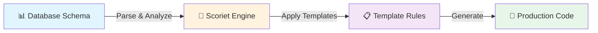

# Welcome to Scoriet 🚀

Welcome to **Scoriet**, the Schema-to-Stack Studio that transforms how development teams build software. Whether you're managing a team of developers or working solo, Scoriet automates repetitive code generation tasks, ensuring consistency, quality, and speed across your entire organization.

## What is Scoriet?

Scoriet is a powerful, intelligent code generation platform designed to eliminate repetitive coding work. By analyzing your database schema and applying custom templates, Scoriet generates production-ready code in seconds—not hours.

Think of it like this: **your database schema + smart templates = instant, consistent code**.

### The Scoriet Workflow



## Key Benefits

:::success **Save Hours Every Week**
Stop writing boilerplate code. Scoriet generates CRUD operations, API endpoints, validation logic, and database migrations in seconds, freeing your team to focus on business logic and innovation.
:::

:::success **Enterprise Consistency**
Define your code standards once in templates, then apply them across all your projects. Every generated file follows the same patterns, naming conventions, and best practices.
:::

:::success **Reduce Human Error**
Automated generation means fewer typos, missed edge cases, and inconsistent implementations. Your code is as reliable as your templates.
:::

:::success **Onboard Faster**
New team members get up to speed quickly when all code follows consistent patterns. Less time explaining "how we do things here."
:::

:::success **Stay Flexible**
Update your templates once and regenerate all your projects. Need to adopt a new framework version or design pattern? Change your template, not your codebase.
:::

## Who is This For?

**Scoriet is built for:**

- **Enterprise Teams** – Large organizations needing consistency across dozens of projects
- **SaaS Companies** – Rapid iteration with guaranteed code quality
- **Development Agencies** – Deliver more projects without scaling headcount
- **Solo Developers** – Amplify your productivity and eliminate tedious boilerplate
- **Open Source Maintainers** – Generate consistent code across community projects

## What You'll Learn Here

```
📚 Getting Started
   ├─ Creating Your Account (Registration)
   ├─ Logging In & Managing Access
   ├─ Your First Project (Step-by-Step)
   └─ Quick Interface Tour

🎯 Core Features
   ├─ Working with Databases
   ├─ Creating & Managing Templates
   ├─ Generating Code
   └─ Managing Your Projects

🔧 Advanced Usage
   ├─ Template Syntax & Functions
   ├─ Working with Multiple Templates
   ├─ Customizing Output
   └─ Team Collaboration

💡 Tips & Tricks
   ├─ Best Practices
   ├─ Common Patterns
   └─ Troubleshooting
```

## Quick Links

Ready to get started? Here's where to go next:

| Task | Location |
|------|----------|
| **Create an account** | [Registration Guide](./getting-started/registration.md) |
| **Log in to Scoriet** | [Login Guide](./getting-started/login.md) |
| **Build your first project** | [First Project Walkthrough](./getting-started/first-project.md) |
| **Learn the interface** | [Quick Tour](./getting-started/quick-tour.md) |

## The Scoriet Advantage

:::tip **Consistency is King**
In enterprise development, consistency matters as much as correctness. Scoriet ensures every line of generated code follows your standards.
:::

:::tip **Speed Without Sacrifice**
Generate code 10-100x faster than manual development, without compromising quality or flexibility.
:::

:::tip **Future-Proof**
Your projects aren't locked into one template version. Update templates, regenerate, and your entire codebase evolves together.
:::

## Platform Highlights

**Modern, Intuitive Interface**  
Work with a clean, multi-panel workspace organized by task. Switch between database explorer, templates, and generated code with one click.

**Database Intelligence**  
Scoriet deeply understands your database schema—tables, relationships, constraints, indexes. It uses this intelligence to generate smarter code.

**Powerful Template Engine**  
Write templates with variables, loops, conditionals, and JavaScript code blocks. Generate anything from SQL migrations to API endpoints to frontend components.

**Security First**  
Template processing runs on your browser for privacy and performance. All your code stays in your control.

**OAuth2 Authentication**  
Enterprise-grade authentication keeps your projects and code safe. Only you access your work.

---

## Ready to Transform Your Development?

You're just a few clicks away from automating your first project. Head over to [Registration](./getting-started/registration.md) to create your account and start your journey with Scoriet.

**Questions?** Check out our [Getting Started](./getting-started/) guides or reach out to our support team.

Let's build faster. Together. 🎉
