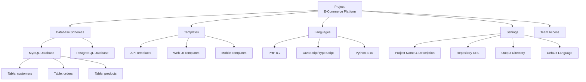
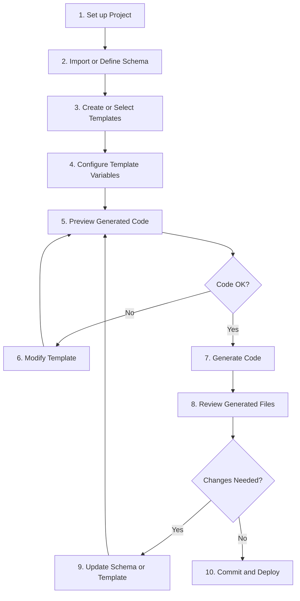

# Projects Overview

A **Project** in Scoriet is your container for code generation work. It's where you organize databases schemas, code generation templates, language configurations, and all the settings needed to automatically generate quality code.

## What is a Project?

Think of a project as a complete code generation workspace for a specific application or system. Each project includes:

- **Database Schemas** - MySQL, PostgreSQL, or other databases you're generating code for
- **Templates** - Code generation templates for different languages and frameworks
- **Languages** - Programming language configurations (PHP, JavaScript, Python, etc.)
- **Settings** - Project-specific configuration (name, URL, output directory, etc.)
- **Generated Code** - Output from template execution
- **Team Access** - Permissions and team member assignments

## Project Structure



## Project Hierarchy

Scoriet organizes projects hierarchically:

```
Organization
├── Team A
│   ├── Project: E-Commerce Platform
│   ├── Project: Admin Dashboard
│   └── Project: Mobile App
├── Team B
│   ├── Project: Customer Portal
│   └── Project: Data Analytics
└── Personal Projects
    ├── Project: Learning Project
    └── Project: Side Project
```

### Teams

**Teams** group related projects and users together:
- Share templates across team projects
- Manage access for multiple team members
- Organize projects by department or product
- Share database connection configurations

### Projects

**Projects** contain the actual code generation work:
- One project = one application or system
- All schemas, templates, and settings specific to that project
- Team can be assigned multiple projects
- Each project can have different access levels for team members

## Key Project Concepts

### Schemas

A **Schema** is a database structure definition:
- Import from live database or create manually
- Contains tables, fields, constraints, relationships
- One project can have multiple schemas (different databases)
- Schemas can represent different environments (dev, staging, prod)

:::tip
Use separate schemas for different database environments. This lets you generate code for dev and production separately.
:::

### Templates

**Templates** are code generation patterns:
- Written in Scoriet's template language
- Generate code from database schema automatically
- Reusable across projects
- One template can generate multiple files

Examples:
- "Laravel Migration Template" - Generates migration files
- "React API Hook Template" - Generates API call hooks
- "TypeScript Model Template" - Generates TypeScript interfaces
- "OpenAPI Documentation Template" - Generates API specs

### Languages

**Languages** define programming language configurations:
- Language name and version (e.g., "PHP 8.2", "JavaScript ES2022")
- Default frameworks for that language
- Code style preferences (indentation, naming conventions)
- Compiler/runtime settings

One project typically works with 1-3 languages:
- Backend API project: PHP, JavaScript
- Mobile project: Swift, Kotlin
- Full-stack project: PHP, JavaScript, TypeScript

### Settings

**Project Settings** configure:
- Project name and description
- Git repository URL (for version control integration)
- Output directory for generated code
- Default language for templates
- Database connection credentials
- Team members and access levels

## Creating a Project

The process is straightforward:

1. **Click Create +** in top navigation or **New Project** in Projects dashboard
2. **Fill in project details**:
   - Project name (e.g., "E-Commerce Platform")
   - Team assignment
   - Description (what this project builds)
3. **Configure database connection**:
   - Choose database type (MySQL, PostgreSQL, etc.)
   - Enter connection credentials
4. **Select initial templates** (optional):
   - Choose common templates to start with
   - Can add more templates later
5. **Click Create**

The project is created and ready to use. See [Create Project](create-project.md) for detailed steps.

:::info
You can modify all project settings later, so don't worry about getting everything perfect during creation. Projects are flexible and evolve as your needs change.
:::

## Project Workflow

Typical workflow for generating code in a project:



## Project Best Practices

### Naming Projects Clearly

Use descriptive, specific names:

- ✅ Good: "E-Commerce Platform - Backend API"
- ✅ Good: "Customer Portal - React Frontend"
- ❌ Avoid: "Project1", "App", "Code"

### Organizing with Teams

Group projects logically by team:

- **By department** - "Marketing Team", "Engineering Team"
- **By product** - "Product A Team", "Product B Team"
- **By function** - "Backend Team", "Frontend Team"

### One Database = One Schema

For projects with multiple databases:

- **Create separate schemas** for each database (dev, staging, production)
- **Use schema names** that clearly identify the environment
- **Never mix** different databases in one schema

### Template Organization

Keep templates organized in a project:

- **Group by layer** - API templates, UI templates, Worker templates
- **Group by language** - PHP templates, JavaScript templates
- **Use clear naming** - "Laravel Migration v1", "React Hook v2"

### Regular Backups

Back up important projects:

- **Export regularly** - Use Export function to save project configs
- **Version control** - Check in generated code to Git
- **Archive templates** - Save template definitions as backups

## Project Templates Gallery

Scoriet provides starter templates for common project types:

| Project Type | Includes | Best For |
|--------------|----------|----------|
| **REST API** | API templates, migration templates | Backend APIs |
| **Web App** | React components, forms, services | Frontend web apps |
| **Mobile App** | Mobile templates, data models | Mobile applications |
| **Full Stack** | All of above | Complete applications |
| **Microservices** | Service templates, contracts | Microservice architecture |
| **Documentation** | API docs, schema docs | Developer documentation |

:::tip
Start with a template gallery project matching your needs. You can customize from there much faster than building from scratch.
:::

## Managing Multiple Projects

### Switching Between Projects

1. **Click Projects** in top navigation
2. **See all your projects** in the dashboard
3. **Click a project** to open it
4. Your workspace switches to that project's context

### Quick Project Access

Projects you use frequently appear in:
- **Sidebar** - Expand Teams to see projects
- **Recent Projects** - On the home dashboard
- **Favorites** - Star projects for quick access

### Collaborating on Projects

Multiple team members can work on the same project:

- **See who's online** - Team member list in sidebar
- **Real-time updates** - Changes are synced across team
- **Conflict prevention** - File locking prevents simultaneous edits
- **Comments** - Leave notes on templates and schemas

See [Team Collaboration](../../collaboration/teams.md) for more details.

## Sharing Projects

### Export and Share

To share a project with external teams:

1. **Settings > Project > Export**
2. **Choose export format** (complete project or templates only)
3. **Download the file**
4. **Share via email or file sharing**

See [Import and Export](import-export.md) for detailed instructions.

### GitHub Integration

Connect projects to GitHub for version control:

1. **Settings > Repository**
2. **Connect GitHub account**
3. **Select or create repository**
4. **Generated code commits automatically** (optional)

See [Git Integration](git-integration.md) for setup instructions.

## Next Steps

Start building your first project:

1. **[Create a Project](create-project.md)** - Step-by-step creation guide
2. **[Configure Settings](project-settings.md)** - Detailed settings reference
3. **[Set Up Git Integration](git-integration.md)** - Version control setup
4. **[Manage Databases](../databases/overview.md)** - Schema and table management
5. **[Create Templates](../templates/overview.md)** - Template creation guide

---

**Related Topics:**
- [Creating Projects](create-project.md)
- [Project Settings](project-settings.md)
- [Git Integration](git-integration.md)
- [Team Collaboration](../../collaboration/teams.md)
