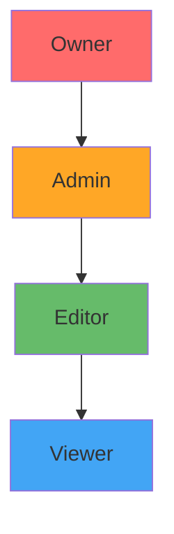

# Roles and Permissions

Scoriet uses a role-based access control (RBAC) system to manage what team members can do. Each role has a specific set of permissions that determine access to features, projects, and management functions.

## The Four Team Roles

Scoriet provides four standard roles for team management. Each role is a superset of the role below it (i.e., Admins have all Editor permissions).

---

## Role Comparison Matrix

| Permission | Viewer | Editor | Admin | Owner |
|-----------|--------|--------|-------|-------|
| **View Projects** | ✓ | ✓ | ✓ | ✓ |
| **View Templates** | ✓ | ✓ | ✓ | ✓ |
| **Generate Code** | ✓ | ✓ | ✓ | ✓ |
| **Edit Projects** | ✗ | ✓ | ✓ | ✓ |
| **Create Projects** | ✗ | ✓ | ✓ | ✓ |
| **Delete Projects** | ✗ | ✓ | ✓ | ✓ |
| **Share Projects** | ✗ | ✓ | ✓ | ✓ |
| **Manage Project Members** | ✗ | ✓ | ✓ | ✓ |
| **Create Invitations** | ✗ | ✗ | ✓ | ✓ |
| **Manage Team Members** | ✗ | ✗ | ✓ | ✓ |
| **Change Member Roles** | ✗ | ✗ | ✓ | ✓ |
| **Remove Members** | ✗ | ✗ | ✓ | ✓ |
| **Modify Team Settings** | ✗ | ✗ | ✓ | ✓ |
| **Delete Team** | ✗ | ✗ | ✗ | ✓ |
| **Transfer Ownership** | ✗ | ✗ | ✗ | ✓ |

---

## Viewer Role

The **Viewer** role is the most restrictive role, ideal for team members who need read-only access.

### What Viewers Can Do

- ✓ **View all team projects** — Access and browse all projects
- ✓ **Read templates** — View template code and definitions
- ✓ **Generate code** — Run templates to generate code output
- ✓ **View project details** — See configurations, fields, tables
- ✓ **Download generated code** — Save code generation results
- ✓ **View team information** — See team members and structure

### What Viewers Cannot Do

- ✗ Edit any project information
- ✗ Create new projects
- ✗ Modify templates or settings
- ✗ Delete projects
- ✗ Add or remove team members
- ✗ Change any team settings

### Best For

- **Stakeholders** who need visibility but don't modify projects
- **Quality assurance** teams that review generated code
- **Project managers** who need to track progress
- **New team members** during onboarding
- **Clients** or external partners who view deliverables

### Transition Path

When a Viewer is ready for more responsibility:
1. Promote to **Editor** to allow project creation and modification
2. Further promote to **Admin** for team management duties
3. Only promote to **Owner** if they need full team control

---

## Editor Role

The **Editor** role enables project creation and modification while excluding team management.

### What Editors Can Do

- ✓ **All Viewer permissions**
- ✓ **Create new projects** — Add projects to the team
- ✓ **Edit projects** — Modify project settings, fields, tables
- ✓ **Edit templates** — Create and modify code generation templates
- ✓ **Delete projects** — Remove projects they created (or all projects with Admin approval)
- ✓ **Share projects** — Grant access to specific team members
- ✓ **Manage project collaborators** — Add/remove users from specific projects
- ✓ **View code generation history** — See past template runs

### What Editors Cannot Do

- ✗ Manage team members or roles
- ✗ Create team invitations
- ✗ Modify team settings
- ✗ View team billing
- ✗ Delete the team

### Best For

- **Developers** who actively create and modify projects
- **Product owners** who define project structures
- **System architects** who design database schemas
- **Full-time contributors** to the codebase

### Editor Workflow

A typical Editor workflow includes:

1. **Create a new project** with database schema
2. **Define tables and fields** from database structure
3. **Create templates** for code generation
4. **Generate code** for team members to use
5. **Share projects** with other team members
6. **Modify templates** based on feedback

:::tip Editor Collaboration
Editors can collaborate by:
- Working on the same project (changes sync in real-time)
- Creating separate projects for different features
- Using templates as shared code generation blueprints
- Sharing generated code with the team
:::

---

## Admin Role

The **Admin** role adds team management capabilities while excluding the ability to delete the team.

### What Admins Can Do

- ✓ **All Editor permissions**
- ✓ **Invite members to team** — Send invitations with specified roles
- ✓ **Manage all team members** — Add, remove, update roles
- ✓ **Modify team settings** — Change name, description, logo
- ✓ **Manage public invitations** — Create team-wide invitation links
- ✓ **View team analytics** — See member activity and project usage
- ✓ **Configure team privacy** — Control who can discover the team
- ✓ **Manage team integrations** — Connect external tools (if available)
- ✓ **Export team data** — Download project and member information

### What Admins Cannot Do

- ✗ Delete the entire team
- ✗ Transfer team ownership
- ✗ Change their own role to Owner
- ✗ Access team billing (on some plans)

### Best For

- **Team leads** who manage team operations
- **Project managers** who coordinate multiple projects
- **Senior developers** responsible for code quality
- **DevOps engineers** managing team infrastructure
- **Technical leaders** organizing team structure

### Admin Responsibilities

Typical Admin responsibilities include:

1. **Onboarding new members** — Send invitations, assign roles
2. **Managing access** — Update roles as responsibilities change
3. **Monitoring activity** — Track project work and contributions
4. **Enforcing standards** — Ensure projects follow guidelines
5. **Team communication** — Keep members informed of changes
6. **Performance monitoring** — Review team productivity metrics

:::tip Multiple Admins
It's recommended to have at least 2-3 Admins per team for:
- Coverage when one is unavailable
- Shared responsibility for team management
- Different areas of expertise
- Better decision-making and oversight
:::

---

## Owner Role

The **Owner** role provides complete team control and responsibility.

### What Owners Can Do

- ✓ **All Admin permissions**
- ✓ **Delete the team** — Permanently remove the team (with confirmation)
- ✓ **Transfer ownership** — Make another member the Owner
- ✓ **View team billing** — Access billing and subscription details
- ✓ **Configure advanced features** — Set up custom roles (Enterprise only)
- ✓ **Access team security settings** — Configure SSO, two-factor auth, etc.
- ✓ **View all team audit logs** — Complete team activity history

### Ownership Responsibilities

As an Owner, you are responsible for:

1. **Team governance** — Set and enforce team policies
2. **Member management** — Ensure appropriate access levels
3. **Financial responsibility** — Manage team subscription and billing
4. **Legal compliance** — Ensure GDPR, data privacy compliance
5. **Security** — Protect team data and access controls
6. **Escalations** — Handle disputes and access requests

### Transferring Ownership

If you need to transfer team ownership to another member:

1. Go to **Team Settings** → **Members**
2. Find the member you want to promote to Owner
3. Click **More Options** → **Make Owner**
4. Confirm the transfer
5. You become an **Admin** (if you choose to stay on the team)
6. The new Owner has full control

:::caution Ownership Transfer
- Only one Owner can exist per team at a time
- Transferring ownership is permanent
- You lose Owner privileges after transferring
- Consider this decision carefully

:::

### When to Transfer Ownership

Consider transferring ownership when:

- You're leaving the team or company
- You want shared responsibility
- Someone else is better positioned to lead
- You're establishing a management structure
- Required by company policy

---

## Permission Details by Category

### Project Permissions

| Action | Viewer | Editor | Admin | Owner |
|--------|--------|--------|-------|-------|
| View project | ✓ | ✓ | ✓ | ✓ |
| Edit project settings | ✗ | ✓ | ✓ | ✓ |
| Create project | ✗ | ✓ | ✓ | ✓ |
| Delete project | ✗ | ✓ | ✓ | ✓ |
| Duplicate project | ✗ | ✓ | ✓ | ✓ |
| Export project | ✗ | ✓ | ✓ | ✓ |
| Share project | ✗ | ✓ | ✓ | ✓ |

### Team Member Permissions

| Action | Viewer | Editor | Admin | Owner |
|--------|--------|--------|-------|-------|
| View members | ✓ | ✓ | ✓ | ✓ |
| Invite members | ✗ | ✗ | ✓ | ✓ |
| Remove members | ✗ | ✗ | ✓ | ✓ |
| Change member role | ✗ | ✗ | ✓ | ✓ |
| Promote to Admin | ✗ | ✗ | ✗ | ✓ |
| Make Owner | ✗ | ✗ | ✗ | ✓ |

### Team Settings Permissions

| Action | Viewer | Editor | Admin | Owner |
|--------|--------|--------|-------|-------|
| View team info | ✓ | ✓ | ✓ | ✓ |
| Modify team name | ✗ | ✗ | ✓ | ✓ |
| Change team logo | ✗ | ✗ | ✓ | ✓ |
| Configure privacy | ✗ | ✗ | ✓ | ✓ |
| View analytics | ✗ | ✗ | ✓ | ✓ |
| Delete team | ✗ | ✗ | ✗ | ✓ |
| Transfer ownership | ✗ | ✗ | ✗ | ✓ |

---

## Role Assignment Best Practices

### Principle of Least Privilege

Always assign the minimum role needed for someone to do their job:

- **Reviewer or stakeholder?** → Viewer
- **Active developer?** → Editor
- **Team lead?** → Admin
- **Responsible for team?** → Owner

:::caution Against Over-Privilege
Don't give everyone Admin or Owner roles. This:
- Increases security risk
- Makes it harder to audit who made changes
- Can lead to accidental deletions
- Violates security best practices
:::

### New Member Onboarding

When adding new team members:

1. **Start with Viewer role** — Let them get familiar with projects
2. **After 1-2 weeks** → Promote to Editor if they're contributing
3. **After 3+ months** → Consider Admin role if they show leadership
4. **Rarely promote to Owner** — Only for senior team leaders

### Regular Audits

Every quarter, review team member roles:

1. Are they at the right level for their current responsibilities?
2. Have their responsibilities changed?
3. Are there inactive members who should be removed?
4. Do you have backup Admins if one is unavailable?

---

## Custom Roles (Enterprise Only)

Enterprise plans can create custom roles with specific permission combinations:

- Create roles like "Template Developer" or "Code Reviewer"
- Assign specific permissions to custom roles
- Reduce role complexity in large organizations
- Enforce company policies and standards

Contact Scoriet Enterprise support for custom role configuration.

---

## Troubleshooting Role Issues

### Member Can't Access a Project
1. Check member's team role — may be too restrictive
2. Verify project hasn't been removed from team
3. Check if project has project-level restrictions
4. Ask Admin to verify member access

### Can't Promote Member to Admin
1. You must be Owner or Admin to change roles
2. Verify member is already on the team
3. Check team plan allows this role level
4. Try promoting through Team Settings

### Former Team Member Still Has Access
1. Verify they were actually removed from team
2. Check if they have personal access to any projects
3. Ask Owner to revoke access
4. Change project-level permissions if needed

---

## Next Steps

- **[Team Overview](./overview.md)** — Understanding team collaboration
- **[Inviting Team Members](./invitations.md)** — How to add people to teams
- **[User Guide Home](/docs)** — Main documentation

