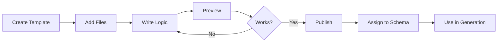
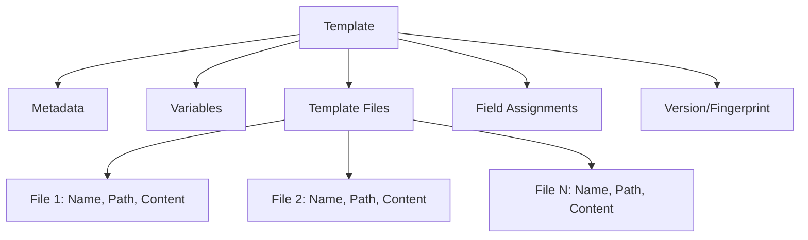

# Creating a Template

Creating a template in Scoriet is straightforward. This guide walks you through each step, from initial setup to ready-to-use template.

## Before You Start

Ensure you have:

- Access to a **Team and Schema** in Scoriet
- A clear understanding of what code you want to generate
- Sample database schema structure (for testing later)
- Basic familiarity with the [template overview](./overview.md)

:::info Preparation
Spend 5-10 minutes planning your template structure before starting. What files will it generate? What data will it access from the schema? The clearer your plan, the easier implementation becomes.
:::

## Step 1: Create Template Metadata

The first step is creating your template with basic information.

### Access Template Creation

1. Navigate to **Template Management** section
2. Select your **Team** and **Schema**
3. Click **+ New Template** button

<div class="screenshot-placeholder">Screenshot: Template creation dialog with name and description fields — <code>create-template-dialog.png</code></div>

### Fill Template Metadata

Complete the following fields:

#### **Template Name** (Required)
A clear, descriptive name for your template.

**Good examples:**
- "Laravel CRUD Generator"
- "REST API Template"
- "React Component Generator"
- "Database Migration Template"

**Avoid:**
- Generic names like "Template 1"
- Abbreviations without context
- Special characters that could affect filenames

#### **Description** (Required)
Explain what this template generates.

**Example:**
> "Generates Laravel models, controllers, and API routes for complete CRUD operations based on database schema. Includes validation, relationships, and RESTful endpoints."

#### **Category** (Optional)
Classify your template for organization:

- Backend
- Frontend
- API
- Database
- Documentation
- Custom

**Tip:** Use consistent categories across your team.

#### **Tags** (Optional)
Add searchable tags:

```
Laravel, PHP, CRUD, REST API, Backend
Vue, SPA, Frontend, Components
PostgreSQL, Migration, Schema
```

**Benefits:**
- Easy discovery in Template Store
- Quick filtering in template lists
- Better organization in large libraries

#### **Version** (Auto-calculated)
Scoriet automatically assigns:
- **Version Number**: Starting at 1.0.0
- **Fingerprint**: Unique identifier for this version
- **Created Date**: Auto-populated

You don't need to set these manually—Scoriet manages versioning automatically.

#### **Template Icon/Category Color** (Optional)
Choose a visual identifier:

- Icon from template category
- Color for visual organization
- Helps distinguish templates in UI

### Example Configuration

```
Name: "Laravel CRUD Generator"
Description: "Generates Laravel models, controllers, API routes, 
             and Blade views for complete CRUD operations"
Category: Backend
Tags: Laravel, PHP, CRUD, REST API
```

<div class="screenshot-placeholder">Screenshot: Completed template metadata form — <code>template-metadata-filled.png</code></div>

:::note Naming Convention
Use PascalCase for template names and include the primary technology: "LaravelCrudTemplate" or "ReactComponentGenerator" makes templates immediately identifiable.
:::

## Step 2: Configure Template Variables

Before adding files, define variables your template will use.

### What Are Template Variables?

Variables are **placeholders** that get replaced with actual data during code generation:

```
{:projectname:}      → Replaced with actual project name
{:tablename:}        → Replaced with current table name
{:customvar:}        → Replaced with custom value you define
```

### Add Custom Variables

1. Click **Template Variables** section
2. Click **+ Add Variable**
3. Fill in variable details:

| Field | Purpose | Example |
|-------|---------|---------|
| **Variable Name** | Name used in templates | `companyName`, `apiVersion` |
| **Display Name** | Label for UI | "Company Name", "API Version" |
| **Type** | Data type | Text, Number, Boolean |
| **Default Value** | Fallback value | "Acme Corp", "1.0.0" |
| **Description** | What it's used for | "Company name for generated code" |
| **Required** | Must be provided? | Yes/No |

### Example Custom Variables

```
Variable Name: companyName
Display Name: Company Name
Type: Text
Default: Acme Corporation
Description: Company name to include in generated code headers

---

Variable Name: apiVersion
Display Name: API Version
Type: Text
Default: v1
Description: API version for endpoint URLs

---

Variable Name: useTimestamps
Display Name: Include Timestamps
Type: Boolean
Default: true
Description: Include created_at/updated_at fields in models
```

<div class="screenshot-placeholder">Screenshot: Template variables configuration panel — <code>template-variables.png</code></div>

:::info System vs. Custom Variables
System variables like `{:tablename:}` and `{:projectname:}` are built-in and always available. Custom variables extend this for project-specific needs. Learn more in the [Variables guide](./variables.md).
:::

## Step 3: Add Template Files

Now add the actual code generation files.

### Create Your First Template File

1. Click **+ Add Template File**
2. Enter file configuration:

#### **File Name** (Required)
Name of the file to be generated.

**Can include placeholders:**

```
model.php                          // Static filename
{:tablename:}.php                 // Dynamic: Users.php, Posts.php
{:tablename:}Controller.php       // Dynamic: UsersController.php
```

**Important:** Placeholders in filenames are processed during generation.

#### **Output Path** (Required)
Where the file should be saved in the project.

```
app/Models/
app/Http/Controllers/
app/Http/Controllers/{:tablename:}/
resources/views/{:tablename:}/
```

**Tip:** Use consistent paths for organization.

#### **File Type** (Optional)
Helps with syntax highlighting:

- PHP, JavaScript, Java, Python, SQL, HTML, CSS, YAML, JSON, etc.

#### **Description** (Optional)
What this file generates:

```
"Generates Laravel Eloquent model with relationships and scopes"
"Creates API controller with CRUD endpoints"
"Generates Blade template for list view"
```

### Template File Example Configuration

```
File Name: {:tablename:}.php
Output Path: app/Models/
File Type: PHP
Description: Generates Laravel Eloquent model with relationships 
             and custom scopes for table

---

File Name: {:tablename:}Controller.php
Output Path: app/Http/Controllers/
File Type: PHP
Description: Generates API controller with complete CRUD endpoints

---

File Name: {:tablename:}/index.blade.php
Output Path: resources/views/
File Type: HTML
Description: Generates list view template
```

<div class="screenshot-placeholder">Screenshot: Add template file dialog — <code>add-template-file.png</code></div>

:::caution File Naming Best Practice
Always use placeholders like `{:tablename:}` in filenames when generating multiple files per table. This prevents file overwriting and maintains organization.
:::

## Step 4: Write Template Content

Now write the actual code generation logic in each template file.

### Access Template Editor

1. Click on a template file to edit
2. The **Template Editor** opens with:
   - Code editor (left side)
   - Syntax highlighting
   - Line numbers
   - Placeholder autocomplete

<div class="screenshot-placeholder">Screenshot: Template editor interface with code panel — <code>template-editor.png</code></div>

### Template Syntax Basics

#### Placeholders
Insert variables:

```
{:projectname:}      // Project name
{:tablename:}        // Current table name
{:fieldname:}        // Current field name
{:companyName:}      // Custom variable
```

#### Loops
Iterate over schema items:

```
{:for table:}
// Code here repeats for each table in schema
{:endfor:}

{:for field in table.fields:}
// Code here repeats for each field
{:endfor:}
```

#### Conditionals
Branch logic:

```
{:if field.type == "int":}
    // Code for integer fields
{:else:}
    // Code for other types
{:endif:}
```

#### JavaScript Code
Embed complex logic:

```
{:code:}
    // JavaScript here
    let fieldName = "user_name";
    let camelCase = fieldName.replace(/_([a-z])/g, (_, letter) => 
        letter.toUpperCase()
    );
{:codeend:}
```

### Simple Template Example

Here's a minimal Laravel model template:

```php
<?php

namespace App\Models;

use Illuminate\Database\Eloquent\Model;

class {:tablename:} extends Model
{
    protected $table = '{:tablename:}';
    
    protected $fillable = [
{:for field in table.fields:}
        '{:field.name:}',
{:endfor:}
    ];
}
```

### Complete Laravel CRUD Template Example

```php
<?php

namespace App\Models;

use Illuminate\Database\Eloquent\Model;
use Illuminate\Database\Eloquent\Factories\HasFactory;

/**
 * {:tablename:} Model
 * 
 * Generated for {:projectname:} by Scoriet
 * {@timestamp:}
 */
class {:tablename:} extends Model
{
    use HasFactory;
    
    protected $table = '{:tablename:}';
    
    protected $fillable = [
{:for field in table.fields:}
{:if field.type != "timestamps":}
        '{:field.name:}',
{:endif:}
{:endfor:}
    ];
    
    protected $casts = [
{:for field in table.fields:}
{:if field.type == "boolean":}
        '{:field.name:}' => 'boolean',
{:endif:}
{:if field.type == "json":}
        '{:field.name:}' => 'array',
{:endif:}
{:endfor:}
    ];
    
    protected $visible = [
{:for field in table.fields:}
        '{:field.name:}',
{:endfor:}
    ];
}
```

<div class="screenshot-placeholder">Screenshot: Template editor with code example — <code>template-code-example.png</code></div>

:::tip Start Simple
Begin with basic templates that generate minimal but correct code. Once working, incrementally add complexity—loops, conditionals, custom variables. This reduces debugging time.
:::

## Step 5: Define Field Assignments

Field assignments control which database fields are included in generation.

### What Are Field Assignments?

They determine:
- Which fields from your schema are used
- How fields map to template sections
- Per-field inclusion/exclusion logic
- Field type-based behavior

### Configure Field Assignments

1. Click **Field Assignments** tab
2. For each template file, define:

| Setting | Purpose |
|---------|---------|
| **Include All Fields** | Use every database field |
| **Exclude Fields** | Skip specific fields (e.g., created_at) |
| **By Field Type** | Include only specific types |
| **Custom Selection** | Choose explicit fields |

### Example Field Assignment

```
Template File: model.php
├─ Include: All fields
├─ Exclude: created_at, updated_at
└─ Field visibility: public (show in model)

Template File: api.tpl
├─ Include: Only non-internal fields
├─ Exclude: password, secret_key
└─ Field visibility: api_response
```

<div class="screenshot-placeholder">Screenshot: Field assignments configuration — <code>field-assignments.png</code></div>

:::note When to Use Field Assignments
Use field assignments when your template should handle different fields differently—some in one file, others excluded, or with different formatting per type.
:::

## Step 6: Preview Template

Before publishing, preview your template with a test schema.

### Run Template Preview

1. Click **Preview** button
2. Select a **test schema** with tables
3. Choose specific **tables** to preview
4. Click **Generate Preview**

<div class="screenshot-placeholder">Screenshot: Preview generation dialog — <code>template-preview.png</code></div>

### Review Generated Output

The preview shows:

- **Generated file structure** with filenames
- **Content preview** for each file
- **Variable substitutions** rendered
- **Potential errors** highlighted
- **File count** and organization

### Check for Common Issues

✓ Variable placeholders replaced correctly
✓ Loop iterations completed
✓ Proper indentation and formatting
✓ No syntax errors
✓ Filenames generated as expected
✓ Output organized in correct paths

If issues found, go back and edit template files, then preview again.

<div class="screenshot-placeholder">Screenshot: Preview output showing generated files — <code>template-preview-output.png</code></div>

## Step 7: Publish Template

Once tested and working, publish your template.

### Publish Your Template

1. Click **Publish** button
2. Review version information:
   - Version number (auto-incremented)
   - Fingerprint (unique ID)
   - Change description (optional)

3. Click **Confirm Publish**

<div class="screenshot-placeholder">Screenshot: Publish template confirmation dialog — <code>publish-template.png</code></div>

### What Publishing Does

- ✓ Locks current state
- ✓ Creates version fingerprint
- ✓ Makes template available for assignment
- ✓ Records in version history
- ✓ Enables sharing via Template Store

:::caution Publishing is Permanent
Once published, a version cannot be changed. To modify a published template, you create a new version. This ensures reproducibility and change tracking.
:::

## Step 8: Assign Template to Schema

Now make your template available for code generation.

### Assign Template

1. Click **Assign Template** button
2. Select **target schema(s)**
3. Configure assignment options:
   - **Active**: Enable/disable template
   - **Variable Values**: Set project-specific values
   - **Field Mapping**: Customize for this schema

4. Click **Assign**

<div class="screenshot-placeholder">Screenshot: Template assignment dialog — <code>assign-template.png</code></div>

### Assignment Workflow



## Quick Reference: Creating a Template

### Checklist

- [ ] Create template with name, description, category
- [ ] Define any custom variables needed
- [ ] Add template files with appropriate names/paths
- [ ] Write generation logic in each file
- [ ] Configure field assignments (if needed)
- [ ] Preview template with test schema
- [ ] Fix any issues found in preview
- [ ] Publish template
- [ ] Assign to your target schema(s)
- [ ] Generate code to verify it works

### Template Structure Diagram



## Common Template Patterns

### Pattern 1: Single Output File
```
Template: Simple SQL Script
├─ File: schema.sql
└─ Content: CREATE TABLE statements
```

### Pattern 2: Multiple Files Per Table
```
Template: CRUD Generator
├─ File: {:tablename:}.php (model)
├─ File: {:tablename:}Controller.php (controller)
└─ File: {:tablename:}/index.blade.php (view)
```

### Pattern 3: Configuration + Code Files
```
Template: API Generator
├─ File: config.yaml (routes, metadata)
├─ File: {:tablename:}Api.ts (API handler)
└─ File: {:tablename:}Api.test.ts (tests)
```

## Troubleshooting

### Template files not generating?
- Check placeholder syntax: `{:tablename:}` not `{tablename}`
- Verify field assignments include needed fields
- Run preview to see specific errors

### Variables not substituting?
- Confirm variable names match exactly
- Check capitalization (case-sensitive)
- Verify variable type matches expected data

### Output files in wrong location?
- Check Output Path in file configuration
- Use forward slashes: `app/Models/` not `app\Models\`
- Test with preview before generating actual code

## Next Steps

- Learn about [template files in detail](./template-files.md)
- Master [template variables](./variables.md)
- Explore [versioning and control](./versioning.md)
- Review [advanced template techniques](./advanced.md)

## Summary

You've now learned how to create a complete, working template in Scoriet. The key steps are:

1. **Define** what you're building
2. **Configure** metadata and variables
3. **Structure** your template files
4. **Implement** generation logic
5. **Preview** to verify correctness
6. **Publish** to lock version
7. **Assign** to schemas
8. **Generate** code at scale

With these fundamentals, you can build templates for virtually any code generation scenario.
