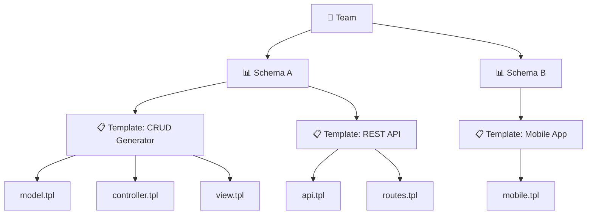

# Template Management Overview

Template Management is the **heart of Scoriet's code generation engine**. Templates define how your code is generated, what components are created, and how database structures are transformed into production-ready applications.

Whether you're generating a complete CRUD application, REST APIs, frontend components, or any custom code structure, Scoriet's flexible template system puts you in control.

## What Are Templates?

Templates are **reusable blueprints** that define how database schemas should be transformed into code. They contain:

- **Template files** with code generation logic
- **Placeholder markers** for dynamic content insertion
- **Control structures** for loops, conditionals, and logic
- **Variable bindings** that connect to your database schema and project settings

Think of a template as a sophisticated code skeleton with intelligence built in—it "understands" your database structure and generates code that's perfectly suited to it.

:::tip Key Concept
Templates are not just text files. They're intelligent, schema-aware blueprints that adapt their output based on your database structure and configuration.
:::

## Template Hierarchy

Scoriet organizes templates in a clear, hierarchical structure:



### Hierarchy Levels

| Level | Purpose | Example |
|-------|---------|---------|
| **Team** | Organization boundary | "Development Team", "Client Account" |
| **Schema** | Database structure | "E-Commerce DB", "CRM System" |
| **Template** | Code generation blueprint | "CRUD Template", "REST API Template" |
| **Template Files** | Individual code generation units | "model.tpl", "controller.tpl" |

This hierarchy allows you to:

- **Organize templates** logically within your team and schemas
- **Reuse templates** across multiple schemas
- **Version templates** independently
- **Share templates** via the Template Store
- **Control permissions** at each level

:::note Organization Tip
Use schemas to group related templates. For example, keep all "E-Commerce" related templates under one schema, and all "CRM" templates under another.
:::

## Types of Templates

Scoriet supports various template types for different generation scenarios:

### 1. CRUD Templates
Generate complete Create-Read-Update-Delete operations including:
- Data models with validation
- Database access layers
- Controllers/handlers
- API endpoints
- User interface components

**Use when:** Building standard business applications

### 2. REST API Templates
Generate REST-compliant APIs including:
- Endpoint definitions
- Request/response handling
- Authentication integration
- OpenAPI/Swagger documentation

**Use when:** Building backend APIs or microservices

### 3. Frontend Templates
Generate UI components:
- React/Vue component files
- Styling and layouts
- Form handling
- State management

**Use when:** Building modern web applications

### 4. Database Templates
Generate database-related code:
- Migration scripts
- Seed data generators
- Database schema documentation
- Index creation

**Use when:** Handling database initialization and management

### 5. Custom Templates
Generate any custom code structure:
- Domain-specific languages
- Configuration files
- Documentation
- Deployment scripts

**Use when:** Solving unique business requirements

:::info Template Flexibility
You're not limited to predefined types. Create any template structure you need—Scoriet's flexible system adapts to your requirements.
:::

## Template Lifecycle

Every template goes through a clear lifecycle from creation to deployment:

```mermaid
stateDiagram-v2
    [*] --> Create: Create Template<br/>Configure metadata
    Create --> Edit: Add Template Files<br/>Write code generation logic
    Edit --> Test: Test with<br/>sample schema
    Test --> Verify{Output<br/>correct?}
    Verify -->|No| Edit: Refine template
    Verify -->|Yes| Publish: Publish/Share
    Publish --> Assign: Assign to schemas<br/>and projects
    Assign --> Generate: Use in code<br/>generation
    Generate --> [*]
    Generate -.->|Update| Edit: Improve template
```

### Lifecycle Phases

#### 1. **Create** 📋
- Define template metadata (name, description, category)
- Set up template structure
- Configure template variables
- Typical duration: 5-15 minutes

#### 2. **Edit** ✏️
- Add template files
- Write generation logic with placeholders
- Implement loops, conditionals, and code blocks
- Define field assignments
- Typical duration: 30+ minutes depending on complexity

#### 3. **Test** 🧪
- Generate code against test schemas
- Verify output structure and content
- Check variable substitution
- Validate code syntax
- Typical duration: 10-20 minutes

#### 4. **Publish** 🚀
- Finalize version
- Create fingerprint for versioning
- Make template available
- Optional: Share via Template Store
- Typical duration: 2 minutes

#### 5. **Assign** 🔗
- Link template to specific schemas
- Configure template variables for project
- Set field mappings
- Typical duration: 5-10 minutes

#### 6. **Generate** ⚡
- Execute template against database schemas
- Produce generated code files
- Export to project
- Typical duration: Seconds to minutes

:::caution Testing is Essential
Always test templates thoroughly before assigning them to production schemas. A small error in template logic can propagate to many generated files.
:::

## Template Features

### Dynamic Content
Templates are **not static**. They adapt based on:
- Database schema structure
- Number of tables and fields
- Field data types
- Project-specific variables
- User-defined custom variables

### Code Generation Logic
Templates support sophisticated generation through:
- **Placeholders**: `{:tablename:}`, `{:fieldname:}`
- **Loops**: Iterate over tables, fields, constraints
- **Conditionals**: Branch logic based on field type or properties
- **JavaScript Code**: Embed complex logic directly in templates
- **Include Statements**: Reuse template snippets

### Versioning & Control
- **Fingerprinting**: Automatic version tracking
- **Version History**: View all previous versions
- **Rollback**: Revert to earlier versions instantly
- **Change Tracking**: See what changed between versions

### Sharing & Collaboration
- **Template Store**: Share templates with your team
- **Template Marketplace**: Access community templates
- **Export/Import**: Share templates via files
- **Permissions**: Control who can view/edit templates

## Template Variables

Templates use variables to inject dynamic content:

### System Variables
Pre-defined variables automatically available:

```
{:projectname:}      - Current project name
{:tablename:}        - Current table being processed
{:fieldname:}        - Current field being processed
{:nmaxitems:}        - Number of items in collection
{:filename:}         - Output filename
{:timestamp:}        - Current timestamp
```

### Custom Variables
User-defined variables specific to your project:

```
{:company:}          - Your company name
{:apiversion:}       - API version number
{:basepackage:}      - Base package name
{:customvar:}        - Any custom variable you define
```

Learn more in the [Variables guide](./variables.md).

:::info Variable Power
Combine system and custom variables to create incredibly flexible templates that adapt to any project requirement.
:::

## Template Files & Field Assignments

Each template contains one or more **template files**—individual code generation units:

```
Template: Laravel CRUD Generator
├── models/{:tablename:}.php
├── controllers/{:tablename:}Controller.php
├── routes/api.tpl
└── views/{:tablename:}/index.blade.php
```

**Field assignments** map specific database fields to template sections:

- Determine which fields generate which code
- Allow selective field inclusion in generated code
- Enable per-template field filtering
- Support field type-based logic

Learn more in the [Template Files guide](./template-files.md).

## Getting Started with Templates

### Quick Start Workflow

1. **Create a Template** → Define name, description, category
2. **Add Template Files** → Create code generation units
3. **Write Generation Logic** → Add placeholders, loops, conditionals
4. **Test Against Schema** → Verify output
5. **Publish Template** → Lock version, make available
6. **Assign to Schema** → Connect to database structure
7. **Generate Code** → Execute and export

### Common Scenarios

**Building REST API?**
- Start with a REST API template
- Define endpoints, request/response structures
- Map database fields to API properties

**Creating Web Application?**
- Use CRUD template for models and controllers
- Add frontend template for UI
- Configure field mappings for form generation

**Generating Documentation?**
- Create custom template
- Use loops to iterate tables and fields
- Produce API docs, schema documentation

:::tip Best Practice
Start by examining existing templates in your team or from the Template Store. Understanding proven patterns will accelerate your template development.
:::

## Next Steps

- Learn how to [create templates](./create-template.md)
- Understand [template files and structure](./template-files.md)
- Master [template variables](./variables.md)
- Explore [versioning and control](./versioning.md)

## Summary

Scoriet's template system is the backbone of intelligent code generation. By understanding the hierarchy, lifecycle, and features of templates, you unlock the power to generate production-quality code in minutes instead of days.

Start with simple templates, gradually add complexity, and build a library of reusable blueprints that accelerate your development process.
