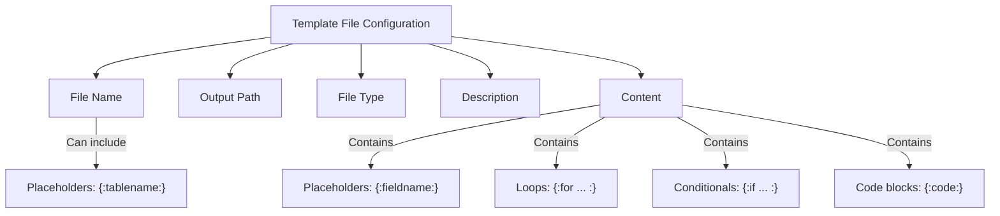
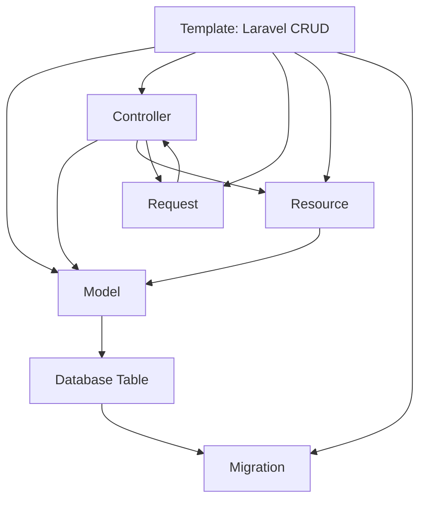

# Template Files

Template files are the **building blocks** of your templates. Each file represents one unit of code generation, producing one or more output files in your project.

Understanding how to structure and organize template files is crucial for creating effective, reusable templates.

## What Are Template Files?

A **template file** is a blueprint for generating one or more output files. It contains:

- **File name** (can include dynamic placeholders)
- **Output path** (where files are saved)
- **Content** with generation logic (placeholders, loops, conditionals)
- **Field assignments** (which database fields to include)
- **Type information** (PHP, JavaScript, SQL, etc.)

### Single File vs. Multiple Files

**Single template file** generates **multiple output files**:

```
Template File: {:tablename:}.php

When processed against a schema with 5 tables:
├─ Users.php (generated from template)
├─ Posts.php (generated from template)
├─ Comments.php (generated from template)
├─ Categories.php (generated from template)
└─ Tags.php (generated from template)
```

This is the power of templates—one template file becomes many output files.

:::info Key Concept
A single template file generates multiple output files when placeholders like `{:tablename:}` are used in the filename. This is how you generate code for all tables without manually writing each file.
:::

## Template File Structure

### Anatomy of a Template File



## Naming Template Files

### Static Filenames
Use when generating a single file:

```
api-routes.js         // Always named this
config.yaml          // Configuration file
README.md            // Documentation
```

**Use case:** Common configuration, shared routes, documentation.

### Dynamic Filenames with Placeholders

Use when generating multiple files per table:

```
{:tablename:}.php                    // Users.php, Posts.php, etc.
{:tablename:}Controller.php          // UsersController.php, etc.
{:tablename:}Service.ts              // UserService.ts, etc.
{:tablename:}/index.blade.php        // Users/index.blade.php, etc.
```

**Placeholder variables available in filenames:**

| Variable | Produces | Example |
|----------|----------|---------|
| `{:tablename:}` | Table name | Users, Posts, Comments |
| `{:projectname:}` | Project name | MyApp, EcommerceApp |
| `{:timestamp:}` | Current timestamp | 2024-01-15-143022 |
| `{:customvar:}` | Custom variable | CompanyName |

### Filename Conventions

**Laravel Example:**
```
Models/{:tablename:}.php
Controllers/{:tablename:}Controller.php
Requests/{:tablename:}StoreRequest.php
Requests/{:tablename:}UpdateRequest.php
Resources/{:tablename:}Resource.php
```

**React Example:**
```
components/{:tablename:}/List.tsx
components/{:tablename:}/Form.tsx
components/{:tablename:}/Detail.tsx
hooks/use{:tablename:}.ts
services/{:tablename:}Service.ts
```

**Angular Example:**
```
{:tablename:}.model.ts
{:tablename:}.service.ts
{:tablename:}.component.ts
{:tablename:}.component.html
{:tablename:}.component.css
```

:::caution Placeholder Syntax
Always use `{:tablename:}` with colons. Common mistakes:
- ❌ `{tablename}` (missing colons)
- ❌ `[tablename]` (wrong brackets)
- ❌ `$tablename` (wrong syntax)

Only `{:tablename:}` is recognized as a placeholder.
:::

## Output Paths

### What Is Output Path?

The directory in your project where generated files are saved:

```
app/Models/                  // Laravel models
app/Http/Controllers/        // Laravel controllers
src/components/              // React components
src/services/                // Service files
database/migrations/         // Database migrations
resources/views/             // View templates
```

### Path Guidelines

**Use forward slashes:**
```
✓ app/Models/
✓ src/components/Services/
✓ resources/views/

✗ app\Models\           (Windows-style backslash)
✗ app//Models/          (Double slashes)
✗ ./app/Models/         (Leading relative path)
```

**Be consistent:**
- Use same path for related files
- Maintain project structure conventions
- Avoid deeply nested paths

**Include trailing slash:**
```
✓ app/Models/           (with slash)
✗ app/Models            (without slash)
```

### Path Placeholders

Paths can also include placeholders:

```
app/Models/{:tablename:}/          // app/Models/User/
src/components/{:tablename:}/      // src/components/Post/
database/{:projectname:}/          // database/myapp/
```

This creates per-table or per-project directories automatically.

### Dynamic Path Example

```
Template File Configuration:
  File Name: Index.tsx
  Output Path: src/views/{:tablename:}/
  
Generated Output:
  src/views/Users/Index.tsx
  src/views/Posts/Index.tsx
  src/views/Comments/Index.tsx
```

## File Types

### Supported File Types

Scoriet recognizes file types for syntax highlighting and validation:

**Backend Languages:**
- PHP, Python, Java, C#, Go, Rust, Ruby, Kotlin

**Frontend Languages:**
- JavaScript, TypeScript, React, Vue, Angular
- HTML, CSS, SCSS, LESS

**Data Formats:**
- JSON, YAML, TOML, XML
- CSV, TSV

**Database:**
- SQL, MySQL, PostgreSQL, T-SQL

**Templates & Configuration:**
- Blade, Twig, Mustache, Handlebars
- YAML, TOML, INI

**Documentation:**
- Markdown, AsciiDoc, ReStructuredText

### Why File Types Matter

- **Syntax Highlighting**: Correct coloring in editor
- **Validation**: Catch syntax errors
- **Code Generation**: Tools can process specific formats
- **IDE Integration**: When exported, files open in correct tools

### Setting File Type

When creating a template file:

```
File Name: {:tablename:}.php
File Type: PHP

File Name: {:tablename:}.tsx
File Type: TypeScript

File Name: config.yaml
File Type: YAML
```

:::info Auto-Detection
Scoriet auto-detects file types from extensions:
- `.php` → PHP
- `.js` → JavaScript
- `.ts` → TypeScript
- `.sql` → SQL

You can override if needed for special cases.
:::

## File Content & Structure

### Content Organization

Well-structured template content:

```
Header/Documentation
├─ File purpose
├─ Author/generated marker
└─ Created date

Imports/Dependencies
├─ Required modules
├─ Base classes
└─ Utilities

Class/Function Definition
├─ Class declaration
├─ Properties
└─ Methods

Generated Content
├─ Properties from database
├─ Methods for each field
└─ Relationships

Footer
└─ Documentation links
```

### Example: Laravel Model Template File

```php
<?php

namespace App\Models;

use Illuminate\Database\Eloquent\Model;
use Illuminate\Database\Eloquent\Factories\HasFactory;

/**
 * {:tablename:} Model
 * 
 * Generated by Scoriet Code Generator
 * {@timestamp:}
 */
class {:tablename:} extends Model
{
    use HasFactory;
    
    protected $table = '{:tablename:}';
    protected $guarded = [];
    
    protected $fillable = [
{:for field in table.fields:}
{:if field.type != 'timestamp':}
        '{:field.name:}',
{:endif:}
{:endfor:}
    ];
    
    protected $casts = [
{:for field in table.fields:}
{:if field.type == 'boolean':}
        '{:field.name:}' => 'boolean',
{:endif:}
{:if field.type == 'json':}
        '{:field.name:}' => 'array',
{:endif:}
{:if field.type == 'date' || field.type == 'datetime':}
        '{:field.name:}' => 'datetime',
{:endif:}
{:endfor:}
    ];
}
```

### Example: React Component Template File

```typescript
import React, { useState, useEffect } from 'react';
import { ApiService } from '@/services/ApiService';
import { {:tablename:} } from '@/types/{:tablename:}';

/**
 * {:tablename:} Component
 * Generated by Scoriet
 * {@timestamp:}
 */
export const {:tablename:}Component: React.FC = () => {
  const [items, setItems] = useState<{:tablename:}[]>([]);
  const [loading, setLoading] = useState(false);
  
  useEffect(() => {
    fetchData();
  }, []);
  
  const fetchData = async () => {
    setLoading(true);
    try {
      const data = await ApiService.get('{:tablename:}');
      setItems(data);
    } finally {
      setLoading(false);
    }
  };
  
  return (
    <div className="{:tablename:}-container">
      <h1>{:tablename:} Management</h1>
      {loading ? (
        <div>Loading...</div>
      ) : (
        <table>
          <thead>
            <tr>
{:for field in table.fields:}
{:if field.type != 'timestamp':}
              <th>{:field.label:}</th>
{:endif:}
{:endfor:}
            </tr>
          </thead>
          <tbody>
            {items.map(item => (
              <tr key={item.id}>
{:for field in table.fields:}
{:if field.type != 'timestamp':}
                <td>{item.{:field.camelname:}}</td>
{:endif:}
{:endfor:}
              </tr>
            ))}
          </tbody>
        </table>
      )}
    </div>
  );
};
```

<div class="screenshot-placeholder">Screenshot: Template file editor showing multi-file template structure — <code>template-file-editor.png</code></div>

## Multiple Files in One Template

### Template with Multiple Files

A single template typically contains multiple related files:

```
Template: "Laravel CRUD Generator"
├─ Model file: {:tablename:}.php
├─ Controller file: {:tablename:}Controller.php
├─ Request file: {:tablename:}Request.php
├─ Resource file: {:tablename:}Resource.php
└─ Migration file: create_{:tablename:}_table.php
```

### File Relationships

Files in a template are coordinated:



### Processing Order

Files are typically processed in order:

1. **Database files first** (migrations, schema)
2. **Core models** (entities, data structures)
3. **Business logic** (controllers, services)
4. **API/Presentation** (responses, views)
5. **Configuration** (routes, settings)

:::note File Processing
While files are processed sequentially, they're independent units. The content of one file doesn't depend on another's content—each generates from the schema independently.
:::

## Field Assignments in Files

### What Are Field Assignments?

For each template file, control which database fields are included:

```
Template File: User.php
├─ Include: All fields
├─ Exclude: password, secret_key
└─ Visibility: public

Template File: UserApi.ts
├─ Include: All fields except internal
├─ Exclude: password, last_login_ip
└─ Visibility: api_safe
```

### Field Assignment Options

| Option | Purpose | Example |
|--------|---------|---------|
| **Include All** | Use every field | Include: All |
| **Exclude Specific** | Skip fields | Exclude: password, token |
| **By Type** | Only certain types | Include: string, integer |
| **By Visibility** | Field visibility level | Include: public, api |
| **Custom List** | Explicit selection | Include: id, name, email |

### Example Configuration

```
Model Template: {:tablename:}.php
├─ Include: All fields
├─ Exclude: deleted_at
└─ Purpose: Internal model representation

API Template: {:tablename:}Response.ts
├─ Include: Public fields only
├─ Exclude: password, secret, deleted_at
└─ Purpose: Safe API response

Admin Template: {:tablename:}Admin.ts
├─ Include: All fields
├─ Purpose: Full administrative access
```

## Template File Editing

### Edit Existing Files

1. Click on template file in list
2. Make changes to:
   - File name or output path
   - Content and logic
   - Field assignments
   - File type

3. Click **Save** to update

### Delete Files

1. Click **delete icon** on file
2. Confirm deletion
3. Click **Remove**

:::caution Deletion is Permanent
Deleting a template file removes it from the template. This affects any future generations using this template. Existing generated code is not affected, but new generations won't include this file.
:::

### Reorder Files

If order matters for generation:

1. Drag files to reorder
2. Files process top-to-bottom
3. Click **Save Order**

## Common Template File Patterns

### Pattern 1: Framework Scaffolding (Laravel)

```
Template: Laravel Complete CRUD
├─ Migration: database/migrations/create_{:tablename:}_table.php
├─ Model: app/Models/{:tablename:}.php
├─ Controller: app/Http/Controllers/{:tablename:}Controller.php
├─ Request: app/Http/Requests/{:tablename:}StoreRequest.php
├─ Request: app/Http/Requests/{:tablename:}UpdateRequest.php
├─ Resource: app/Http/Resources/{:tablename:}Resource.php
└─ Route: routes/{:tablename:}.api.php
```

### Pattern 2: Frontend Components (React)

```
Template: React Component Suite
├─ Component: src/components/{:tablename:}/List.tsx
├─ Component: src/components/{:tablename:}/Form.tsx
├─ Component: src/components/{:tablename:}/Detail.tsx
├─ Type: src/types/{:tablename:}.ts
├─ Service: src/services/{:tablename:}Service.ts
├─ Hook: src/hooks/use{:tablename:}.ts
└─ Test: src/components/{:tablename:}/__tests__/List.test.tsx
```

### Pattern 3: API-First (Node/TypeScript)

```
Template: Express API Routes
├─ Model: src/models/{:tablename:}.model.ts
├─ Service: src/services/{:tablename:}.service.ts
├─ Route: src/routes/{:tablename:}.routes.ts
├─ Controller: src/controllers/{:tablename:}.controller.ts
├─ Validation: src/validations/{:tablename:}.validation.ts
└─ Test: src/tests/{:tablename:}.test.ts
```

### Pattern 4: Documentation

```
Template: API Documentation
├─ Endpoints: docs/api/{:tablename:}-endpoints.md
├─ Models: docs/models/{:tablename:}-model.md
├─ Examples: docs/examples/{:tablename:}-examples.md
└─ OpenAPI: openapi/{:tablename:}.yaml
```

## Best Practices

### File Naming
✓ Use clear, descriptive names
✓ Include file type in name when relevant
✓ Use consistent patterns across template
✓ Use placeholders for variable parts

### File Organization
✓ Keep files logically organized
✓ Use output paths that match project structure
✓ Group related files together
✓ Document purpose of each file

### Content Quality
✓ Include headers with file purpose
✓ Add comments for complex logic
✓ Use consistent indentation
✓ Validate output in preview

### Field Assignments
✓ Explicitly define which fields to include
✓ Exclude sensitive fields from APIs
✓ Test with different schema structures
✓ Document why fields are included/excluded

## Troubleshooting

### Files not generating?
- Check file name doesn't have invalid characters
- Verify output path exists or is valid
- Ensure content doesn't have syntax errors
- Run preview to see specific issues

### Wrong filenames generated?
- Check placeholder syntax: `{:tablename:}` not `{tablename}`
- Verify placeholder is actually in filename
- Test preview to see actual filenames

### Fields missing from output?
- Check field assignments include the field
- Verify field type is included in filters
- Test with different schemas
- Review visibility settings

## Next Steps

- Learn [how to create templates](./create-template.md)
- Master [template variables](./variables.md)
- Understand [versioning](./versioning.md)

## Summary

Template files are the executable blueprints of your code generation. By understanding:

- **Dynamic filenames** with placeholders
- **Output path** organization
- **File type** categorization
- **Field assignments** for selective generation
- **Multiple file coordination**

You unlock the ability to generate complete, multi-file projects from a single template definition.
