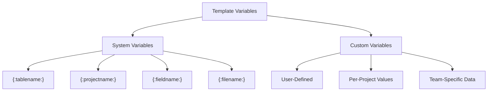

# Template Variables

Variables are the **dynamic hearts** of templates. They transform static templates into intelligent, context-aware blueprints that adapt to any project and database structure.

## Introduction to Variables

### What Are Variables?

Variables are placeholders in templates that get replaced with actual values during code generation:

```
Template: "class {:tablename:} extends Model"
          ↓
Generated: "class Users extends Model"
           (when processing the Users table)
```

Every time the template processes, variables provide different values based on context.

### Two Types of Variables



## System Variables

System variables are **built-in** and automatically available in every template. They're populated from the database schema and project configuration.

### System Variables Reference

Complete list of system variables:

#### **{:tablename:}**
The name of the table currently being processed.

**Example:**
```
Template: class {:tablename:} extends Model
Schema has tables: users, posts, comments

Generated:
class users extends Model
class posts extends Model
class comments extends Model
```

**Use cases:**
- Class names
- File names
- Identifiers
- Document titles

#### **{:projectname:}**
The name of the current project.

**Example:**
```
Template: package com.{:projectname:}.models;
Project: "myapp"

Generated: package com.myapp.models;
```

**Use cases:**
- Package/namespace names
- Project identifiers
- Documentation headers
- Configuration values

#### **{:fieldname:}**
The name of the field currently being processed (in loops).

**Example:**
```
Template:
{:for field in table.fields:}
    {@field.name:}
{:endfor:}

For Users table with fields [id, name, email]:
Generated:
    id
    name
    email
```

**Use cases:**
- Field properties
- Column declarations
- Parameter names
- Property assignments

#### **{:field.name:}**
Specific field property: database field name (exact).

**Example:**
```
Database field: user_name
{:field.name:} → user_name
```

#### **{:field.label:}**
Human-readable field label.

**Example:**
```
Database field: user_name
{:field.label:} → User Name
(auto-converted from snake_case)
```

#### **{:field.type:}**
Database field data type.

**Example:**
```
Database: id INT PRIMARY KEY
{:field.type:} → int

Database: user_name VARCHAR(255)
{:field.type:} → string

Database: is_active BOOLEAN
{:field.type:} → boolean
```

**Common types:**
- `string`, `text`, `varchar`
- `integer`, `int`, `bigint`, `smallint`
- `float`, `decimal`, `double`
- `boolean`, `bool`
- `date`, `datetime`, `timestamp`
- `json`, `jsonb`
- `enum`

#### **{:field.camelcase:}**
Field name converted to camelCase.

**Example:**
```
Database field: user_name
{:field.camelcase:} → userName

Database field: first_name
{:field.camelcase:} → firstName
```

**Use cases:**
- JavaScript/TypeScript properties
- Method names
- Parameter names

#### **{:field.pascalcase:}**
Field name converted to PascalCase.

**Example:**
```
Database field: user_name
{:field.pascalcase:} → UserName

Database field: first_name
{:field.pascalcase:} → FirstName
```

**Use cases:**
- Class names
- Type names
- Component names

#### **{:field.length:}**
Field length for strings.

**Example:**
```
Database: name VARCHAR(255)
{:field.length:} → 255

Database: email VARCHAR(100)
{:field.length:} → 100
```

**Use cases:**
- Form validation
- Database constraints
- Input limits

#### **{:field.nullable:}**
Whether field allows NULL values.

**Example:**
```
Database: email VARCHAR(255) NULL
{:field.nullable:} → true

Database: id INT NOT NULL
{:field.nullable:} → false
```

**Use cases:**
- Nullable checks
- Required field logic
- Validation rules

#### **{:field.default:}**
Default value for field.

**Example:**
```
Database: status VARCHAR(20) DEFAULT 'active'
{:field.default:} → active

Database: count INT DEFAULT 0
{:field.default:} → 0
```

**Use cases:**
- Field initialization
- Default values in forms
- Seed data

#### **{:field.isprimary:}**
Is this field a primary key?

**Example:**
```
Database: id INT PRIMARY KEY
{:field.isprimary:} → true

Database: name VARCHAR(255)
{:field.isprimary:} → false
```

**Use cases:**
- Identifying key fields
- Unique constraint logic
- ID field handling

#### **{:field.isforeign:}**
Is this field a foreign key?

**Example:**
```
Database: user_id INT FOREIGN KEY
{:field.isforeign:} → true

Database: name VARCHAR(255)
{:field.isforeign:} → false
```

**Use cases:**
- Relationship detection
- Reference handling
- Join logic

#### **{:field.referencedtable:}**
For foreign keys, the referenced table.

**Example:**
```
Database: user_id INT FOREIGN KEY REFERENCES users(id)
{:field.referencedtable:} → users
```

**Use cases:**
- Relationship mapping
- Join declarations
- Reference documentation

#### **{:nmaxitems:}**
Total count of items in current collection.

**Example:**
```
Table has 5 fields:
{:nmaxitems:} → 5

Schema has 12 tables:
{:nmaxitems:} → 12
```

**Use cases:**
- Loop counters
- Conditional checks
- Collection size references

#### **{:filename:}**
The output filename being generated.

**Example:**
```
Template file: {:tablename:}Controller.php
Processing: users

{:filename:} → UsersController.php
```

**Use cases:**
- File identification
- Auto-generated comments
- Metadata

#### **{:timestamp:}**
Current generation timestamp.

**Example:**
```
{:timestamp:} → 2024-01-15T14:30:22Z
```

**Use cases:**
- Generated markers
- Version tracking
- Timestamps in comments

#### **{:counter:}**
Loop counter (0-based in loops).

**Example:**
```
{:for field in table.fields:}
    Field #{:counter:}: {:field.name:}
{:endfor:}

Generated:
    Field #0: id
    Field #1: name
    Field #2: email
```

**Use cases:**
- Ordered lists
- Array indices
- Sequence numbering

### System Variables Quick Reference Table

| Variable | Produces | Use Case |
|----------|----------|----------|
| `{:tablename:}` | Current table | Class names, file names |
| `{:projectname:}` | Project name | Package names, namespaces |
| `{:fieldname:}` | Current field | Field identifiers |
| `{:field.name:}` | Field name | Database references |
| `{:field.label:}` | Readable label | UI labels, documentation |
| `{:field.type:}` | Data type | Type declarations, validation |
| `{:field.camelcase:}` | camelCase | JS/TS properties |
| `{:field.pascalcase:}` | PascalCase | Class/type names |
| `{:field.length:}` | String length | Constraints, validation |
| `{:field.nullable:}` | Allow NULL? | Nullable logic |
| `{:field.default:}` | Default value | Initialization |
| `{:field.isprimary:}` | Is primary key? | Key identification |
| `{:field.isforeign:}` | Is foreign key? | Relationship logic |
| `{:field.referencedtable:}` | Referenced table | Join references |
| `{:nmaxitems:}` | Collection count | Loop conditions |
| `{:filename:}` | Output filename | File references |
| `{:timestamp:}` | Current time | Timestamps, versions |
| `{:counter:}` | Loop counter | Numbering, indexing |

## Custom Variables

Custom variables extend system variables with **project-specific data**. Define them when creating your template, then set values when assigning to schemas.

### Defining Custom Variables

When [creating a template](./create-template.md), add custom variables:

```
Variable Name: companyName
Display Name: Company Name
Type: Text
Default: Acme Corporation
Description: Used in generated code headers and documentation
Required: Yes

---

Variable Name: apiVersion
Display Name: API Version
Type: Text
Default: v1
Description: Version for API endpoints
Required: Yes

---

Variable Name: useTimestamps
Display Name: Include Timestamps
Type: Boolean
Default: true
Description: Include created_at/updated_at fields
Required: No
```

<div class="screenshot-placeholder">Screenshot: Custom variables definition panel — <code>custom-variables.png</code></div>

### Custom Variable Properties

| Property | Purpose | Example |
|----------|---------|---------|
| **Variable Name** | Name used in templates | `companyName`, `apiVersion` |
| **Display Name** | Label for UI | "Company Name", "API Version" |
| **Type** | Data type | Text, Number, Boolean, Enum |
| **Default Value** | Fallback if not set | "Acme Corp", "1.0.0" |
| **Description** | Explanation | "Company name for code headers" |
| **Required** | Must be provided? | true/false |
| **Allowed Values** | For enum type | ["v1", "v2", "v3"] |

### Types of Custom Variables

#### Text Variables
For string values:

```
Variable: companyName
Type: Text
Default: Acme Corporation
Description: Company name to include in headers

Usage in template:
{:companyName:}
```

#### Number Variables
For numeric values:

```
Variable: apiVersion
Type: Number
Default: 1
Description: API version number

Usage in template:
API v{:apiVersion:}
```

#### Boolean Variables
For true/false logic:

```
Variable: includeTests
Type: Boolean
Default: true
Description: Generate test files

Usage in template:
{:if includeTests:}
    // Test code here
{:endif:}
```

#### Enum Variables
For predefined choices:

```
Variable: framework
Type: Enum
Values: ["Laravel", "Symfony", "Slim", "Yii"]
Default: Laravel
Description: PHP framework to use

Usage in template:
{:if framework == "Laravel":}
    // Laravel-specific code
{:endif:}
```

### Setting Custom Variable Values

When assigning a template to a schema, set custom variable values:

1. Go to template assignment screen
2. Scroll to **Custom Variables** section
3. Enter values for each variable:

```
Template: CRUD Generator
Variables:
├─ companyName: "TechCorp Inc."
├─ apiVersion: "2"
├─ baseNamespace: "App\TechCorp"
└─ includeTests: true
```

<div class="screenshot-placeholder">Screenshot: Template assignment with custom variables — <code>assign-template-variables.png</code></div>

### Scope of Custom Variables

**Template-level:**
- Defined when creating template
- Same for all projects using template

**Project-level:**
- Values set during assignment
- Different per project/schema
- Can be overridden per assignment

**Use cases:**

```
Template: Company Project Generator

Template Variables (defined once):
├─ companyName
├─ apiVersion
├─ baseNamespace

Project 1 Values:
├─ companyName: "TechCorp"
├─ apiVersion: "1"
├─ baseNamespace: "TechCorp"

Project 2 Values:
├─ companyName: "DataWorks"
├─ apiVersion: "2"
├─ baseNamespace: "DataWorks"
```

## Using Variables in Templates

### Variable Syntax

```
{:variablename:}     // Replace with variable value
{:tablename:}        // System variable
{:customvar:}        // Custom variable
```

### Basic Substitution

**Template:**
```php
namespace {:projectname:};

class {:tablename:} {
    private $company = "{:companyName:}";
}
```

**Generated (for Users table, TechCorp company):**
```php
namespace myapp;

class Users {
    private $company = "TechCorp";
}
```

### Variables in Conditionals

**Template:**
```
{:if useTimestamps:}
    $table->timestamps();
{:endif:}

{:if apiVersion == "2":}
    // API v2 endpoints
{:else:}
    // API v1 endpoints
{:endif:}
```

### Variables in Loops

**Template:**
```
{:for field in table.fields:}
    * Field: {:field.name:}
    * Label: {:field.label:}
    * Type: {:field.type:}
    * Nullable: {:field.nullable:}
{:endfor:}
```

### Variables in File Names

**Template File Config:**
```
File Name: {:projectname:}_{:tablename:}.sql
Output Path: database/migrations/

Generated:
myapp_users.sql
myapp_posts.sql
myapp_comments.sql
```

### Combining Variables

**Template:**
```php
<?php
/**
 * Generated for {:companyName:}
 * Table: {:tablename:}
 * Version: {:apiVersion:}
 * Generated: {:timestamp:}
 */
namespace {:projectname:}\Models;

class {:tablename:} {
    // Generated content
}
```

## Advanced Variable Usage

### Variables in JavaScript Code Blocks

Execute JavaScript to manipulate variables:

```javascript
{:code:}
    let tableName = "{:tablename:}";
    let pluralized = tableName + "s";
    let camelCase = tableName.replace(/(?:^\w|[A-Z]|\b\w)/g, 
        (word) => word.toUpperCase());
{:codeend:}

Usage: {:pluralized:}, {:camelCase:}
```

### Variable Transformations

Apply transformations to variables:

```
{:tablename:}              → users
{:tablename.upper:}        → USERS
{:tablename.lower:}        → users
{:tablename.pascalcase:}   → Users
{:tablename.camelcase:}    → users
```

### Conditional Variable Values

Provide fallback values:

```
{:field.label | "Unknown":}  // Use label, or "Unknown" if empty
{:field.default | "null":}   // Use default, or "null"
```

## Common Variable Patterns

### Pattern 1: Header Generation

```
/**
 * Generated for {:companyName:}
 * Project: {:projectname:}
 * Table: {:tablename:}
 * Created: {:timestamp:}
 * Version: {@apiVersion:}
 */
```

### Pattern 2: Namespace/Package Declaration

```php
namespace {:projectname:}\Models;      // PHP

---

package com.{:projectname:}.models;   // Java

---

import com.{:projectname:}.models.*;  // Java import
```

### Pattern 3: API Endpoint Generation

```typescript
export const API_BASE = "https://api.{:companyName:}.com/v{:apiVersion:}";
export const ENDPOINT_USERS = `${API_BASE}/{:tablename:}`;
export const ENDPOINT_USERS_GET = `${ENDPOINT_USERS}/:id`;
export const ENDPOINT_USERS_CREATE = `${ENDPOINT_USERS}`;
export const ENDPOINT_USERS_UPDATE = `${ENDPOINT_USERS}/:id`;
export const ENDPOINT_USERS_DELETE = `${ENDPOINT_USERS}/:id`;
```

### Pattern 4: Conditional Features

```
{:if includeTimestamps:}
    $table->timestamps();
{:endif:}

{:if includeTests:}
    // Test methods here
{:endif:}

{:if useModernSyntax == "ES6":}
    export const {:tablename:} = async () => { }
{:else:}
    const {:tablename:} = async function() { }
{:endif:}
```

### Pattern 5: Field Iteration

```
{:for field in table.fields:}
{:if field.type == "string":}
    @Column(type: "varchar")
    public ${{:field.camelcase:}};
{:endif:}

{:if field.type == "integer":}
    @Column(type: "int")
    public ${{:field.camelcase:}};
{:endif:}
{:endfor:}
```

## Best Practices

### Naming Variables

✓ Use clear, descriptive names
✓ Use camelCase for custom variables
✓ Indicate type in name (is*, has*, use*)
✓ Make purpose immediately clear

```
✓ companyName, apiVersion, useTimestamps
✗ cn, av, ut (too abbreviated)
✗ COMPANY_NAME (use camelCase instead)
```

### Providing Defaults

✓ Always provide default values
✓ Defaults should be sensible
✓ Document what defaults mean
✓ Make defaults non-destructive

```
✓ Default: true (enables safe feature)
✗ Default: empty (confusing what it means)
```

### Variable Documentation

✓ Write clear descriptions
✓ Provide usage examples
✓ Document expected values
✓ Note any dependencies

```
Variable: apiVersion
Description: API version for endpoints
Expected: "v1", "v2", "v3"
Example: In endpoints: /api/{:apiVersion:}/users
```

### Using Variables Effectively

✓ Use system variables for database-driven content
✓ Use custom variables for project-specific values
✓ Keep variable count reasonable
✓ Test with various variable values
✓ Document which variables affect which outputs

## Variable Reference Sheet

```
System Variables (Always Available):
{:tablename:}              Current table
{:projectname:}            Project name
{:fieldname:}              Current field
{:field.name:}             Field database name
{:field.label:}            Human-readable field label
{:field.type:}             Field data type
{:field.camelcase:}        Field in camelCase
{:field.pascalcase:}       Field in PascalCase
{:field.length:}           String length
{:field.nullable:}         Allows NULL?
{:field.default:}          Default value
{:field.isprimary:}        Is primary key?
{:field.isforeign:}        Is foreign key?
{:field.referencedtable:}  Referenced table
{:nmaxitems:}              Count of items
{:filename:}               Output filename
{:timestamp:}              Current timestamp
{:counter:}                Loop counter

Custom Variables (Template-Defined):
{:variablename:}           Custom variable value
(define in template creation)
```

## Troubleshooting

### Variable not substituting?
- Check variable name spelling and case
- Ensure variable is defined (system or custom)
- Verify variable has a value (not empty)
- Check syntax: `{:variablename:}` with colons

### Wrong variable value used?
- Confirm variable is set correctly during assignment
- Check for typos in variable names
- Verify conditional logic (wrong branch taken?)
- Test with preview to see actual values

### Variable in wrong context?
- System variables only work inside loops
- Custom variables work everywhere
- Check if variable is in correct scope
- Use preview to debug

## Next Steps

- Master [template creation](./create-template.md)
- Understand [template files](./template-files.md)
- Learn about [versioning](./versioning.md)

## Summary

Template variables transform static templates into dynamic blueprints:

- **System variables** provide automatic database/project context
- **Custom variables** enable project-specific customization
- **Proper variable usage** makes templates flexible and reusable
- **Testing variables** ensures correct substitution

By mastering variables, you unlock the true power of Scoriet's code generation engine.
