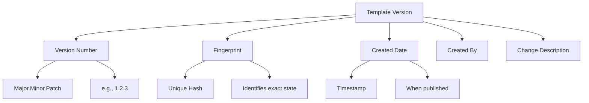
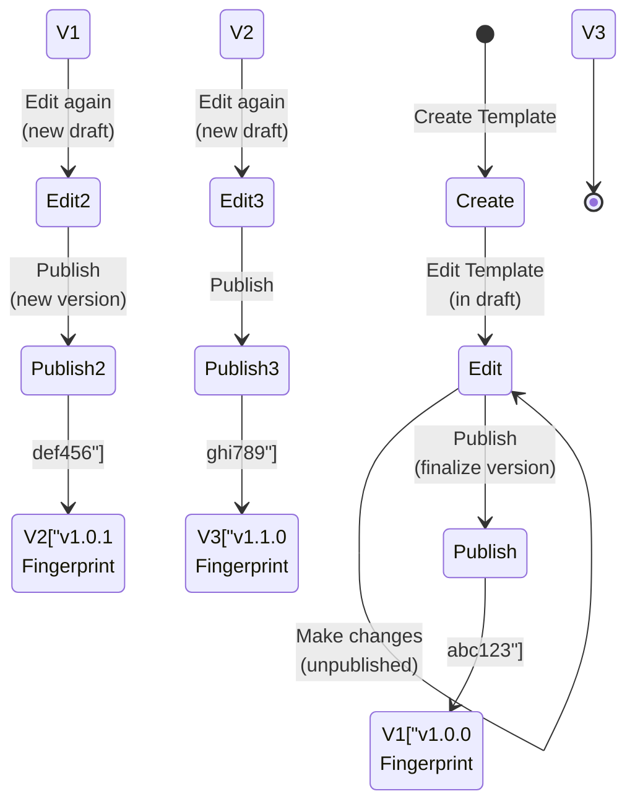

# Template Versioning

Template versioning is critical for maintaining **reproducibility**, **stability**, and **control** over your code generation process. Scoriet's versioning system ensures you always know exactly which template generated your code.

## Why Versioning Matters

### The Problem Without Versioning

Without versioning, templates become a moving target:

```
Today:  Template generates great code
Later:  You modify template slightly
Later:  "Wait, why did this change?" 
        (Can't trace which version generated it)
Result: Confusion, inconsistency, regressions
```

### The Solution: Versioning

```
v1.0.0: Initial template (2024-01-10)
v1.0.1: Fixed field ordering (2024-01-12)
v1.1.0: Added custom variables (2024-01-15)
v1.2.0: Improved React components (2024-01-18)

Code generated with v1.0.0 is identical to code generated 
today with v1.0.0. Full reproducibility.
```

:::info Core Benefit
Versioning guarantees **reproducibility**: the same template version always produces the same output when run against the same schema.
:::

## How Versioning Works

### Version Components

Every template version consists of:



### Version Number Format

Scoriet uses **Semantic Versioning**: `MAJOR.MINOR.PATCH`

```
1.2.3
│ │ └─ PATCH (bug fixes, small tweaks)
│ └─── MINOR (new features, additions)
└───── MAJOR (breaking changes)
```

#### MAJOR Version (1st number)
Increment when making **breaking changes**:

- Remove template files
- Change template file structure
- Change variable names
- Remove custom variables
- Incompatible output structure

```
v1.0.0 → v2.0.0 (Major breaking change)
```

#### MINOR Version (2nd number)
Increment when **adding features**:

- Add new template files
- Add new custom variables
- Add new generation features
- Improve output (backwards compatible)
- Enhance field handling

```
v1.0.0 → v1.1.0 (New feature)
v1.1.0 → v1.2.0 (Another new feature)
```

#### PATCH Version (3rd number)
Increment for **bug fixes** and **tweaks**:

- Fix generation logic errors
- Improve output formatting
- Fix field type handling
- Minor improvements

```
v1.2.0 → v1.2.1 (Bug fix)
v1.2.1 → v1.2.2 (Another fix)
```

### Fingerprints

A **fingerprint** is a unique hash that identifies the exact state of a template version:

```
Template: Laravel CRUD Generator
Version: 1.2.0
Fingerprint: 8f3a4b2c9e1d7f5a
            │
            └─ This exact combination of version + content
               Cannot be reproduced elsewhere
```

**Properties:**

- Unique identifier for each version
- Automatically generated by Scoriet
- Cannot be manually changed
- Based on template content hash
- Changes if any file is modified

**Why fingerprints matter:**

```
Generated code includes fingerprint reference:
// Generated by: Laravel CRUD Generator v1.2.0 (8f3a4b2c9e1d7f5a)

Later, you can trace:
"This code was generated by exactly this template version"
```

:::caution Fingerprint Significance
If you modify a published template, you must create a new version with a new fingerprint. Modifying the current version invalidates the fingerprint.
:::

## Template Lifecycle & Versions

### Publishing Creates a Version



### Key Points

**Draft State (Unpublished):**
- You can edit freely
- No version assigned
- Not available for generation
- No fingerprint

**Published State:**
- Version is locked
- Fingerprint assigned
- Available for code generation
- Cannot be modified
- Recorded in history

### Workflow

1. **Create** template (draft)
2. **Edit** template content (draft)
3. **Test** template (draft)
4. **Publish** (creates version, locks state)
5. **Assign** to schemas (use specific version)
6. **Generate** code (repeatable with same version)

Later, if you need changes:

7. **Edit** template again (new draft)
8. **Publish** (creates new version)
9. **Assign** or **update** existing assignments
10. **Generate** with new version

:::info New Version, Not Modification
Scoriet enforces immutability: you publish a version, then if you make changes, you publish a *new* version. The old version remains unchanged.
:::

## Version History

### Viewing Version History

Each template maintains a complete history:

```
Template: Laravel CRUD Generator

Version History:
├─ v1.2.0 (Current)
│  └─ Published: 2024-01-18 by John Doe
│     Fingerprint: 8f3a4b2c9e1d7f5a
│     Changes: Improved React components
│
├─ v1.1.0
│  └─ Published: 2024-01-15 by Jane Smith
│     Fingerprint: 7d2c3b1a9f8e6d5c
│     Changes: Added custom variables support
│
├─ v1.0.1
│  └─ Published: 2024-01-12 by John Doe
│     Fingerprint: 6c1b2a0f8e7d5c4b
│     Changes: Fixed field ordering bug
│
└─ v1.0.0
   └─ Published: 2024-01-10 by Jane Smith
      Fingerprint: 5a0f1e9d8c7b6a5f
      Changes: Initial template
```

### History Information

For each version:

- **Version number** (1.2.0)
- **Publication date** (2024-01-18 15:30)
- **Author** (who published)
- **Fingerprint** (unique identifier)
- **Change description** (what changed)
- **Status** (current, previous, deprecated)

### Accessing History

1. Open template
2. Click **Version History** tab
3. View all versions chronologically
4. Click version for details

<div class="screenshot-placeholder">Screenshot: Template version history panel — <code>version-history.png</code></div>

## Reverting to Previous Versions

### Why Revert?

```
Scenario 1: New version introduced bugs
  Solution: Revert to last stable version

Scenario 2: Client prefers old output style
  Solution: Revert to version that matched their preferences

Scenario 3: Experiment with changes
  Solution: Revert if experiment doesn't work
```

### Reverting a Version

:::caution Revert Creates New Version
Reverting doesn't go backwards in time. It creates a *new* version with the old content, so you have a clear history of what happened.
:::

**Process:**

1. Open template
2. Go to **Version History**
3. Find version to revert to
4. Click **Revert to This Version**
5. Confirm action
6. New version created with old content

**Example:**

```
Current: v1.2.0 (has bugs)
Want:    v1.1.0 (was stable)

Action:  Revert to v1.1.0

Result:  v1.3.0 created with v1.1.0 content
         (New version, not actual rollback)
```

<div class="screenshot-placeholder">Screenshot: Revert version confirmation dialog — <code>revert-version.png</code></div>

### Revert Considerations

**Before reverting, consider:**

- Is the problem worth reverting?
- Will reverting break existing uses?
- Are there generated files to update?
- Should you fix the bug instead?

**Scenarios where reverting makes sense:**

✓ New version has critical bugs
✓ Changes broke compatibility
✓ Experiment didn't work out

**Scenarios where fixing is better:**

✓ Minor output formatting issue
✓ One field type not handled correctly
✓ Performance improvements needed

## Assigning Specific Versions

### Version Assignment

When assigning a template to a schema, you choose which version to use:

```
Template: Laravel CRUD Generator

Available Versions:
┌─────────────┬──────────┬─────────────────┐
│ Version     │ Date     │ Status          │
├─────────────┼──────────┼─────────────────┤
│ v1.2.0      │ Jan 18   │ Latest          │
│ v1.1.0      │ Jan 15   │ Available       │
│ v1.0.1      │ Jan 12   │ Deprecated      │
│ v1.0.0      │ Jan 10   │ Deprecated      │
└─────────────┴──────────┴─────────────────┘

Select: v1.2.0 (Latest)
```

### Managing Template Versions in Schemas

**Best practices:**

1. **Use latest version** by default
2. **Pin specific version** if needed
3. **Update versions** periodically
4. **Deprecate old versions** (mark as outdated)
5. **Migration path** when updating

### Updating to New Version

When a new template version is available:

```
Current Assignment: Schema uses v1.1.0
New Available:     v1.2.0

Options:
1. Update schema to v1.2.0 (now)
   └─ Future generations use new version
   
2. Keep v1.1.0 (stay safe)
   └─ Safe but miss improvements
   
3. Schedule update for later
   └─ Plan migration
```

**Update Process:**

1. Go to template assignment
2. Click **Change Version**
3. Select new version
4. Click **Update**
5. Future generations use new version

:::caution Update Impact
Updating a template version means future generations use the new template. Existing code is not retroactively updated. Only new generations get the new template.
:::

## Version Metadata

### What's Tracked in Each Version

When you publish a version, Scoriet automatically records:

- **Version number** (1.2.0)
- **Fingerprint** (8f3a4b2c9e1d7f5a)
- **Publication timestamp** (2024-01-18 15:30:22)
- **Author** (who published)
- **Template files** (all files in this version)
- **Custom variables** (all variables in this version)
- **Field assignments** (configuration)
- **Change description** (provided by author)

### Example Version Info

```
Template: REST API Generator
Version: 1.3.0
Fingerprint: 9d3e5c7b1f4a8e2c

Published: 2024-01-18 at 15:30 UTC
Published By: john.doe@acme.com

Files in Version:
├─ api/{:tablename:}.ts (12 KB)
├─ api/{:tablename:}.service.ts (8 KB)
├─ tests/{:tablename:}.test.ts (5 KB)
└─ types/{:tablename:}.types.ts (3 KB)

Custom Variables:
├─ apiVersion (default: "v1")
├─ useOpenAPI (default: true)
└─ includeTests (default: true)

Change Description:
"Added OpenAPI documentation generation, 
improved error handling, added test generation"

Generated Code Fingerprint: 9d3e5c7b1f4a8e2c
```

## Sharing & Exporting Versions

### Publishing to Template Store

Share specific versions via the Template Store:

1. Go to template **Version History**
2. Click version → **Share**
3. Choose:
   - Public (everyone can use)
   - Team private (team only)
   - Organization (organization only)

4. Add description, tags
5. Confirm sharing

### Exporting Versions

Export a version for external use:

1. Click version → **Export**
2. Choose format:
   - JSON (metadata + files)
   - ZIP (all files)
3. Download
4. Share via email, git, etc.

### Importing Versions

Import previously exported versions:

1. Click **Import** button
2. Upload exported file
3. Scoriet detects version info
4. Confirm import
5. Version added to your templates

:::info Version Portability
Exported versions maintain all metadata, making them completely portable between Scoriet instances.
:::

## Version Naming Best Practices

### When to Increment What

```
Fixed typo in comment                          → v1.2.3 → v1.2.4 (PATCH)
Added nullable field handling                  → v1.2.4 → v1.3.0 (MINOR)
Completely restructured template files         → v1.3.0 → v2.0.0 (MAJOR)
Improved validation in JavaScript block       → v1.3.0 → v1.3.1 (PATCH)
Added support for enum field types            → v1.3.1 → v1.4.0 (MINOR)
Removed deprecated field format (breaking)    → v1.4.0 → v2.0.0 (MAJOR)
```

### Change Descriptions

Write clear change descriptions when publishing:

**Good:**
```
"Added JSON field type support, improved 
camelCase conversion for field names, 
fixed null pointer in relationship handling"
```

**Poor:**
```
"Various improvements"
```

**Guidelines:**
- List what changed
- Mention bugs fixed
- Note breaking changes
- Be specific and technical
- Keep under 200 words

## Accessing Generated Code Metadata

### Fingerprint in Generated Code

Generated files include version information:

```php
<?php
/**
 * Generated by Scoriet
 * Template: Laravel CRUD Generator
 * Version: 1.2.0
 * Fingerprint: 8f3a4b2c9e1d7f5a
 * Generated: 2024-01-20 10:30:15 UTC
 */
```

### Tracing Generated Code

To find which template version generated code:

1. Look for template metadata in generated file
2. Find fingerprint or version
3. Open that template in Scoriet
4. Go to Version History
5. Find matching version
6. Review changes and details

```
Generated file says: Version 1.2.0, Fingerprint: 8f3a4b...

Steps to trace:
1. Open template in Scoriet
2. Version History tab
3. Find v1.2.0
4. View details and changes
```

## Best Practices

### Version Management

✓ Publish versions frequently (after meaningful changes)
✓ Write descriptive change descriptions
✓ Use semantic versioning correctly
✓ Test before publishing
✓ Keep version history clean

✗ Don't modify published versions
✗ Don't skip patch/minor/major numbering
✗ Don't keep too many deprecated versions
✗ Don't publish untested changes

### Migration Strategy

✓ Plan major version upgrades
✓ Provide migration documentation
✓ Test new versions thoroughly
✓ Gradual rollout (new projects first)
✓ Keep previous version available initially

### Documentation

✓ Document breaking changes
✓ Provide upgrade guide
✓ List new features clearly
✓ Note deprecations explicitly
✓ Keep detailed change history

## Troubleshooting

### Version not showing in history?
- Ensure version was published (not just drafted)
- Check that you have permission to view version
- Refresh page to reload history

### Can't revert to version?
- Check if version has been deleted
- Verify you have edit permissions
- Ensure new version number doesn't conflict

### Wrong version assigned?
- Go to schema → template assignments
- Click "Change Version"
- Select correct version
- Save changes

## Common Version Scenarios

### Scenario 1: Bug Fix Workflow
```
1. Using v1.2.0 (has bug)
2. Edit template, fix bug
3. Publish as v1.2.1
4. Update schema assignment to v1.2.1
5. Generate code with fixed version
```

### Scenario 2: Major Rewrite
```
1. Using v1.5.0 (old structure)
2. Completely rewrite template
3. Publish as v2.0.0 (breaking changes)
4. Notify users of major version
5. Gradual migration to v2.0.0
```

### Scenario 3: Testing New Features
```
1. Create new template version with features
2. Publish as v1.3.0-beta (beta version)
3. Assign to test schema
4. Test thoroughly
5. If good, publish v1.3.0 (stable)
6. If bad, revert or create v1.2.2 fix
```

### Scenario 4: Multiple Versions in Production
```
Team A uses: Laravel CRUD v1.2.0
Team B uses: Laravel CRUD v1.4.0
Team C uses: Laravel CRUD v2.0.0

Each team gets updates at their pace
No forced upgrades
Full version independence
```

## Summary

Template versioning ensures:

- **Reproducibility**: Same version produces same output
- **Traceability**: Know exactly what generated your code
- **Stability**: Old versions remain unchanged
- **Control**: Choose which version to use
- **Evolution**: Templates improve over time
- **Safety**: Revert if problems occur

Master versioning and you have complete control over your code generation pipeline.

## Next Steps

- Learn about [template creation](./create-template.md)
- Review [template structure](./template-files.md)
- Explore [template variables](./variables.md)
