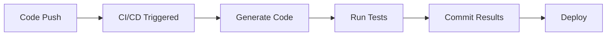

# Automation & CI/CD

Integrate Scoriet code generation into your continuous integration and deployment pipelines. This guide covers best practices for automating code generation in popular CI/CD platforms.

## Why Automate Code Generation?

Automation provides:

- **Consistency** — Generate code the same way every time
- **Speed** — Generate code as part of build pipeline
- **Reliability** — No manual steps, reduced errors
- **Traceability** — See what code was generated in commit history
- **Scalability** — Generate for multiple projects/services



---

## GitHub Actions

GitHub Actions is GitHub's built-in CI/CD platform. This example generates code on push to main branch.

### Basic Workflow

Create `.github/workflows/generate-code.yml`:

```yaml
name: Generate Code

on:
  push:
    branches: [main]
    paths:
      - 'schema/**'
      - '.github/workflows/generate-code.yml'
  pull_request:
    branches: [main]

jobs:
  generate:
    runs-on: ubuntu-latest
    
    steps:
      - uses: actions/checkout@v4
      
      - name: Setup Node.js
        uses: actions/setup-node@v4
        with:
          node-version: '20'
      
      - name: Install Scoriet CLI
        run: npm install -g @scoriet/cli
      
      - name: Authenticate
        run: scoriet auth login
        env:
          SCORIET_API_KEY: ${{ secrets.SCORIET_API_KEY }}
      
      - name: Generate Code
        run: |
          scoriet generate my-project laravel-model \
            --output ./app/Models/User.php
      
      - name: Commit Generated Code
        run: |
          git config --local user.email "action@github.com"
          git config --local user.name "GitHub Action"
          git add app/Models/User.php
          git commit -m "Generated code from Scoriet"
          git push
```

### Multi-Project Generation

Generate code for multiple projects:

```yaml
name: Generate Multiple Projects

on: [push]

jobs:
  generate:
    runs-on: ubuntu-latest
    
    strategy:
      matrix:
        project: [api-service, mobile-app, admin-dashboard]
        template: [models, controllers, migrations]
    
    steps:
      - uses: actions/checkout@v4
      
      - name: Setup Node.js
        uses: actions/setup-node@v4
        with:
          node-version: '20'
      
      - name: Install Scoriet CLI
        run: npm install -g @scoriet/cli
      
      - name: Generate Code
        run: |
          scoriet generate ${{ matrix.project }} ${{ matrix.template }} \
            --output ./generated/${{ matrix.project }}/${{ matrix.template }}
        env:
          SCORIET_API_KEY: ${{ secrets.SCORIET_API_KEY }}
      
      - name: Commit Changes
        run: |
          git config --local user.email "action@github.com"
          git config --local user.name "GitHub Action"
          git add generated/
          git commit -m "Generated code: ${{ matrix.project }} - ${{ matrix.template }}"
          git push
```

### Setting Up Secrets

In GitHub repository settings:

1. **Settings** → **Secrets and variables** → **Actions**
2. **New repository secret**
3. Name: `SCORIET_API_KEY`
4. Value: Your Scoriet API key from dashboard

```bash
# Get your API key from Scoriet dashboard
# https://scoriet.com/settings/api-keys
```

---

## GitLab CI/CD

GitLab's built-in CI/CD platform uses `.gitlab-ci.yml` for configuration.

### Basic Pipeline

Create `.gitlab-ci.yml`:

```yaml
stages:
  - generate
  - test
  - build

generate_code:
  stage: generate
  image: node:20
  script:
    - npm install -g @scoriet/cli
    - scoriet generate my-project laravel-model --output ./app/Models/User.php
  artifacts:
    paths:
      - app/Models/User.php
    expire_in: 1 week
  only:
    - main

test_generated_code:
  stage: test
  image: php:8.2
  script:
    - composer install
    - ./vendor/bin/phpunit tests/ModelTest.php
  dependencies:
    - generate_code
  only:
    - main

build:
  stage: build
  image: php:8.2
  script:
    - composer install
    - php artisan build
  only:
    - main
```

### Setting CI/CD Variables

In GitLab project settings:

1. **Settings** → **CI/CD** → **Variables**
2. **Add variable**
3. Name: `SCORIET_API_KEY`
4. Value: Your API key
5. **Protect variable** (optional)

---

## GitLab CI with Local Service

For faster generation, use the Scoriet Local Service in Docker:

```yaml
generate_with_local_service:
  stage: generate
  
  services:
    - name: scoriet/local-service:latest
      alias: scoriet
  
  script:
    - npm install -g @scoriet/cli
    - scoriet generate my-project my-template --output ./generated.php
  
  artifacts:
    paths:
      - generated.php
  
  only:
    - main
```

---

## Jenkins

Jenkins integration using declarative pipelines.

### Jenkinsfile

```groovy
pipeline {
    agent any
    
    environment {
        SCORIET_API_KEY = credentials('scoriet-api-key')
        PROJECT_ID = 'my-project'
        TEMPLATE = 'laravel-model'
    }
    
    stages {
        stage('Checkout') {
            steps {
                checkout scm
            }
        }
        
        stage('Install Dependencies') {
            steps {
                sh 'npm install -g @scoriet/cli'
            }
        }
        
        stage('Generate Code') {
            steps {
                sh '''
                    scoriet auth login
                    scoriet generate ${PROJECT_ID} ${TEMPLATE} \
                        --output ./app/Models/User.php
                '''
            }
        }
        
        stage('Commit Generated Code') {
            steps {
                sh '''
                    git config user.email "jenkins@company.com"
                    git config user.name "Jenkins"
                    git add app/Models/User.php
                    git commit -m "Generated code from Scoriet" || true
                    git push origin main || true
                '''
            }
        }
        
        stage('Test') {
            steps {
                sh 'composer install'
                sh './vendor/bin/phpunit'
            }
        }
        
        stage('Build') {
            steps {
                sh 'php artisan build'
            }
        }
    }
    
    post {
        always {
            cleanWs()
        }
    }
}
```

### Configure Credentials

1. **Manage Jenkins** → **Manage Credentials**
2. **Global credentials**
3. **Add Credentials**
4. Type: **Secret text**
5. Secret: Your Scoriet API key
6. ID: `scoriet-api-key`

---

## Azure Pipelines

Microsoft Azure Pipelines configuration.

### azure-pipelines.yml

```yaml
trigger:
  - main

pool:
  vmImage: 'ubuntu-latest'

stages:
  - stage: Generate
    jobs:
      - job: GenerateCode
        steps:
          - task: UseNode@1
            inputs:
              version: '20.x'
          
          - script: npm install -g @scoriet/cli
            displayName: 'Install Scoriet CLI'
          
          - script: |
              scoriet generate my-project laravel-model \
                --output $(Build.SourcesDirectory)/app/Models/User.php
            displayName: 'Generate Code'
            env:
              SCORIET_API_KEY: $(ScorlexApiKey)
          
          - task: PublishBuildArtifacts@1
            inputs:
              PathtoPublish: '$(Build.SourcesDirectory)/app/Models'
              ArtifactName: 'generated-code'
          
          - script: |
              git config --local user.email "azure@pipelines.com"
              git config --local user.name "Azure Pipelines"
              git add app/Models/User.php
              git commit -m "Generated code from Scoriet"
              git push
            displayName: 'Commit Generated Code'

  - stage: Test
    dependsOn: Generate
    jobs:
      - job: TestGenerated
        steps:
          - task: UseNode@1
            inputs:
              version: '20.x'
          
          - script: composer install
            displayName: 'Install Dependencies'
          
          - script: ./vendor/bin/phpunit
            displayName: 'Run Tests'
```

### Set Pipeline Variables

1. **Edit pipeline**
2. **Variables**
3. **New variable**
4. Name: `ScorlexApiKey`
5. Value: Your API key
6. **Keep this value secret**

---

## CircleCI

CircleCI configuration for code generation.

### .circleci/config.yml

```yaml
version: 2.1

executors:
  node-executor:
    docker:
      - image: cimg/node:20.0

jobs:
  generate-code:
    executor: node-executor
    steps:
      - checkout
      
      - run:
          name: Install Scoriet CLI
          command: npm install -g @scoriet/cli
      
      - run:
          name: Generate Code
          command: |
            scoriet generate my-project laravel-model \
              --output ./app/Models/User.php
          environment:
            SCORIET_API_KEY: $SCORIET_API_KEY
      
      - persist_to_workspace:
          root: .
          paths:
            - app/Models/User.php
      
      - run:
          name: Commit Generated Code
          command: |
            git config user.email "circleci@example.com"
            git config user.name "CircleCI"
            git add app/Models/User.php
            git commit -m "Generated code from Scoriet" || true
            git push origin main || true

  test:
    docker:
      - image: cimg/php:8.2
    steps:
      - checkout
      - attach_workspace:
          at: .
      - run: composer install
      - run: ./vendor/bin/phpunit

workflows:
  generate-and-test:
    jobs:
      - generate-code
      - test:
          requires:
            - generate-code
```

### Set Environment Variables

1. **Project Settings** → **Environment Variables**
2. **Add Environment Variable**
3. Name: `SCORIET_API_KEY`
4. Value: Your API key

---

## Travis CI

Legacy but still used CI/CD platform.

### .travis.yml

```yaml
language: php
php:
  - '8.2'

before_script:
  - npm install -g @scoriet/cli

script:
  - scoriet generate my-project laravel-model --output ./app/Models/User.php
  - composer install
  - ./vendor/bin/phpunit

after_success:
  - |
    git config --local user.email "travis@example.com"
    git config --local user.name "Travis CI"
    git add app/Models/User.php
    git commit -m "Generated code from Scoriet"
    git push https://${GITHUB_TOKEN}@github.com/user/repo.git main || true

env:
  global:
    - secure: $SCORIET_API_KEY_ENCRYPTED
```

---

## Bitbucket Pipelines

Atlassian Bitbucket's CI/CD platform.

### bitbucket-pipelines.yml

```yaml
image: node:20

definitions:
  steps:
    - step: &generate-code
        name: Generate Code
        script:
          - npm install -g @scoriet/cli
          - scoriet generate my-project laravel-model --output ./app/Models/User.php
        artifacts:
          - app/Models/User.php

pipelines:
  branches:
    main:
      - step: *generate-code
      - step:
          name: Test
          image: php:8.2
          script:
            - composer install
            - ./vendor/bin/phpunit
          artifacts:
            - app/Models/User.php
```

---

## Docker and Container Integration

### Docker Build Step

Generate code during Docker image build:

```dockerfile
FROM node:20 AS generate
RUN npm install -g @scoriet/cli
ENV SCORIET_API_KEY=${SCORIET_API_KEY}
WORKDIR /app
COPY . .
RUN scoriet generate my-project laravel-model --output ./generated.php

FROM php:8.2
WORKDIR /app
COPY --from=generate /app/generated.php ./app/Models/User.php
COPY . .
RUN composer install
EXPOSE 8000
CMD ["php", "artisan", "serve"]
```

**Build with secrets**:
```bash
docker build \
  --secret scoriet_api_key \
  -t my-app:latest \
  .
```

### Docker Compose with Scoriet

```yaml
version: '3.8'

services:
  scoriet:
    image: scoriet/local-service:latest
    container_name: scoriet-service
    ports:
      - "9000:9000"
    volumes:
      - ~/.scoriet:/root/.scoriet
    environment:
      SCORIET_LOG_LEVEL: info

  app:
    build: .
    depends_on:
      - scoriet
    environment:
      SCORIET_LOCAL_SERVICE: http://scoriet:9000
    volumes:
      - ./app:/app
```

---

## Best Practices

:::tip Automate on Schema Changes
Only generate when database schema changes:

```yaml
on:
  push:
    paths:
      - 'database/schema.sql'
      - 'src/templates/**'
```
:::

:::info Version Control Generated Code
Always commit generated code to version control:
- Track changes over time
- Review generated code in PRs
- Revert if needed
- Audit trail of generations
:::

:::caution Handle Generation Failures
Always check generation status:

```bash
scoriet generate ... || {
  echo "Generation failed!"
  exit 1
}
```
:::

:::tip Use Caching
Cache Scoriet configuration and projects:

```yaml
- uses: actions/cache@v3
  with:
    path: ~/.scoriet
    key: scoriet-cache-${{ hashFiles('*.json') }}
```
:::

:::info Run Tests After Generation
Always test generated code:

```yaml
- run: scoriet generate ...
- run: composer install
- run: ./vendor/bin/phpunit
```
:::

---

## Common Patterns

### Pattern 1: Generate on Tag

Generate and release code when you create a version tag:

```yaml
on:
  push:
    tags:
      - 'v*'
```

### Pattern 2: Generate and Auto-Merge

Generate, test, and auto-merge if tests pass:

```yaml
- run: scoriet generate ...
- run: npm run test
- uses: peter-evans/create-pull-request@v5
  with:
    title: "Generated code from Scoriet"
```

### Pattern 3: Batch Generation

Generate for multiple services at once:

```yaml
matrix:
  include:
    - service: api
      project: api-service-123
    - service: web
      project: web-app-456
    - service: mobile
      project: mobile-app-789
```

### Pattern 4: Conditional Generation

Only generate if specific conditions are met:

```bash
if [[ -f "needs_generation.txt" ]]; then
  scoriet generate ...
fi
```

---

## Troubleshooting CI/CD Integration

### Authentication Fails

**Error**: `Authentication failed`

**Solutions**:
1. Verify API key is set in secrets
2. Check API key hasn't expired
3. Regenerate API key in Scoriet dashboard

### Generation Times Out

**Error**: `Request timeout`

**Solutions**:
1. Increase timeout in configuration
2. Use local service for faster generation
3. Check network connectivity

### Generated Code Not Committed

**Issue**: Generated files not committed to repository

**Solutions**:
1. Check git user.email and user.name are set
2. Verify branch name is correct
3. Check git push permissions
4. Add debug logging: `git push -v`

### Cache Issues

**Issue**: Old generated code used from cache

**Solutions**:
1. Clear cache step: `scoriet-service --clear-cache`
2. Increase cache TTL
3. Force no-cache: `--no-cache` flag

---

## Next Steps

- **[CLI Overview](./cli-overview.md)** — Command reference
- **[Local Service](./local-service.md)** — Local execution
- **[User Guide Home](/docs)** — Main documentation

