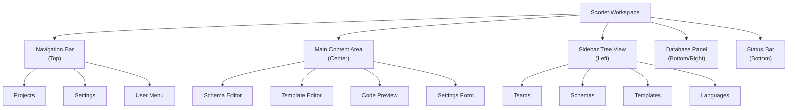

# Understanding the Workspace

Welcome to Scoriet's intuitive workspace! The Scoriet interface uses a **Multi-Document Interface (MDI)** design, allowing you to organize your code generation work with maximum flexibility and efficiency.

## What is an MDI Workspace?

An MDI workspace lets you work with multiple documents and panels simultaneously, each in its own window or docked area. Unlike traditional single-window applications, Scoriet allows you to:

- **Float** panels anywhere on your screen
- **Dock** panels to the left, right, top, or bottom
- **Tab** panels together for organized grouping
- **Maximize** panels to focus on a single task
- **Resize** panels to fit your workflow

This means you can arrange Scoriet exactly how you work best.

## Main Workspace Areas

## Key Workspace Components

### Navigation Bar (Top)
The navigation bar is your command center, containing:
- **Home/Projects** button to access your projects
- **Create** buttons for new items (schemas, templates, etc.)
- **Settings** for application and project configuration
- **User Profile** menu with logout and account options

:::tip
Click any navigation item to jump directly to that section. The active area is highlighted so you always know where you are.
:::

### Left Sidebar Tree View
The sidebar displays your project structure hierarchically:
- **Teams** - Groupings of projects for team collaboration
- **Schemas** - Database structure definitions
- **Tables** - Individual table definitions within schemas
- **Templates** - Code generation templates
- **Languages** - Programming language configurations

Expand/collapse items by clicking the arrow icons. Right-click items for context menus with quick actions.

### Main Content Area (Center)
This is where the work happens. Panels in the main area show:
- Schema editor with field definitions
- Template editor with code generation logic
- Preview of generated code
- Project settings and configuration forms

### Database Panel (Right/Bottom)
The database explorer panel shows:
- Connected databases
- Available schemas and tables
- Field definitions and constraints
- Data types and relationships

### Status Bar (Bottom)
The status bar provides quick information:
- Current project name
- Connection status
- Operation feedback and messages
- Last updated timestamp

## Panel Groups and Behavior

Scoriet automatically organizes panels into groups with consistent behavior:

| Group | Panels | Behavior |
|-------|--------|----------|
| **Top Navigation** | Navigation items | Always visible, not closable |
| **Main Work Area** | Schema/Template editors | Floatable, dockable, closable |
| **Sidebar** | Tree view | Resizable width, always visible |
| **Database** | Explorer | Floatable, dockable, minimizable |

:::info
Each group can be customized independently. You can have multiple content panels open simultaneously and switch between them using tabs or floating windows.
:::

## Quick Start: Your First Workspace

1. **Login** to Scoriet with your credentials
2. **Select or create** a project from the Projects page
3. The workspace automatically loads with default panels
4. **Customize** your layout by dragging panels around (see [Working with Panels](dock-panels.md))
5. **Use keyboard shortcuts** to speed up your workflow (see [Keyboard Shortcuts](keyboard-shortcuts.md))

## Layout Persistence

Your custom workspace layout is automatically saved as you work. When you:
- Close and reopen Scoriet
- Switch between projects
- Return to this workspace tomorrow

Your panels will be exactly where you left them. This ensures a consistent, personalized workflow experience.

:::caution
If you want to reset to the default layout, use the **Reset Layout** option in Settings. This cannot be undone, so save any custom configurations first.
:::

## Responsive Design

Scoriet's workspace adapts to different screen sizes:
- **Large monitors** (2560px+) - Take advantage of floating panels and expanded views
- **Standard monitors** (1920px) - Use docking to maximize visible content
- **Smaller screens** (1366px) - Switch to floating windows and close unused panels

See [Keyboard Shortcuts](keyboard-shortcuts.md) to learn how to quickly maximize individual panels for focused work on smaller screens.

---

**Next Steps:**
- Learn about [Navigation](navigation.md) options
- Master [Working with Panels](dock-panels.md)
- Discover [Keyboard Shortcuts](keyboard-shortcuts.md)
